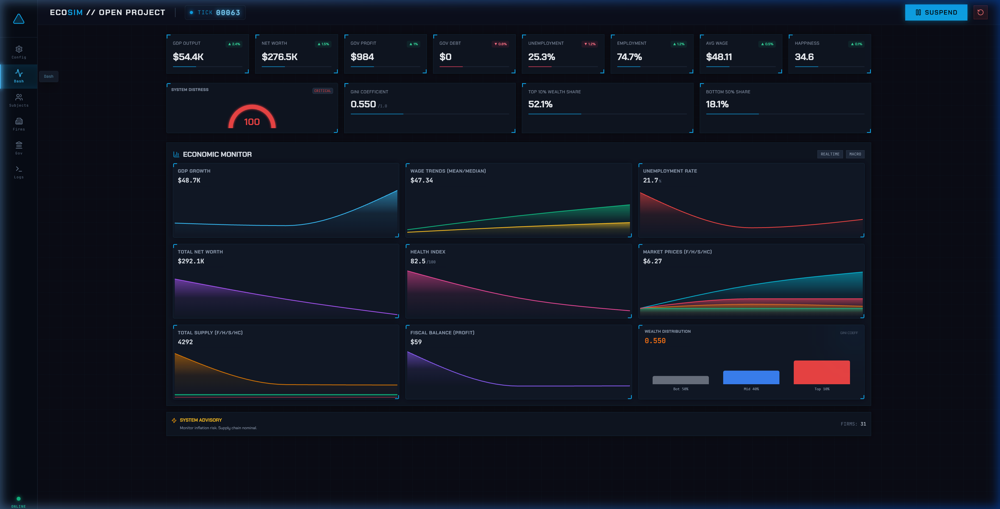
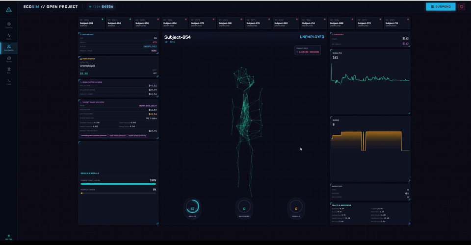
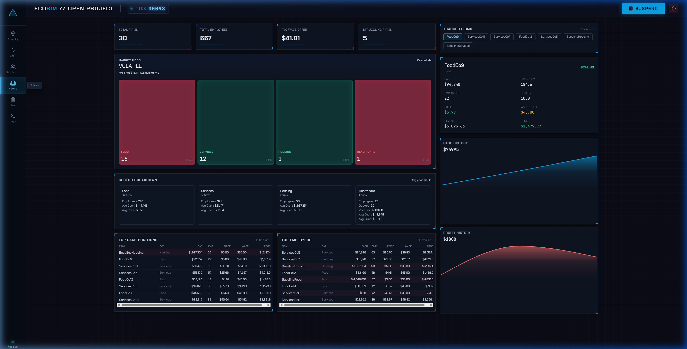
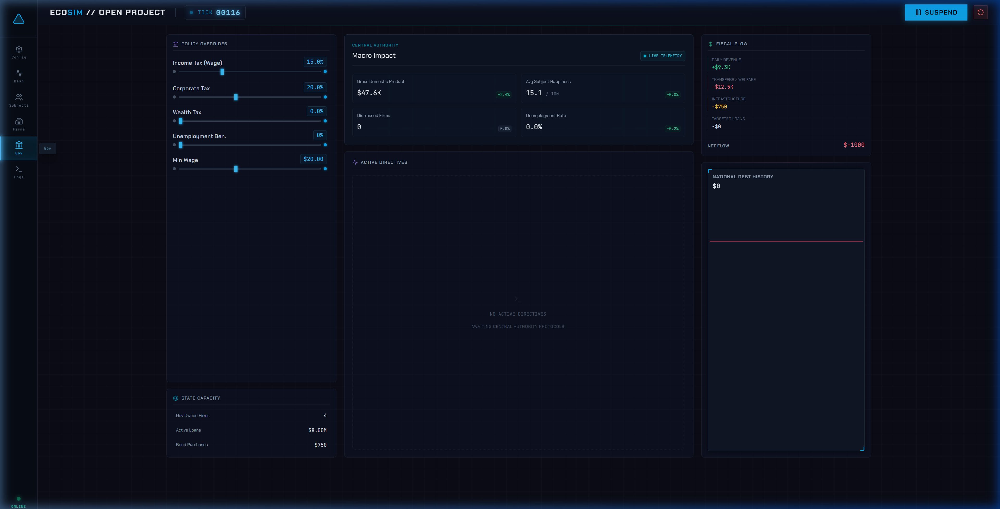

# EcoSim

[](https://github.com/AymanCode/EcoSim/actions/workflows/ci.yml)
[](pyproject.toml)
[](docker-compose.yml)
[](pyproject.toml)
[](frontend-react/package.json)
[](LICENSE)

EcoSim is an agent-based macroeconomic simulation with households, firms, a bank, and a government interacting across labor, goods, housing, healthcare, and credit markets. It includes a FastAPI backend, live WebSocket metrics, a React dashboard, and optional SQLite/PostgreSQL/TimescaleDB persistence for run history.

You can use it as a policy sandbox: change taxes, subsidies, wage floors, public works, social spending, or bailout rules and watch the economy react. You can also put an LLM in the government's seat and constrain it to the same schema-validated policy controls.

> **Featured experiment:** [Can an AI run an economy?](docs/experiments/AI_GOVERNMENT_EXPERIMENT.md) compares five LLMs plus a rule-based baseline on a 1,000-household run.

## Quickstart

Run the full stack with Docker:

```bash
git clone https://github.com/AymanCode/EcoSim.git
cd EcoSim
docker compose up --build -d --wait
```

Open `http://localhost:5173`.

Stop the stack:

```bash
docker compose down
```

## Dashboard


*Macro metrics streamed over WebSocket during a rule-based baseline run.*


*Per-household drill-down with wage drivers, traits, inventory, health, and happiness.*


*Sector breakdown, market mood, and per-firm cash and profit history.*


*Policy controls shared by the dashboard and LLM government agent.*

## What The Simulation Models

Each tick is roughly one simulated week. During a tick:

- **Households** look for work, earn wages or benefits, pay taxes, and spend on food, housing, services, and healthcare.
- **Firms** hire workers, set prices and wages, produce, sell into markets, pay taxes, and can become distressed.
- **The bank** holds deposits, pays interest, and processes loan repayments.
- **The government** collects taxes and applies policy through tax rates, subsidies, wage floors, public works, social spending, stabilization, and bailouts.

The backend optionally persists run metadata, tick metrics, policy actions, decision features, diagnostics, and agent snapshots for post-run analysis.

## Stack

| Layer | Tech |
|---|---|
| Simulation engine | Python 3.11+ |
| API and streaming | FastAPI, WebSockets |
| Frontend | React, Vite, Recharts |
| Persistence | SQLite, PostgreSQL, TimescaleDB |
| LLM orchestration | LangGraph, LM Studio, Groq, OpenRouter, Ollama |
| Tests | pytest, contract-style regression suites |

## Architecture

```text
frontend-react/     live dashboard
    |
    | WebSocket ws://localhost:8002/ws
    v
backend/server.py   FastAPI and simulation lifecycle
    v
backend/economy.py  tick coordinator and market clearing
    v
backend/agents.py   household, firm, bank, and government behavior

backend/config.py   400+ tunable parameters
backend/tools/      runners, LLM harness, diagnostics, and analysis
```

Each tick follows a fixed sequence: labor matching, production, goods market, housing, healthcare, banking, government policy, pricing, wage planning, firm exits, spawning, and metrics broadcast. Agent decisions are split into `plan_*` steps and `apply_*` steps so behavior can be tested without mutating state.

## LLM Government

The government action space lives in [`backend/policy_schema.py`](backend/policy_schema.py). The same schema drives the dashboard sliders and the LLM government agent. When an LLM is driving policy, it receives a compact economy report every 26 ticks and proposes policy changes. The schema validates each proposal before it touches simulation state.

The 1,000-household comparison is published as a curated writeup: [docs/experiments/AI_GOVERNMENT_EXPERIMENT.md](docs/experiments/AI_GOVERNMENT_EXPERIMENT.md).

## Local Development

Backend:

```bash
python --version
python -m venv .venv
source .venv/bin/activate   # Windows: .venv\Scripts\Activate.ps1
python -m pip install -e ".[dev,ml]"
python -m uvicorn backend.server:app --reload --port 8002
```

Frontend:

```bash
cd frontend-react
npm install
npm run dev
```

## Testing

Python CI gate:

```bash
python -m pip install -e ".[dev,ml]"
pytest backend/data/tests backend/tests_server/test_server_api.py -q
pytest backend/tests_contracts -q -m "not llm and not research"
```

Frontend:

```bash
cd frontend-react
npm ci
npm run lint
npm run build
```

LLM and research-marked tests require provider credentials such as `OPENROUTER_API_KEY` and are excluded from the default CI gate.

## Configuration

Warehouse persistence is off by default:

```text
ECOSIM_ENABLE_WAREHOUSE=1
ECOSIM_WAREHOUSE_BACKEND=sqlite     # sqlite, postgres, or timescale
```

LLM providers are optional and can be mixed:

```text
OPENROUTER_API_KEY=...
GROQ_API_KEY=...
LMSTUDIO_BASE_URL=http://127.0.0.1:1234
OLLAMA_BASE_URL=http://localhost:11434
```

Simulation parameters live in [`backend/config.py`](backend/config.py) as frozen dataclasses.

## Repository Layout

```text
backend/          simulation engine, API, persistence, tools, and tests
frontend-react/   React dashboard
docs/             technical docs and curated experiment writeups
ops/              optional infrastructure
```

For the simulation deep dive, see [docs/SIMULATION.md](docs/SIMULATION.md). For implementation details, see [docs/TECHNICAL.md](docs/TECHNICAL.md). For the full doc index, see [docs/README.md](docs/README.md).
