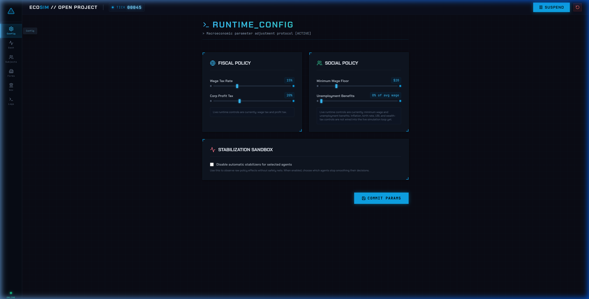
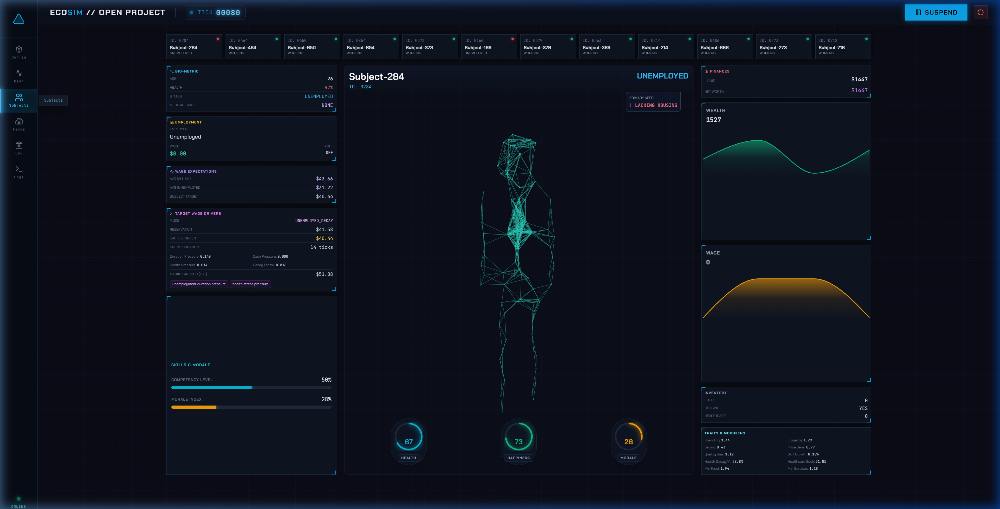
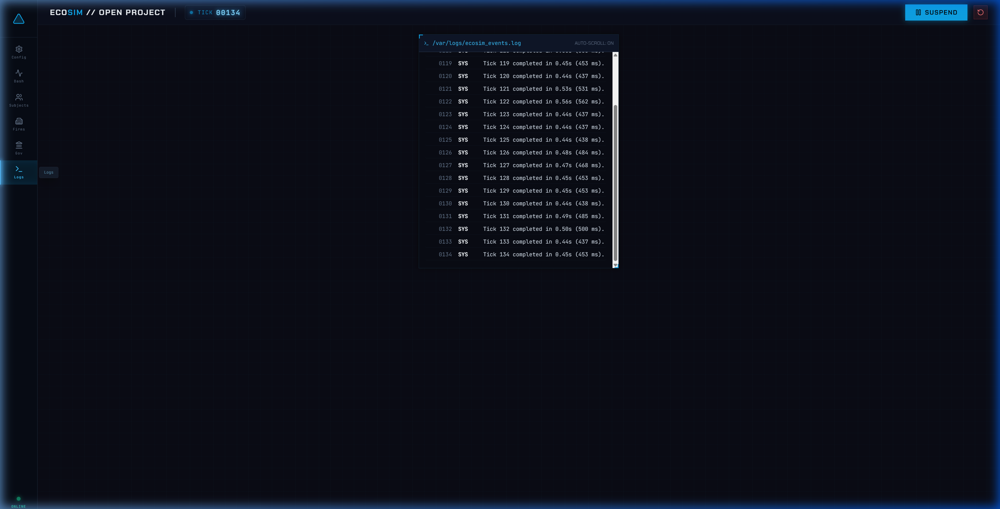

# Frontend Dashboard

The EcoSim frontend is a React/Vite dashboard for launching, controlling, and inspecting live simulation runs.

## Stack

- React 19
- Vite (run with Node 22; the Vite dev server needs `cwd=frontend-react`)
- Recharts for the line and bar charts
- Tailwind CSS on top of a token stylesheet
- lucide-react icons
- Custom canvas-based neural visualizations
- WebSocket transport through `/ws`

The application entry point is [`frontend-react/src/App.jsx`](../frontend-react/src/App.jsx), which owns the session state, the WebSocket protocol client, and the handlers, and renders one screen component per view.

### Source layout

| Path | Owns |
|---|---|
| `src/theme/tokens.css` | The design tokens (two themes: `ember`, dark by default, and `paper`, light), fonts, base styles, and the panel "fill rule" that makes charts grow to their panel |
| `src/ui/` | Stat tiles (`StatTile`, `ChartTile`, `HeroMetric` with a tick-driven count-up), pills, chips, deltas, key/value rows, panels, page headers, inputs |
| `src/charts/` | `TimeSeries` (the one line chart: tick-aligned series, end labels, threshold bands, policy-change markers, split-at-change mode), `Sparkline`, `Meter`, `CompositionBar`, `Radar`, `ProfileBars`, `Ledger`, shared `tones` |
| `src/screens/` | One component per view: `Config`, `Command`, `Population`, `Markets`, `Finance`, `Government` (with `government/Timeline`, `EffectsPanel`, `LeverTile`), `Logs` |
| `src/shell/` | `Rail`, `TopBar`, `StatusStrip`, `Logo` |
| `src/telemetry.js`, `src/format.js`, `src/logs.js`, `src/governmentInsights.js` | Pure helpers: history access and derived metrics, formatters, log normalisation, policy derivations |
| `src/test/renderScreen.jsx`, `src/test/fixtures/frame.json` | Screen test helper and a real tick frame captured from the server |

The theme toggle in the top bar switches `data-theme` on `<html>` and persists the choice in `localStorage['ecosim.theme']`. Money fields in the frame (`gdp`, `govProfit`, `govRevenue`, `govTransfers`, `govInvestments`, `bondPurchases`, `netWorth`, `govDebt`) are in millions and are formatted with `formatMillionsAdaptive`. Vite proxies `/ws` and `/health` to the backend on port `8002` during local development. The production Docker image serves the built app through Nginx and proxies the same paths to the backend service.

## Running Locally

Start the backend first:

```bash
python -m uvicorn backend.server:app --reload --port 8002
```

Then start Vite:

```bash
cd frontend-react
npm install
npm run dev
```

Open `http://localhost:5173`.

For the full Docker stack, run `./start.sh` or `.\start.ps1` from the repository root.

## Views

The sidebar currently exposes seven views:

| View | Route state | Purpose |
|---|---|---|
| Config | `CONFIG` | Preflight: run profile, opening policy, assistant and stabilizer toggles, checklist, what the run creates, schedule |
| Command | `DASHBOARD` | Live ticker, six stat tiles, GDP with policy markers, population stress meter and history, sector price small multiples, wealth composition, wages, unemployment band |
| Population | `SUBJECTS` | Roster with cohort filters, one household's radar profile against the population median, wealth and wage history, wage drivers, housing, this-tick cash ledger, events |
| Markets | `FIRMS` | Sector map with price charts, selected firm dossier, sortable all-firms table, cash and profit history |
| Finance | `FINANCE` | Net fiscal balance hero, revenue/transfers/bonds/net-worth chart tiles, fiscal flows with markers, per-tick ledger, government-backed loans, state capacity |
| Government | `GOVERNMENT` | Policy changes timeline with per-change effects (charts split at the change tick), compact lever tiles highlighting what moved, latest AI decision with audited evidence, ledger, assistant card |
| Logs | `LOGS` | Filter row, stat tiles, severity-marked event table, event detail with same-entity history and buffer breakdown |

Only Config is available before initialization. Other views unlock after a successful `SETUP`.

## Config View

Pre-launch controls:

- `Population Scale`: frontend slider range `100` to `10000`; backend accepts `3` to `100000`
- `Policy Assistant`: maps to `enable_llm_government`
- `Wage Tax`: setup `wage_tax`
- `Corporate Profit Tax`: setup `profit_tax`
- `Minimum Wage Floor`: runtime preview mapped to `minimum_wage_policy`
- `Unemployment Benefits`: runtime preview mapped to `benefit_level`
- `Infrastructure` and `Social Spending`
- `Disable automatic stabilizers` with agent options for households, firms, government, or all agents

After initialization, policy controls queue `CONFIG` updates. Changes are debounced client-side and applied by the server at safe tick boundaries.



## Command View

The Command view is the main run monitor. It shows:

- GDP, net worth, fiscal flow, unemployment, employment, wage, happiness, health, and inequality metrics
- population stress and system advisory cards
- sector status and firm pressure
- finance summary, including government-backed loan count
- policy assistant summary
- chart histories for GDP, wages, unemployment, health, happiness, prices, supply, fiscal balance, firm count, net worth, and wealth distribution where available

The server caches some aggregate metrics on a stride for performance, so chart payloads are compact rather than full raw history.

## Population View

The Population view inspects the tracked household subset sent in each tick payload.

Displayed state includes:

- identity, age, health, state, medical status
- employer, wage, expected wage, reservation wage, unemployment duration
- expected-wage reasoning tags and pressure components
- skills, morale, happiness, cash, net worth, medical debt
- food, housing, and healthcare need/status
- personality traits and per-household history charts
- canvas avatar visualization via `NeuralAvatar`

The tracked subset is selected server-side. It is not the full population.



## Markets View

The Markets view displays sector-level and tracked-firm state:

- total firms, employees, average wage offer, struggling firms
- Food, Housing, Services, and Healthcare sector rollups
- top cash positions and top employers
- selected tracked-firm detail
- price, wage offer, inventory, quality, employees, revenue, profit, and history charts
- canvas firm visualization via `NeuralBuilding`

Tracked firms are selected by the server to highlight top private firms plus baseline firms where available.

## Finance View

The Finance view surfaces credit and fiscal telemetry:

- government-backed loan count
- government debt and fiscal balance history
- active loan exposure
- bank/credit related metrics from the backend payload when available
- liquidity visualization through `FinanceLiquidityHologram`

The bank itself remains a backend simulation actor; the frontend displays selected aggregate signals rather than raw loan records.

## Government View

The Government view is the live policy console.

Controls include:

- AI Policy Engine toggle
- wage tax and profit tax
- benefit level
- minimum wage policy
- public works
- sector subsidy target and level
- infrastructure, technology, and social spending
- price stabilization target and level
- rent stabilization level
- bailout policy, target, and budget

The view also shows:

- current GDP, unemployment, happiness, and net fiscal flow
- fiscal revenue, transfers, investments, active loans, government cash, and debt
- current LLM status, provider/model where available, snapshot tick, applied tick, accepted/rejected changes
- recent manual and LLM policy actions
- canvas government visualization via `NeuralGovernment`

Manual controls remain available when the AI Policy Engine is inactive or provider setup is missing.

## Logs View

The Logs view presents the rolling log buffer from server tick payloads plus frontend lifecycle events.

Features:

- auto-scroll toggle
- severity/type filters
- event count and error count
- selected event detail
- buffered list capped client-side



## WebSocket Contract

Endpoint:

```text
ws://localhost:8002/ws
```

Each connection receives its own bounded server session. The session ID is retained for display and for session-specific REST reads such as the live decision context.

Commands sent by the frontend:

| Command | Payload shape |
|---|---|
| `SETUP` | `{ command: "SETUP", config: { num_households, num_firms, seed, wage_tax, profit_tax, enable_llm_government, disable_stabilizers, disabled_agents } }` |
| `START` | `{ command: "START" }` |
| `STOP` | `{ command: "STOP" }` |
| `RESET` | `{ command: "RESET" }` |
| `CONFIG` | `{ command: "CONFIG", config: { ...runtimeControls } }` |
| `STABILIZERS` | `{ command: "STABILIZERS", disable_stabilizers, disabled_agents }` |

Important server messages:

| Message | Meaning |
|---|---|
| `SESSION` | Connection accepted; includes the isolated `sessionId` |
| `SETUP_COMPLETE` | Economy initialized |
| `STARTED` | Tick loop running |
| `STOPPED` | Tick loop paused |
| `RESET` | Run reset to pre-initialization state |
| `STABILIZERS_UPDATED` | Stabilizer state acknowledged |
| Tick payload | Object with `tick`, `metrics`, `firm_stats`, and `logs` |

## Runtime Config Mapping

The frontend sends camelCase runtime fields. The server maps them to policy-schema fields before applying:

| Frontend field | Backend policy field |
|---|---|
| `wageTax` | `wage_tax_rate` |
| `profitTax` | `profit_tax_rate` |
| `investmentTax` | `investment_tax_rate` |
| `benefitLevel` | `benefit_level` |
| `publicWorks` | `public_works` |
| `minimumWagePolicy` | `minimum_wage_policy` |
| `minimumWage` | mapped to `minimum_wage_policy` |
| `unemploymentBenefitRate` | mapped to `benefit_level` |
| `sectorSubsidyTarget` | `sector_subsidy_target` |
| `sectorSubsidyLevel` | `sector_subsidy_level` |
| `infrastructureSpending` | `infrastructure_spending` |
| `technologySpending` | `technology_spending` |
| `socialSpending` | `social_spending` |
| `priceStabilizationTarget` | `price_stabilization_target` |
| `priceStabilizationLevel` | `price_stabilization_level` |
| `rentStabilizationLevel` | `rent_stabilization_level` |
| `bailoutPolicy` | `bailout_policy` |
| `bailoutTarget` | `bailout_target` |
| `bailoutBudget` | `bailout_budget` |

Legacy-style UI fields for UBI, wealth tax, target inflation, and birth rate are still accepted by the server as direct government fields and recorded as policy actions when changed.

## Visual Components

| Component | File | Represents |
|---|---|---|
| `NeuralAvatar` | [`src/NeuralAvatar.jsx`](../frontend-react/src/NeuralAvatar.jsx) | Household agent state |
| `NeuralBuilding` | [`src/NeuralBuilding.jsx`](../frontend-react/src/NeuralBuilding.jsx) | Firm and market state |
| `NeuralGovernment` | [`src/NeuralGovernment.jsx`](../frontend-react/src/NeuralGovernment.jsx) | Government and policy engine state |

These are canvas animations managed with React effects and refs, placed in bounded accent slots on the Population, Markets and Government screens. They are presentation components only; simulation state comes from the WebSocket payload.

Everything else on screen is built from `src/ui` and `src/charts`. Every colour is a token (`var(--acc)`, `var(--good)`, …); status colours always come with a label; charts fill their panel through the `.chart{flex:1}` rule and grids that hold charts grow to the panel.

## Build Checks

```bash
cd frontend-react
npm ci
npm run lint
npm run test
npm run build
```

Use Node 22 (`npx --yes node@22 ./node_modules/.bin/vitest run` works when the default node is older). Screen tests render a real tick frame from `src/test/fixtures/frame.json`; regenerate it against the current server with:

```bash
.venv/bin/python frontend-react/scripts/capture_fixture.py 60
```
