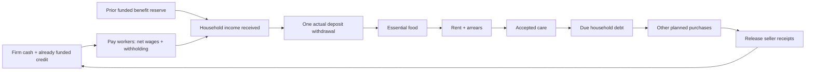

# Income first, then household payments — shared contract PS3.1

**Status: design closure complete for the proposed PS3.1 pilot.** Fable rechecked all ten findings and the orchestrator additions; no blocking ambiguity remained. The coordinator source-checked and resolved its final nonblocking startup-fallback wording below. No implementation, simulation or performance result is claimed. This closes the C01 payment-order issue that the previous cross-role round left conditional. Ayman accepted the broader direction, challenged that deferral, and asked why households do not receive income before paying bills. The proposal now pays actual ordinary wages and funded baseline benefits before the payment window. Reviewers are development agents; no LLM is added to a simulation tick.

The source is the preserved working tree over `4f693890b5f133c2c6c1dcbec9b1ec91ced97b46`. Current code deducts firm payroll at phase 5 but credits household wages at phase 10, after the current goods/rent/care/debt sequence. It also awards goods before the household pays. PS3 replaces both splits. Phase numbers below identify proposed integration points, not current implemented behavior.

There is no unique economic starting actor: opening stocks finance the first modeled week, and prior receipts finance later payroll/production. The explicit within-week convention gives households paid income before bills. It does not advance future sales, guarantee every wage/benefit, or make this priority universal human behavior. Existing traits, job choices, supplier awareness, inventories, debts and resources still distinguish households and firms.

## 1. Single timeline and owner

| Boundary | Owner and exact action |
|---|---|
| Fiscal close: end of 16 | After all dividend/bonus payouts and before household ledger finalization, Government reconciles actual outlays/payables/restrictions, funds next baseline benefits B, then optional care/rent A from remaining cash. No forecast receipts. |
| Entry, planning, labor | Existing request/plan cadence and matched labor remain. Plans are desired quantities, not accepted purchases. Actually disbursed phase-2a consumption credit is unrestricted household cash. |
| 5: production | Firm records actual output and earned ordinary wage cost using the synchronized employee roster and actual wage records. Create payroll dues; bypass the old full wage cash debit. Nonwage costs retain their actual payer. |
| 5a: income | Economy settles ordinary payroll once, withholding once, old wage claims and the funded late-CEO hold under §2. Government pays actual baseline benefits from B. Household cash now includes only actual net receipts. |
| 5b: access savings | Economy/Bank performs one combined request per household, using signed cash, no more than 90% of opening deposits and actual bank release. No rent/care second withdrawal. |
| 6a: essential Food | Goods owner buys planned Food up to unmet minimum need from one shared price/supply book, committing actual cash and quantity together. |
| 6.5: housing | Housing pays current weekly contract rent then old rent arrears, applies any distinct funded relief, updates notice/tenancy once. New entrants need full first rent. |
| 6.6/6.6b: housing operations | Repairs, provider expansion and provider mortgage servicing retain their separate cash/claims. Bank receipts here cannot reopen household deposit access. |
| 6.8: care | Care checks qualified slot, accepted quote and full payment. One completed visit creates one funded payable; denial creates no visit/loan/sale. |
| 6.9: household debt | Bank/claim owner actually collects registered household dues pro rata from residual cash, crediting the actual funder now. No new same-tick installment or later catch-up. |
| 6.95: remaining goods | Goods owner uses original planned quantities minus accepted first-pass quantities, remaining cash/subsidy/stock, and the same prices. |
| Market close before 7 | Combine paid goods/care lines; update current Services utilization once and consider future capacity. Move misc household distribution here from 6.7; its recipients cannot reopen a payment stage. |
| 7/9: seller taxes/receipts | Tax snapshots use combined funded sales and once-only direct paid-rent receipts. At 9 release goods/care clearing cash to firms once, with no second stock deduction or direct-rent credit. Firm registered loans remain 9.5. |
| 10/11 and later | Keep the separate direct firm→government loan collector at 10, after registered firm9.5 and before exits/dividends; it debits actual firm cash and credits treasury once, never collects a claim already registered at 9.5. Household consumes/observes receipts, receives the funded late CEO hold, but does not repeat wages/benefits/purchases/taxes. Government recognizes already paid transfers/withholding, releases wage-tax restriction at 11 and settles other tax cash once. Other late income remains next-window liquidity. |

## 2. Payroll, benefits and starting liquidity

**One named payroll book.** Use one write-through contract-wage owner: every existing matched wage, continuing-worker raise, phase-9 cut and healthcare reset commits the same current contract wage to `firm.actual_wages[worker_id]` and `household.wage`. The phase-4 roster sync then reads consistent mirrors; preserve employer links and matching rules. Freeze the post-labor employee roster and each `actual_wages` amount at phase 5; do not later reconstruct ordinary pay from `household.wage`, which can disagree or change at phase 9. Phase-5/5a records keep that tick's frozen gross due; later phase-9 changes update both contract-wage mirrors for the next tick, never the frozen paid/due record. A write-back only at 5a would still let the next roster sync erase phase-9 cuts, so it is insufficient. Full earned wages enter production costs once. At 5a use positive actual firm cash, including only working capital already disbursed before production: current ordinary dues first pro rata by worker; old ordinary wage arrears second pro rata by outstanding worker claim; funded CEO hold third. Stable worker/claim ID resolves numerical remainders. Keep float model currency with absolute money tolerance 1e-6; allocate arithmetic remainder in stable ID order without overpaying a due or creating cash. Claims at/below tolerance follow the same explicit settlement/write-off convention across cash, mirrors and telemetry; this is not a new cent-rounding tax rule. No same-tick sale payable is firm cash before 9.

One actual ordinary gross payment splits into household net cash plus wage withholding. Its unpaid part becomes a mirrored worker receivable/firm payable, never spendable cash. The Economy payroll owner retries carried wage claims at the next 5a after current ordinary dues. Paying an old claim is cash settlement, not another wage expense. Employment departure does not erase a named former worker's claim. **Exit-recovery cash and tax clock:** any positive gross worker recovery at phase 12 moves from the exiting firm to a named, protected Economy worker-recovery cash hold. Discharge that part of the original claim, preserve an equal funded claim against the hold, and write off only the uncovered original balance before lender write-off/removal. At the next 5a, release the hold through the same population-wide ordinary-gross/withholding/net-income book (even if the worker is unemployed or the firm no longer exists). There is no second firm debit, no new wage expense and no late phase-12 wage-tax recalculation. This hold is a persistent funded claim distinct from goods/CEO holds; count its cash once in totals and never lend, distribute or appropriate it. It intentionally waits until the next modeled payday. At 5a, funded recovery pays from its hold independently of current-employer payroll capacity. At firm exit, snapshot the named worker claims and recover cash **before** the existing loan-write-off/removal path; setting `household.wage=0` on layoff does not erase a claim. This is a proposed new recovery mechanism. With the current default negative-cash/zero-streak exit triggers, there will usually be little or no positive cash to recover; that is a source-grounded expectation, not a measured recovery rate. Positive available cash pays recorded worker claims before ordinary loan/owner residual; distribute equally ranked worker claims pro rata and write off only the unrecovered matched liability, with no cash created. Outstanding worker payables remain a senior liability in credit leverage/runway calculations; never charge their whole stock as a recurring weekly expense. In this bounded pilot, **worker arrears above the money tolerance block discretionary new capital/entry credit** until cleared. A separately requested, actually funded and reserve-gated pre-5a working-capital loan may cover current payroll and a named arrears cure; include the new bank installment in debt service and the one-time cure only once. There is no new phase-9 worker sweep: existing firm loan service at 9.5 may receive released sales while old wages await next 5a. Wage arrears alone do not create an automatic bank default. This tradeoff is explicit. No additional strike/layoff behavior is introduced here: scheduled labor can have unpaid accrued wages, whose duration, worker hardship and firm exit must be reported as a limitation. **Employed but unpaid workers remain baseline-benefit-ineligible**; report their count, current wage shortfall, carried claim and consecutive unpaid/part-paid duration each tick. No new arrears-triggered exit is selected. Existing baseline-firm exit protection can prolong this condition, which must remain visible.

**Progressive withholding is preserved.** Use two bounded payroll passes: first reserve each employer's funded gross allocation and aggregate current/old paid wages per household across all firms, then calculate the population-wide tax once and atomically post the reserved employer debits, household net receipts and restricted withholding. Do not tax/pay sequentially per firm using a partial population. Compute the existing wage-percentile/scaler rule once from total ordinary gross actually paid to each household (including paid old wage claims and zeros); use all household IDs in the percentile population. Withholding and net receipt commit with that same employer debit. The tax amount is treasury cash restricted from other spending until 11; at 7 reuse its record, at 10 observe it, at 11 release the restriction rather than credit treasury again. A paid-gross/tax record is distinct from CEO-inclusive income. Reject invalid/nonfinite tax configurations that imply a negative net payment; do not silently clip or rewrite brackets.

**Late CEO income.** After current and old ordinary payroll, fund no more than the existing `3 × median current worker wage` from positive remaining firm cash, using the same frozen roster. Firm cash moves once to a separately tagged Economy CEO cash hold/payable. Phase 7 deducts only the funded CEO expense; phase 10 releases that hold once to the named CEO. No employee roster means zero. CEO payment remains outside ordinary withholding as in current source; changing its tax treatment is another policy. At phase 16, any worker wage arrears above the money tolerance blocks both dividends and discretionary healthcare-worker bonuses until those claims are cleared. With no arrears, retain the existing payout rules and buffers. This stricter pilot gate prevents owner/bonus payout while ordinary wages remain unpaid; it does not add a phase-9 worker sweep or change the disclosed 9.5 loan priority. This hold is distinct from goods clearing (goods clears at 9, CEO at 10), participates in cash totals, and cannot fund loans/investment while held.

**Baseline benefits.** At prior close let F be positive treasury cash after actual outlays and nonoverlapping carried restrictions/payables. Reserve `B=min(announced baseline benefit × then-unemployed count, F)`. At 5a after labor match, pay each actually unemployed household up to that baseline amount; if B is short, scale all eligible amounts pro rata with stable ID remainder. New unemployment can therefore receive a partial benefit; fewer eligible households leave unused B. Unpaid benefit is an explicit denied amount, not a treasury debt. Gap-filling is off in this cash-limited pilot. Release unused B only at the next fiscal close. The fiscal close is **after phase-16 dividends/bonuses and before household ledger finalization**. Release unused B/A/G, reconcile remaining named payables/restrictions and all actual outlays, then compute F; count unemployed by `employer_id is None` after that tick's exits/entry. Record B before A for the next tick. Tick zero applies the same appropriation at first step entry, before post-warmup stimulus, against initialized cash/counts; no prior tax receipt means optional tax-linked A starts at zero.

**Comparison boundary.** Current firms/treasury can implicitly run negative cash; PS3's finite funded payroll, named wage claims and cash-limited benefits are an explicit baseline change. Compare early versus late income only after giving both arms those same funding/eligibility/accounting rules. In a timing-only comparator, the same funded net wage/benefit is held for release at 10; resources/claims cannot be spent elsewhere during that hold. Report cash shortages, unpaid wages and denied benefits separately from income timing. Current recurring deficit finance is not being equated with an implemented bond/central-bank system.

## 3. One deposit pass and two goods passes

At 5b compute each household's desired gross goods cost, current rent plus rent arrears, contract-derived household dues and an applicable one-visit quote, less **signed** current cash. Ask for the positive shortfall, capped at 90% of opening deposits. Bank debits actual reserves and deposit liability; household deposit falls and cash rises by exactly its returned amount. Negative stored cash is not clamped away; only `max(0,cash)` can be spent. Unused withdrawn cash stays with the household. Stable household order remains; early speculative withdrawals can ration later households even if a visit or purchase fails.

For an unhoused applicant, one O(F) vacancy pass supplies the cheapest currently available prior-posted weekly ask as a nonbinding quote; it reserves no unit. If no vacancy exists at 5b but one opens at 6.5, the applicant uses existing cash only. At matching, retain the existing candidate-order/income gate but actual positive cash replaces unwithdrawn deposits as payment capacity. For patient-pay care, quote at most one newly requested **or already queued** due visit with known qualified capacity; covered/no-self-pay care adds **zero** to the household's withdrawal request. A quote is not a slot, grant or claim.

Build one tick-local goods price/supply book: stored goods use actual opening stock after production; Services uses current `last_units_produced` throughput. At book build, keep the current Services posted-price write to its effective floor **once**, then freeze effective seller prices and keep existing firm-ID/good-name target routing. Copy cached desired plans; never overwrite cached desire with last tick's accepted quantities. At 6a traverse original Food targets until `min(planned Food, max(0,min_food_per_tick−usable opening Food))` is actually bought. A failed target consumes no need or cash; other already planned targets may be tried. At 6.95 use original desired minus **accepted** first-pass units, including unfilled Food. No new supplier search or replanning. After both passes, unmet equals original desire minus combined accepted quantity once. No two fresh calls that reset available supply.

Each accepted goods line atomically debits household/public cash to Economy goods/care clearing, creates one named firm payable, decrements seller stock/throughput, and adds stored goods once to buyer inventory. Services is not stored. At 9 the exact order is **Economy clearing cash credit → assessed tax debit → zero-cash streak update → sales/profit metrics → existing wage adjustment/price-wage commits**. The final wage commits write both contract mirrors and leave frozen current payroll unchanged. **Economy is the only cash-release owner**: consume each clearing payable and credit firm cash once. Adapt `apply_sales_and_profit` in this arm to book combined revenue/cost/metrics and deduct assessed taxes once, while bypassing both its old revenue cash credit and inventory subtraction; phase 10 consumes/spoils inventory and observes receipts without another purchase addition/debit or affordability shrink. Failures commit nothing. Clearing cash equals outstanding funded goods/care payables and reaches zero after 9. Direct rent bypasses clearing.

At close, Services upgrades read explicit **current combined committed units**, current produced capacity and final unmet demand; advance the five-tick decision windows once. Underwriting still uses prior settled revenue plus actual reserves and existing gates, not held current sales. An upgrade changes future supply. Earlier6.9 repayments can improve later upgrade funding; report that timing effect. Phase 7 price-ceiling tax uses settled line prices; phase 15 sales statistics use combined quantities/revenue, while existing post-phase 9 `last_tick_prices` remains a posted-price planning statistic and realized transaction prices are separately named. **Measurement boundary:** retain a separately tagged committed goods/care sales proxy for the current `gdp_this_tick` series; this is not complete national-accounts GDP and excludes direct Housing receipts. The phase-15 proxy and fiscal/subsidy denominator readers must use that same **measurement scope**, not newly broadened firm operating receipts; their time/fallback rules are distinct and explicit. For fiscal-pressure fallback use current goods/care receipts, then prior comparable proxy/history if positive, then the existing floor of 1. Phase-15 reported current sales itself remains zero if no sales occurred; a denominator fallback is not reported output. The separate trailing G fallback is defined in §5. Publish current rent paid, old arrears collected, relief payer share and valid occupied units separately; old arrears are debt recovery, not this week's new housing output. This avoids a tax/firm-income repair silently changing what the macro denominator measures. Contract wages remain job-price inputs; report actual ordinary gross/net received and unpaid wages separately from them using the settled payroll book.

## 4. Housing, care and household claims

**Rent.** Stored `monthly_rent` is weekly contract due despite its name. Spend remaining positive cash on current rent then all collectible old arrears; pair remaining tenant liability/provider receivable. First end-of-settlement arrears gives notice, followed by two further weekly settlement opportunities. Full cure by actual tenant/relief cash cancels notice. Otherwise terminate after the second opportunity, release unit and both roster links once, exclude immediate same-tick rematch, and write off both arrears mirrors without cash. Valid notice-period tenancy still provides shelter; provider exit can end it. Replace the old pre-payment liquidity eviction and nested withdrawal. New tenant admission requires full actual first rent after Food. Asking-price/renewal/expansion policy remains a separate proposal. Rent/relief already credited to landlord enters `paid_rent_for_tax` once at 7; supply missing housing/property fields without crediting rent again at 9. Provider mortgage misses remain distinct from tenant arrears. **Rent signal ownership:** paid current rent, collected old arrears and relief-funded payment are tagged once by claim; relief is a payer share, never additional revenue on top of that same rent payment. Include total paid rent in the Housing firm's phase-7 cash-income tax basis and phase-9 operating-receipt/profit/underwriting record, with zero second cash credit. Do not turn rent currency or old arrears into generic goods units. Shelter delivery/occupancy is a separate count for every valid tenancy, including notice-period tenancies.

**Care.** Existing entry request timing remains before 5a income; paid income can fund an already requested visit but does not fabricate a same-tick request. Count only employed qualified doctors/residents, with fractional capacity carryover and zero contribution from missing/unqualified IDs. Keep existing provider assignment/queue priority/rotation, one due episode and at most one basic visit per household/tick. No physical slot means physical waiting, no payment. At an offered slot freeze quote and require full funding/consent. Funding denial consumes no completed slot, leaves the episode due outside the physical queue for next-tick retry and creates no new illness or surge-pricing arrival. No repeat healing/charge at 10.

In the clean **patient-pay** arm, existing request at the known quote is consent; a higher service-time quote defers the visit. Residual positive cash plus, if necessary, a fully approved bank-funded registered medical loan pays the visit. Require no active medical loan, existing score/reserve gate and full shortfall approval. Principal goes directly into that accepted visit's clearing transaction; failed delivery/approval creates neither loan nor visit. First installment is next tick or later. Treasury rescue and unfunded no-bank fallback are off. In the **covered** arm the full posted price comes from separate care cash; no automatic self-pay/loan conversion on exhaustion. In both clean comparison arms, same-visit configured/generic healthcare cost share is off. A no-bank cash-only household is valid; starting states with unregistered legacy medical claims are rejected rather than letting phase 10 bypass this collector.

**Household debt.** One indexed due by unique claim ID/version is computed at 5b and consumed at 6.9; v2 interest accrues once per tick, never once per reader. Legacy v1 uses its frozen scheduled fee/remaining convention; v2 uses due interest and outstanding principal, capped final installment, no interest-on-interest. New contracts first fall due no earlier than next tick; existing live v1 due dates are not reset. For total due D and residual cash C, pay each `due_i × min(1,max(0,C)/D)` (zero if D=0), stable claim-ID remainder, never beyond remaining due. Record each underpaid claim's miss; a token partial payment cannot reset it. Credit the actual bank/treasury funder once and update mirrors by ID. V2 payments apply interest then principal; legacy accounting keeps its frozen fee allocation. Paid/zero-due claims get no debit. Firm registered claims remain9.5 and mortgages6.6b. No8.5/10 catch-up collection; existing versioned default/discharge rules remain separate from this cash event.

## 5. Public funds and bounded state

Treasury's recorded cash is **total**, with named restrictions; free cash is total less restrictions and only payable coverage not already included in them. At prior close B is first. Optional `A=min(0.10 × actual wage/profit/price-ceiling/property tax receipts, remaining positive free cash)` funds one selected care-only/rent-only destination versus reserve; a mixed profile explicitly splits A 50/50. Ten percent and the split are uncalibrated model assumptions. The A receipt base is that completed tick's released wage withholding plus actually collected profit, price-ceiling and property tax; **exclude phase-11.6 investment tax** from the A fraction while retaining its actual cash and ordinary fiscal reporting. Relief and treasury emergency credit are off by default; a treasury-credit extension needs a distinct funder/envelope and is not silently enabled. Prior restrictions cannot be raided for new B. Wage withholding received at 5a remains restricted until 11, so it cannot fund the current window.

Every existing treasury debit must use this same free-cash guard or consume its named restriction: sector subsidy/refund, public works, post-warmup stimulus, emergency credit, capital support, **new-firm seed cash (`economy.py:4743`) and treasury-funded firm loans through `_issue_firm_loan` (including phase-1 working-capital bridges)**, infrastructure/technology/social/bond spending and miscellaneous/baseline routing. An old helper reading raw treasury cash cannot raid B/A/G or withholding. Unfunded ordinary outlays are reduced or denied with their amount logged; a separately authorized financing instrument would require an actual named lender/claim and is off in this pilot. Preserve signed opening deficits without treating them as available cash. This common funding rule applies to both income-timing arms and is a declared change from permissive legacy debit paths. **Trailing G input:** use the most recent positive completed goods/care proxy in comparable history, then last committed goods/care revenue if positive, then `max(1, 25 × household count)` as in the existing `trailing_gdp` helper; no other fallback. This differs intentionally from the fiscal-pressure ratio's floor-of-1 fallback and is not actual measured production. At 5b reserve generic-sector subsidy G once using the existing cap coefficients: minimum of 5% × `max(trailing goods/care sales proxy, 1)`, 2% positive **unencumbered** treasury cash, and that free cash. Exclude B/A, withholding and other promises. For locked p>0, share s∈[0,1], household cash H and remaining G, buy the greatest planned/available continuous q with `p*q − min(s*p*q,G) <= H`. Public pays `min(s*p*q,G)`, household pays the remainder, seller receives their full sum once. If p=0, accepted available units transfer with zero cash/payable. Indivisible visits instead need full price. When G exhausts, shrink the actual sale, not only the later household receipt. No public share is recorded before commitment. Unused restrictions release only at the next declared fiscal close and never add cash again.

Relief eligibility: active tenancy at intervention, frozen pre-policy `max(0,cash)+0.9*deposit` below one weekly contract rent, and verified current shortfall. Stable household-ID order; direct landlord grant capped at one weekly rent per tenant/tick and remaining envelope, current shortfall before old arrears, matching claim reduction once. This frozen statistic is eligibility, not available bank cash. Care eligibility/queue/full-price rules are §4. Earmarks can leave resources idle in one program while another denies payment; that tradeoff is visible.

Persistent state is limited to named wage/loan/rent claims and funded exit-worker recovery holds, existing episode/notice state and fiscal restrictions. Tick-local state includes one due index, immutable-plan copies, one price/supply book, committed lines/payables, paid-income/tax records and separately tagged late-income holds. One owner per write; no per-household LLM, network, all-pairs search or new global replan. Preflight unique claims, valid funders, finite amounts and supported contract versions; reject inconsistent starting mirrors. Existing household `to_dict` is not a complete save/restore format. This proposal claims no new mid-run restore capability: rollback means re-initialize under the same recorded source/config, initializer and global RNG state discipline, shocks, warmup and policy-command trace (K07), then rerun the selected arm. A future resume/export feature must version all persistent claims and restrict snapshots to completed ticks after the cash holds release. Enable this as a named new-scenario contract, not a mid-tick switch; do not claim a current complete pre-arm save exists. Existing normal/performance cadence remains. Added O(H+F+L+planned lines+active claims) work and bounded cash/claim records count against the shared cumulative 5% median/p95 runtime target and memory checks, which have **not** been measured here.

## 6. Paper cases and implementation gates

These are illustrative arithmetic checks, not executed simulations or economic predictions.

| Case | Required result |
|---|---|
| Firm has60, current wages due40/40, no old claims | Pay gross30/30, split each into net+withholding; firm0; two worker claims10/10. Costs80 once. No CEO hold or invented20 cash. |
| Household starts0 and actually receives net100 before 5b; Food20, rent50, debt20, other10 | All paid from 100; no wage advance or second phase 10 income. With held-late income comparator those funds are unavailable this window. |
| Cash120; Food20, rent50+arrears10, care15, debt20, other5 | Household0; landlord60, lender20, goods/care clearing40 then seller credit40 at 9. |
| Cash65; Food20, rent50; care/debt requested | Rent45, arrears5; zero patient cash afterward. Only separately approved medical/public funds can buy a visit. |
| Food unavailable; cash65, rent50, care5, debt10 | Food0, then50/5/10. Food unmet persists; no phantom sale or reservation. |
| Cash5, deposits100, requested draw90, bank releases10 | Cash15, deposits90, bank reserves/liability each−10; only15 is available. |
| Food demand8 units at 5; cash20, share50%, G5 | Deliver5 units/value25; household20+government5. Three unmet units counted once. |
| Debt dues30/10, residual20 | Payments15/5, exact actual funder credits, both underpaid claims record miss. |
| Patient cash0, accepted visit25, bank approves25 | One bank-funded clearing line, one25 principal claim, one visit; first due next tick, no discretionary cash. |
| Covered care price25, care envelope20 | No partial visit, patient charge or automatic loan; retain due episode, release any failed care-only restriction. |
| B100, baseline50, three actually unemployed | Pro-rata payments totaling100 and denied entitlements50; no negative treasury or phantom debt. |
| Firm exit has10 positive cash and30 worker claims, no senior competing worker claim | Hold10 funded gross for those workers pro rata, discharge10 original claim and write off20 once; next5a hold10 splits into worker net+withholding, no firm debit or new wage expense. |
| Starting household cash−10, no paid income/draw | Spendable0, stored−10; no clamped forgiveness. A real later payment first improves the signed balance. |

Later implementation must reconcile actual employer debit with paid gross/net/withholding; paid versus accrued wages and exit recoveries; every treasury restriction; bank reserves/deposits; stock/throughput; goods/care cash/payables; tax bases; receipts and metrics. Force zero/partial funding, no stock/qualified slot, new/old queued care, new tenancy, subsidy exhaustion, stale cached plans, final loan payoff, provider exit and late income. Verify combined Services utilization once, no double stock/debit/heal, and identical source/initialization/shocks/mode/cache cadence across comparisons. Measure the cumulative performance budget after integration. None of those tests ran in this proposal round.

## 7. Source and review evidence

Source anchors: [current tick ordering](../../../backend/economy.py#L1780); [firm actual payroll and cash debit](../../../backend/agents.py#L5263); [independent later household income](../../../backend/economy.py#L1187); [wage tax and benefit planners](../../../backend/agents.py#L6802); [tax snapshots](../../../backend/economy.py#L4328); [goods allocation](../../../backend/economy.py#L3771); [late purchase settlement](../../../backend/economy.py#L1230); [firm sale credit/inventory owner](../../../backend/agents.py#L5329); [rent](../../../backend/economy.py#L5800); [care](../../../backend/economy.py#L6243); [loan collector](../../../backend/economy.py#L6511); [actual-funder repayment](../../../backend/agents.py#L6030). The proposed timing, caps and priority are modeling choices, not claims that those source paths already implement them. Original economic citations remain in the [proposal pack](../agent_round_01/README.md); they do not empirically validate this exact weekly order.

The focused role replies are [Household](PAYMENT_REVIEW_HOUSEHOLD.md), [Firm](PAYMENT_REVIEW_FIRM.md), [Bank](PAYMENT_REVIEW_BANK.md), [Housing](PAYMENT_REVIEW_HOUSING.md), [Healthcare](PAYMENT_REVIEW_HEALTHCARE.md), and [Government](PAYMENT_REVIEW_GOVERNMENT.md). Their PS1/PS2 history is preserved; final PS3 addenda control income-first conditions. Actual role positions and source-audit dispositions are recorded below and in the linked correction record.

### Actual role positions before Fable

| Role | Received decision and how its conditions are fulfilled |
|---|---|
| Household | PS3 addendum accepts actual 5a income, current wages→arrears→CEO, one5b draw, unchanged desired-plan cadence, and finite benefits common to both timing arms; §§1–3. Its PS1 late-wage paragraphs are historical. |
| Firm | PS3 addendum agrees payroll ordering/claims with Household through PAY3-FIRM-HH-01 / PAY3-HH-FIRM-01; shared sale book and current Services signal in §3. Bank later answered its exact relayed PAY3-FIRM-BANK-01 as PAY3-BANK-FIRM-01; final conservative credit gate is recorded in §2. |
| Bank | PS3 addendum accepts paid income before actual 6.9 collection, worker-priority exit and versioned due/funder mechanics. It requires wage liabilities in underwriting and warns that existing9.5 debt can be paid while wage arrears remain; §2 states both. Its addressed replies are actual responses to the coordinator's exact file relay, not claimed live exchanges. |
| Housing | Actual Care/Government exchanges accept funded pre-window income, current-rent-first notice/relief, one draw and direct paid-rent tax; §§2–5 fulfill those conditions. Adds bounded5b vacancy quote. It did not independently author the final payroll priority. |
| Healthcare | Actual Housing/Government exchanges accept funded income, qualified/full-funded visit and no covered-to-debt conversion; §4. Corrected5b patient-pay new/old queued quote versus zero covered quote; §3. It did not independently author the payroll priority. |
| Government | Final PS3 acknowledgment reads the compiled contract and accepts current wages→arrears→CEO, withholding on actual gross including paid old claims, B-before-A and once-only tax/rent/CEO accounting; §§2/4/5. |

Technical conditions are mapped to named rules, not inferred as unanimous policy preference. Phase/priority/cap assumptions are selected here by the coordinator to make a reviewable pilot. Missing live messages caused by the four-agent limit were relayed verbatim and labeled in the role files. See the verbatim [Fable source audit](../../reviews/ECONOMIC_PAYMENT_SEQUENCE_FABLE_AUDIT.md) and [PSF01–PSF10 coordinator dispositions](PAYMENT_AUDIT_DISPOSITIONS.md). Later correction acknowledgments are recorded there.

### Independent source-interface check incorporated before Fable

A Sol/high read-only check identified three precise seams: population-wide gross-pay aggregation before withholding (`GovernmentAgent.plan_taxes`), the dual stock/cash mutations in `FirmAgent.apply_sales_and_profit`, and old treasury spenders that read raw cash. Sections2/3/5 now select the two-pass payroll calculation, Economy-only seller cash release, and a shared free-cash guard across old debit paths. Explicitly bypass the old wage/CEO/transfer/tax cash mutations in `_batch_apply_household_updates`; the phase 8 transfer planner is replaced by B's paid record; `apply_fiscal_results` must observe previously posted wage tax and paid transfers without repeating either. Current other tax debits/receipts still require their once-only declared settlement records. These were source/design checks, not tests.

Firm's final relay acknowledgment and Bank's PAY3-BANK-FINAL-01 both accept §2's conservative outstanding-wage credit gate. There is no remaining pending role answer for that rule.

### Orchestrator's independent audit

The [orchestrator audit](ORCHESTRATOR_PAYMENT_AUDIT.md) records source checks and decisions beyond relaying role/Fable answers: strengthening the wage-mirror fix; giving exit recoveries an actual tax/payment clock; separating landlord cash receipts from goods units and the limited GDP proxy; distinguishing contract wages from actual pay; and preserving the existing subsidy denominator floor. These are proposed source-interface rules, not implemented repairs or measured outcomes.

### Final review result

[Fable's bounded recheck](../../reviews/ECONOMIC_PAYMENT_SEQUENCE_FABLE_RECHECK.md) closed PSF01–PSF10 and verified the orchestrator's rent/measurement/floor additions against source. It left one nonblocking startup-fallback wording issue; §5 now explicitly preserves the `trailing_gdp` population fallback, separately from the fiscal-pressure helper. The [disposition record](PAYMENT_AUDIT_DISPOSITIONS.md) identifies this coordinator clarification made after that recheck and preserves the reviewed snapshots. This is a complete proposed payment contract, not proof of implemented behavior, runtime compliance or economic effectiveness.
