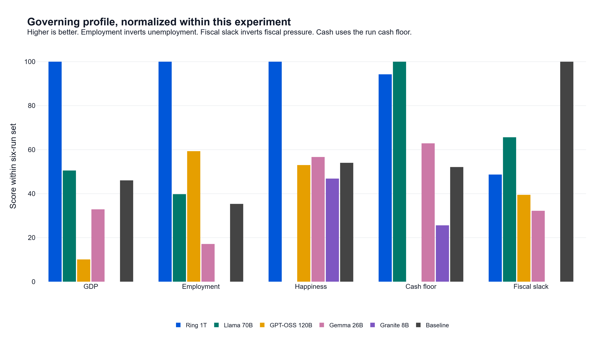
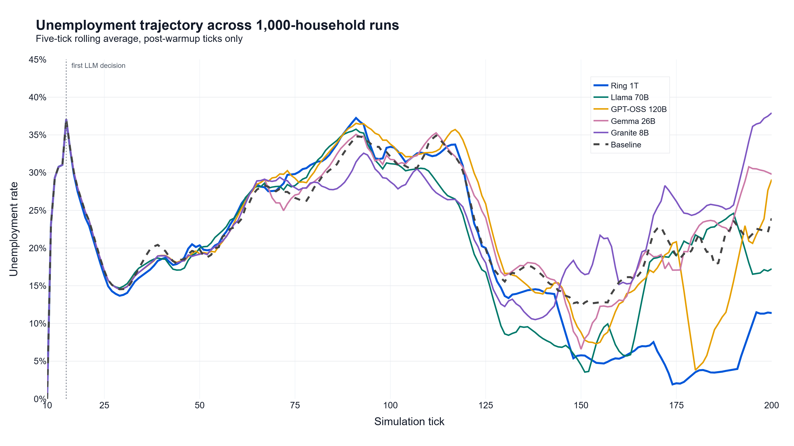
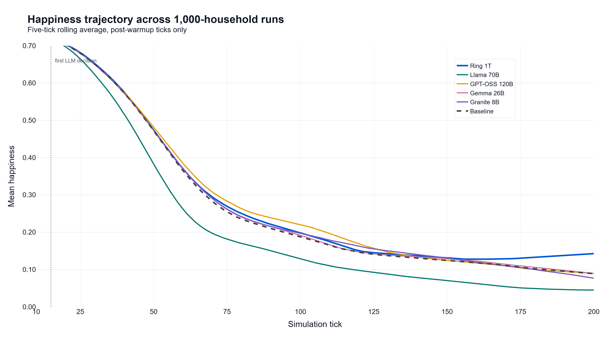

# Can an AI Run an Economy?

EcoSim is a general policy sandbox. This experiment asks a narrow question: if an LLM gets the policy controls of a simulated government, can it make coherent decisions and keep the economy running?

For this run, I scaled the experiment to **1,000 households** and compared five LLMs, from an 8B local model to a 1T OpenRouter model, against a fixed rule-based baseline. Every run used the same seed, same simulation length, same government action schema, and same decision schedule. The only thing that changed was the policymaker.

**Short version:** inside this sandbox, yes. The models read the state, chose valid policies, and produced different measurable outcomes. But "good governance" is not one number. Ring 1T had the strongest overall run. Llama 70B protected the treasury. GPT-OSS 120B reasoned cleanly but nearly bankrupted the government. Granite 8B got stuck in a narrow bailout loop.

The interesting part is not just who won, but that the LLMs had recognizable governing styles, and those styles showed up in GDP, unemployment, government cash, and household wellbeing.

---

## What the simulation does

EcoSim is a turn-based economic simulation. Each tick, three major groups act:

**Households** look for work, earn wages or unemployment benefits, pay taxes, and spend on food, housing, healthcare, and services. Health and happiness move with income, prices, employment, and policy.

**Firms** hire workers, set wages and prices, produce goods, sell into markets, pay taxes, and can become distressed. The main sectors are food, housing, services, and healthcare.

**The government** collects taxes and chooses policy. In the baseline run, that policy is fixed and rule-based. In the LLM runs, a model reads a compact economic report every 26 ticks and chooses from a constrained policy schema.

The 1,000-household setup also scales the firm side and healthcare staffing with the larger population.

---

## Experiment setup

Every run in the main table uses:

- `1,000` households
- seed `42`
- `10` warmup ticks
- `200` simulation ticks
- first LLM decision at tick `15`
- one LLM decision every `26` ticks after that
- temperature `0.4`, top-p `0.8`, max tokens `2000` for the LLM runs

26 ticks is twice per simulated year, which keeps the LLM call budget bounded while giving the government two policy windows annually.

| Run | Government | Provider |
|---|---|---|
| Baseline | Fixed rule-based government | No LLM |
| 8B | Granite 4.1 8B | Local LM Studio |
| 26B | Gemma 4 26B | Local LM Studio |
| 70B | Llama 3.3 70B | Groq |
| 120B | GPT-OSS 120B | Groq |
| 1T | Ring 2.6 1T | OpenRouter |

The hosted models ran through Groq and OpenRouter cloud APIs, including free API access. I treat those services as providers for the policy comparison, not as economic outcomes.

**Baseline.** The no-LLM baseline used a fixed conservative policy: 15% wage tax, 20% profit tax, 10% investment tax, neutral benefits at $30, medium social spending, and no active public works, subsidies, price or rent stabilization, infrastructure spending, technology spending, or bailouts. It was not an optimized controller. The moving parts were the simulation's normal budget accounting and transfer sizing.

---

## LLM harness

The government runner is built like a production agent harness, not a loose prompt script.

- **Structured I/O.** Every model returns JSON policy actions validated against `policy_schema.py`.
- **Constrained action space.** Models can only use known fiscal and market levers. They cannot invent a policy or set impossible values.
- **Retry and repair.** Blank, malformed, or truncated provider responses are retried or repaired before anything touches simulation state.
- **Provider-agnostic runner.** The same harness drives OpenRouter, Groq, and local LM Studio models. Swapping models is a config change.
- **Outcome telemetry.** Economic results are logged separately from behavior metrics like accepted decision rate and evidence match rate.
- **Per-decision logs.** Each cycle records the prompt context, raw model plan, accepted changes, rejected changes, current policy, and state metrics.

That separation matters. A model can cite the economy correctly and still pick bad policy. A model can also make a valid policy move for the wrong stated reason. The harness keeps those questions separate.

---

## What the model sees

Each LLM decision has two parts. The system prompt sets the model's role, objective, output shape, one-step policy limits, and policy schema. The user prompt then gives the compact economic report: observed macro data, fiscal context, labor definitions, sector diagnostics, affordability diagnostics, current policy, recent policy memory, allowed next changes, and blocked changes.

```text
ROLE: You are the AI Central Government of a simulated economy.
PHILOSOPHY: {philosophy_label}
OBJECTIVE: Maximize GDP and mean happiness while keeping unemployment low and maintaining a sustainable government cash balance.

CRITICAL SIMULATION RULES:
1. ONE-STEP LIMIT: You may only change a qualitative ordered lever by one step per decision cycle.
...
7. OUTPUT: Return only valid JSON. Do not use markdown, comments, <think> tags, or text outside the JSON object.

POLICY SCHEMA:
{render_policy_schema_for_prompt()}
...
[ALLOWED NEXT POLICY CHANGES]
Validator-accepted next raw changes. For grouped instruments, output a complete combination if changing that instrument.
```

Valid actions are communicated twice: first through the rendered policy schema from `backend/policy_schema.py`, then through a live allowed and blocked action mask in the user prompt. The provider call asks for a JSON object where supported, but the real safety line is local validation before any policy touches the simulation.

---

## What the government can control

The LLM sees a compact economic report and chooses from a fixed policy schema. Every proposed change is validated before it is applied. The action space covers 15 fiscal and market levers across taxation, social spending, sector subsidies, price and rent stabilization, and bailouts.

<details>
<summary>Full lever reference (15 levers)</summary>

| Lever | What it does |
|---|---|
| Wage tax rate | Taxes household wages. Raises revenue, reduces take-home pay. |
| Profit tax rate | Taxes firm profits. Raises revenue, reduces reinvestment. |
| Investment tax rate | Taxes firm investment. Raises revenue, slows expansion. |
| Benefit level | Unemployment benefit size. Supports demand, costs treasury. |
| Public works | Government-backed jobs. Cuts unemployment, costs cash. |
| Minimum wage | Wage floor pressure. Helps workers, can stress weak firms. |
| Sector subsidy target | Which sector receives subsidies. |
| Sector subsidy level | Subsidy strength. |
| Price stabilization target | Which sector to monitor or control. |
| Price stabilization level | Monitor, soft, or strict price controls. |
| Rent stabilization | Caps rent increases. Helps affordability, reduces housing revenue. |
| Infrastructure spending | Public investment in productivity. Pays off later, costs cash now. |
| Technology spending | Public investment in quality and technical progress. |
| Social spending | Happiness support. Does not directly improve health. |
| Bailout policy, target, and budget | Emergency support for distressed firms. |

</details>

---

## Results

Higher is better for GDP, happiness, health, and government cash. Lower is better for unemployment. "Last 26" is the trailing average at the end of the run, which shows the final operating state better than the lifetime mean. Fiscal pressure is the rolling deficit-to-GDP signal, an EMA of per-tick spending minus revenue divided by current GDP.

The table is the source of truth. The charts below reorganize the same run artifacts so the governing styles are easier to see.

| Metric | Baseline | Granite 8B | Gemma 26B | Llama 70B | GPT-OSS 120B | Ring 1T |
|---|---:|---:|---:|---:|---:|---:|
| Final government cash | $19,265 | -$16,885 | $23,876 | $75,197 | $14,306 | $58,844 |
| Minimum government cash | $12,102 | -$16,885 | $23,876 | $64,434 | -$44,878 | $58,163 |
| Average GDP | $46,756 | $46,212 | $47,300 | $48,749 | $45,104 | $51,097 |
| Final GDP | $38,396 | $36,442 | $43,072 | $47,971 | $38,715 | $47,252 |
| Last-26 average GDP | $45,869 | $41,207 | $44,537 | $46,323 | $42,230 | $51,329 |
| Average unemployment | 21.96% | 22.57% | 22.37% | 20.04% | 21.41% | 18.34% |
| Final unemployment | 32.99% | 39.04% | 29.71% | 18.77% | 28.15% | 11.09% |
| Last-26 average unemployment | 21.47% | 29.78% | 25.75% | 20.43% | 15.84% | 6.29% |
| Average happiness | 0.288 | 0.292 | 0.291 | 0.235 | 0.298 | 0.300 |
| Final happiness | 0.088 | 0.074 | 0.088 | 0.045 | 0.089 | 0.144 |
| Last-26 average happiness | 0.096 | 0.089 | 0.098 | 0.047 | 0.095 | 0.137 |
| Final health | 0.762 | 0.759 | 0.762 | 0.758 | 0.760 | 0.763 |
| Final fiscal pressure | 0.005 | 0.061 | 0.043 | 0.024 | 0.039 | 0.033 |
| Accepted decision rate | N/A | 50.0% | 87.5% | 100.0% | 100.0% | 100.0% |
| Evidence match rate | N/A | 65.6% | 56.2% | 86.7% | 94.4% | 82.5% |



This is the direct answer to "what does good even mean?" I score each model from 0 to 100 within this six-run set. GDP and happiness use the last-26 average, employment inverts last-26 unemployment, fiscal slack inverts final fiscal pressure, and cash uses the run cash floor. That last choice matters: GPT-OSS recovered by the final tick, but its mid-run cash floor was the worst in the group.



The five-tick rolling unemployment path shows the clearest separation after warmup. Ring held the cleanest late labor market, Llama stayed steadier than its welfare score suggests, and GPT-OSS, Granite, and the baseline all showed late spikes.



The happiness path makes Llama's trade-off visible. It kept the strongest treasury position and avoided the worst labor-market collapse, but happiness fell faster than the other runs and stayed pinned near the bottom.

---

## Key Results

- **Ring 1T was strongest overall.** It had the best average GDP, best average unemployment, best final unemployment, best final happiness, and a strong cash floor. The profile chart is why I call it balanced rather than just "winner by one metric."
- **Llama 70B was the fiscal hawk.** It ended with the most government cash, but it also produced the lowest final happiness. The happiness trajectory makes that trade-off visible.
- **GPT-OSS 120B was technically clean but financially risky.** It had the best evidence match rate and 100% accepted decisions, but government cash dropped to -$44,878 mid-run. The cash-floor score captures the risk that final cash alone hides.
- **Gemma 26B was steady but reactive.** It kept cash positive and made mostly valid decisions, but unemployment stayed high.
- **Granite 8B got stuck.** It kept increasing food bailout capacity, stopped making new useful changes, ended cash-negative, and had the worst final unemployment.
- **The baseline was useful.** It did not win, but it also did not collapse. That makes the comparison more meaningful.

One important result: at 1,000 households, final happiness was low across the board. The models separated more clearly on unemployment, GDP, and fiscal stability than on household wellbeing. That is a real finding, but the mechanism needs more diagnosis before I read too much into the welfare numbers.

---

## Model behavior

**Ring 2.6 1T.** Ring had the best overall run. It turned public works on early, used food support, lowered minimum wage pressure when the labor market was strained, raised taxes later for stability, and kept social spending high late in the run. It ended with $58,844 in government cash, a minimum cash floor of $58,163, final unemployment of 11.09%, and the best final happiness score in the group at 0.144. That happiness number is still low in absolute terms, but Ring handled the trade-off better than the other models. Its final GDP dip was real but did not change the result. At tick 192, a bankruptcy coincided with unemployment rising from about 4.2% to 12.18% and GDP falling from about $52,171 to $47,521 while public works and high food subsidies stayed active.

**Llama 3.3 70B.** Llama protected the treasury better than anyone. It cut social spending early, raised wage taxes, and later used targeted support for food and services. Final government cash was $75,197, the best in the table. The downside is clear: final happiness fell to 0.045, the worst result. This is the "balanced books, unhappy households" run.

**GPT-OSS 120B.** GPT-OSS made clean, valid decisions and cited the prompt well. It had the highest evidence match rate at 94.4%. Its policy style was growth-oriented: lower profit taxes, infrastructure spending, wage tax changes, food monitoring, and later food subsidies. The problem is cash discipline. It went as low as -$44,878 before recovering to $14,306 by the end. The model looked technically disciplined while still taking the economy too close to the edge. The late unemployment spike did not come from the final tick alone. After unemployment bottomed near 3% around tick 180, two bankruptcy blips and a labor search bottleneck pushed it above 20% by tick 189; GPT-OSS still had public works off, food price monitoring on, and food subsidies active, then cut profit tax to 0 and raised the food subsidy to 25% at tick 197.

**Gemma 4 26B.** Gemma governed like a sector firefighter. It started with food bailouts, moved to all-sector bailouts, raised profit taxes when cash got tighter, monitored healthcare prices, and added food subsidies. It completed the run with positive cash at $23,876, but final unemployment stayed high at 29.71%. One decision at tick 171 came back as nested grouped actions (`group sector_subsidy`, `group bailout`) instead of valid policy keys. The schema rejected those changes and the run continued safely.

**Granite 4.1 8B.** Granite was coherent but narrow. It kept focusing on food bailouts and raised bailout capacity from $5,000 to $10,000 to $25,000 to $50,000. After that, half of the decision cycles produced no new accepted change because the model was repeating policy that was already active. It ended with -$16,885 in government cash, 39.04% final unemployment, and final happiness of 0.074. The smaller model did not fail because it wrote nonsense. It failed because it got stuck on one play.

**Baseline.** The rule-based government matters here. It ended cash-positive at $19,265 and landed near Gemma and GPT-OSS on final happiness, but unemployment finished at 32.99%. It is not an optimized controller, but it gives a useful floor. The LLMs had to beat something that at least stays solvent.

---

## Engineering takeaways

**Validation did real work.** Gemma's malformed grouped action at tick 171 did not break the run because policy changes have to pass the schema before touching state.

**Provider reliability matters.** The same harness ran local LM Studio models, Groq models, and OpenRouter models. That makes model comparison practical, but it also means the runner has to handle different response quirks. In the canonical 1,000-household set, the concrete response quirk was Gemma's tick 171 grouped action. The other five runs parsed cleanly, which is useful evidence for this specific comparison, not a guarantee about provider behavior in general.

**Decision quality is not policy quality.** GPT-OSS had the strongest evidence discipline and every decision passed validation. It still drove government cash negative. Clean agent behavior is useful, but it is not the same thing as good governance.

**Scale changed the story.** At 1,000 households, weak strategies became easier to see. Granite's narrow bailout loop and Llama's happiness trade-off both stand out clearly.

**Model size was not the clean axis.** Ring 1T did the best in this run, but bigger was not automatically cleaner. GPT-OSS 120B reasoned well and still went cash-negative, while the useful comparison was governing style, not parameter count.

**The best model did not optimize everything.** Ring won the main comparison, but even Ring ended with low absolute happiness. The run says "best in this setup," not "solved governance."

---

## So can an AI govern?

Inside this sandbox, yes. The models read the economy, chose policies, and the economy moved in response. They were not random. They had styles: growth manager, cash hawk, sector firefighter, bailout loop, and balanced active manager.

Outside the sandbox, no claim that strong. Real economies have central banks, debt markets, politics, trade, expectations, regional differences, shocks, legal constraints, and people who react to policy before it lands. EcoSim is not a country. It is a controlled environment for testing agentic policy behavior.

The strongest takeaway is practical: an LLM can be put behind a constrained action schema, observed, scored, retried, audited, and compared across providers. That is useful beyond this economic sandbox.

---

## Limitations

- One seed. Rankings can change under different random seeds.
- One scale point. This doc reports the 1,000-household run, not a distribution across population sizes.
- Fiscal policy only. There is no central bank, debt issuance, exchange rate, or monetary policy.
- The action space is small compared with real fiscal policy.
- The LLM sees aggregate metrics, not individual household stories.
- Evidence match rate measures citation discipline, not wisdom.
- Happiness calibration at 1,000-household scale needs more diagnosis before reading too much into welfare numbers.

---

## Next Experiments

- Run every model across 20+ seeds and report distributions instead of one table.
- Add shocks: productivity drop, demand collapse, housing shortage, healthcare overload, or food-sector failure.
- Add a monetary authority and test whether one model can coordinate fiscal and monetary policy.
- Fine-tune a small model on EcoSim transcripts and compare it against the general-purpose models.
- Add a human-in-the-loop mode where the model proposes policy and a person approves it.
- Build a scoring view that separates "solvent government," "low unemployment," "stable prices," and "household wellbeing" instead of pretending one score captures governance.

---

## Reproduce

The simulation, policy schema, and LLM harness are all in this repo. Same seed gives the same baseline run. Pointing the runner at a different model swaps the policymaker without changing the simulation.

The local per-run artifacts include the model identifier, every policy decision, accepted and rejected changes, final policy, final metrics, and firm-level financial diagnostics. Those raw run outputs are generated artifacts; the table and charts above are the stable summary to read first.

For the broader project, see the [project README](../../README.md).
