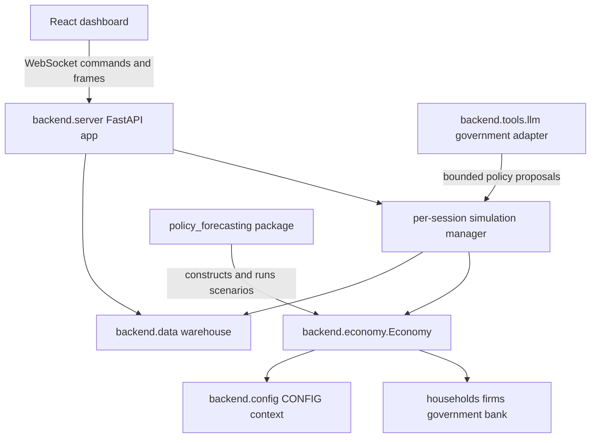

# EcoSim architecture overview

EcoSim is a local-first, weekly-tick agent-based economic research environment. The installable Python distribution is `ecosim` 2.0.0; `pyproject.toml` packages `backend*` and `policy_forecasting*`. The separately built React application is the interactive client. This is a synthetic, heuristic model for controlled comparisons and mechanism exploration—not a calibrated national economy, a causal estimate, or a real-world forecast.

## System map



*Figure 1. Source-grounded ownership and major runtime dependencies; arrows show calls or data flow, not deployment processes.*

`backend.server:app` is the network composition root. It owns WebSocket/session lifecycle, creates simulation state, advances ticks, emits telemetry, and coordinates optional warehouse and LLM work. `backend.economy.Economy` is the simulation composition root: its constructor receives `HouseholdAgent`, `FirmAgent`, `GovernmentAgent`, optional queued firms, and optional `BankAgent`; `Economy.step()` is the authoritative state transition. `backend.config.CONFIG` is read throughout the kernel. The forecasting package invokes the simulator as a library rather than serving requests.

The dashboard is not the model. It supplies configuration and policy commands and renders server frames. Likewise, the warehouse is an evidence sink/read model, not an input that resolves markets. Detailed tick behavior is documented in [Tick lifecycle](../backend/tick-lifecycle.md); agent and market mechanics in [Agents and markets](../backend/agents-and-markets.md); fiscal, credit, healthcare, and housing institutions in [Public institutions](../backend/public-institutions.md).

## Ownership boundaries

| Concern | Authoritative owner | Important symbols |
|---|---|---|
| Tick ordering and cross-market settlement | `backend/economy.py` | `Economy.step`, `_run_labor_matching`, `_clear_goods_market` |
| Agent state and local decisions | `backend/agents.py` | `HouseholdAgent`, `FirmAgent`, `GovernmentAgent`, `BankAgent` |
| Tunables and session-scoped configuration proxy | `backend/config.py` | `CONFIG`, configuration dataclasses |
| Network/session orchestration | `backend/server.py` | `app` and simulation-manager code |
| Durable run evidence | `backend/data/` | SQLite/Postgres managers and typed models |
| Policy action contract | `backend/policy_schema.py`, `backend/fiscal_guards.py` | validated bounded levers and fiscal guards |
| Forecast experiments | `policy_forecasting/` | matched-seed scenario and model pipeline |

The kernel is intentionally centralized rather than plugin-driven. `Economy` directly knows concrete agents and contains labor, goods, housing, healthcare, banking, fiscal, lifecycle, diagnostics, and shock code. A new phase or market normally changes `Economy.step()` and therefore must preserve ordering and accounting contracts.

## Runtime paths

1. The FastAPI process loads `backend.server:app` (typically via Uvicorn).
2. A WebSocket session supplies setup/configuration; the manager constructs agents and an `Economy` under session configuration and RNG state.
3. The run loop invokes `Economy.step()` and then reads metrics and selected subject state.
4. The server sends a telemetry frame and may persist typed rows/events to the warehouse.
5. Manual or experimental LLM government changes are validated and applied at the server-controlled tick boundary; mechanical fiscal execution remains in the kernel.

Forecasting bypasses HTTP/WebSocket: it constructs matched scenarios and runs the same kernel. This supports within-simulator comparisons only; sharing code does not establish external validity.

## Architectural invariants

- **One authoritative transition:** market and institutional ordering belongs to `Economy.step()`; callers should not reproduce a partial tick.
- **Plan before apply:** agents create plans from pre-resolution state; central matching/clearing resolves contention; apply methods mutate balances and inventories afterward.
- **Session isolation is a server responsibility:** mutable `CONFIG` access must occur in the correct context; global mutation outside that boundary risks cross-session leakage.
- **Optional bank:** `Economy.bank` may be `None`; lending paths must retain their documented fallback or no-op behavior.
- **Seeded does not mean shock-free:** `_apply_random_shocks()` is deterministic for a seed and tick, while tests commonly replace it to isolate contracts.
- **Evidence is generated after settlement:** metrics and audit snapshots describe the simulator state, not observed real economies.

## Focused verification

From the repository root:

```bash
python -m pytest backend/tests_contracts/test_contracts_integration_smoke.py
python -m pytest backend/tests_contracts/test_contracts_invariants.py
python -m pytest backend/tests_server/test_server_sessions.py
```

Default pytest discovery covers `backend/tests_contracts`, `backend/tests_server`, and `backend/data/tests` once each; strict markers include provider-free mocked `llm` contracts and exclude exploratory `research` contracts. Forecasting remains an explicit path in a separate dependency environment. These commands verify narrow contracts, not empirical calibration, production scalability, or correctness of every policy claim.

## Evidence boundaries

This page is grounded in manifests and inspected implementation/tests. It deliberately does not infer deployment guarantees from Docker files, causal policy effects from behavior checks, or demographic realism from the presence of an `age` field. Reported model outcomes should always include seed, initial conditions, warm-up, shock setting, policy path, horizon, and code revision.