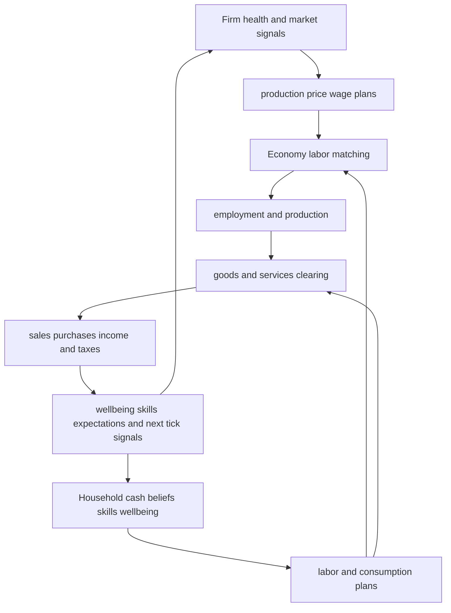

# Agents and markets

The private economy is implemented by `HouseholdAgent` and `FirmAgent` in `backend/agents.py`, coordinated by `Economy` in `backend/economy.py`. Agents plan locally; the coordinator resolves scarce jobs and goods; apply methods commit outcomes. This split is the central extension constraint.



*Figure 1. The private-agent feedback loop across ticks; fiscal and sector-specific institutions are omitted here and documented separately.*

## Households

`HouseholdAgent.plan_labor_supply` derives search/acceptance behavior from employment, benefit level, reservation and expected wages, cash pressure, health, happiness, unemployment duration, market wage anchors, and on-the-job search cooldown. `Economy._run_labor_matching` resolves this against firm hire/layoff plans; `HouseholdAgent.apply_labor_outcome` sets employer and wage and updates experience and expectations.

### Wage contracts and earned wages

The two representations of an ordinary employment contract are `household.wage` and `FirmAgent.actual_wages[household_id]`. At phase 4, `Economy.step()` applies the employer's resolved `actual_wages` entry to the household when it exists, then `_sync_firm_employee_rosters()` treats `household.employer_id` as the ownership link: it removes stale former-employer records, clears wages for unemployed or invalidly assigned households, and reconstructs a missing household wage from the actual employer's contract or offer. Continuing-worker raises, the post-warm-up living-cost/minimum-wage floor, and phase-9 firm wage updates write both contract mirrors only for the actual employment pairing.

This contract is distinct from earnings already owed for the current tick. The [tick lifecycle](tick-lifecycle.md) freezes ordinary gross wages after labor resolution and continuing-worker raises, at the phase-5 production boundary. Tax planning and the household cash/ledger receipt reuse that map. A later phase-9 wage cut, healthcare reset, or other future-contract write is mirrored for the next tick but cannot reduce the current ordinary wage, wage-tax input, `last_wage_income`, or `last_tick_ledger["wage"]`. CEO salary/bonus mechanics and other income flows are not part of this PAY-01 freeze.

Consumption is category-budgeted and boundedly rational. Household traits include savings tendency, category preferences, price sensitivity, quality preference, price beliefs and awareness pools. `Economy._batch_plan_consumption` and `_clear_goods_market` resolve planned firm-level quantities against available inventory and liquidity. Food is perishable, services and healthcare are non-storable flow consumption, and shelter can be satisfied by an active rental rather than a housing-good purchase. Purchases update receipts and asymmetric price beliefs.

### Skills, education, and unemployment hysteresis

Skills are operational, not decorative:

- labor matching and production use `skills_level` and category experience;
- employed households gain diminishing passive skill annually in `apply_labor_outcome` when 52 ticks have elapsed;
- unemployed households below skill `0.5` with cash above `300` spend `100` and gain `0.005` through `maybe_active_education`;
- `invest_in_education` is a general explicit API with diminishing returns;
- `apply_skill_decay` defines a decline after `CONFIG.households.skill_decay_unemployment_threshold` (default 26 ticks) toward a `0.1` floor, **but no runtime caller exists in the inspected repository**. Skill decay is therefore currently inert unless an external caller invokes the method.

`unemployment_duration` does actively accelerate expected-wage decay and reservation adjustment. The implemented hysteresis is therefore in wage expectations and reservation behavior; long-unemployment skill loss is only a dormant capability. Method existence alone is not evidence of tick integration.

### Wellbeing and health

`HouseholdAgent.update_wellbeing` bounds happiness, morale and health to `[0,1]`. Poverty, unemployment, relative cash loss, food shortfall and lack of shelter lower wellbeing; adequate food, services, housing, acceptable wages and public social multipliers provide offsets. Food and an idiosyncratic annualized `health_decay_rate` drive natural health change; completed healthcare visits apply separate recovery through the queue system. `get_performance_multiplier` maps weighted morale, health and happiness to `[0.75,1.5]`, feeding production and preventing a zero-productivity doom loop.

## Firms

`FirmAgent.refresh_health_snapshot` supplies runway, smoothed margin, sell-through, inventory weeks, vacancy/turnover and distress state. `plan_production_and_labor`, `plan_pricing`, and `plan_wage` react to expected sales, inventories, capacity, unemployment, taxes, minimum wage and firm personality. Production is subsequently adjusted for worker skill, category experience, wellbeing, infrastructure and diminishing returns before `apply_production_and_costs`.

`apply_sales_and_profit` settles revenue and taxes; `apply_price_and_wage_updates` commits planned offers. R&D can improve quality. Service and housing firms have capacity-expansion paths, while healthcare labor is managed through its medical workforce pipeline rather than ordinary hiring.

### Entry, distress, and exit

`Economy._handle_firm_exits` handles bankruptcy/exits and associated ownership/loan cleanup. `_maybe_create_new_firms` and queued-firm activation replenish toward a population-scaled target, with `CONFIG.firms.max_new_firms_per_tick` limiting labor shocks. Baseline firms and sector floors prevent all competitive supply from disappearing in selected sectors. Burn/survival modes, working-capital candidacy, failed hiring, shortage and entry/exit events are diagnostics as well as behavior inputs.

## Markets

- **Labor:** `_run_labor_matching` selects fast or legacy matching. It resolves layoffs, vacancies, skills, wage offers, reservation wages and switching; compare mode can check implementations. Healthcare and housing are excluded from ordinary private-offer signals in planning.
- **Goods:** `_clear_goods_market` allocates firm inventory to planned household demand and returns `per_household_purchases` and `per_firm_sales`. Sector subsidy settlement may split price between household and government under a per-tick cap.
- **Services:** cleared as non-storable flow units; firms may upgrade employee-slot infrastructure after sustained capacity use.
- **Housing and healthcare:** specialized resolvers run after general goods clearing; see [Public institutions](public-institutions.md).
- **Prices:** firm PID/adaptive pricing is constrained by stabilization policy and price floors; realized purchase prices update household beliefs. Statistics use transaction/supply state from the completed tick.

## Wealth and inequality

`Economy.get_economic_metrics` computes household cash percentiles and `gini_coefficient` using `_calculate_gini_coefficient`. The implementation shifts negative values before applying the sorted-value formula and clamps the result to `[0,1]`. Crucially, the metric is based on **household cash balances**, not total household net worth: deposits, goods, housing claims, firm ownership and debts are not combined into the Gini input. Labels such as `wealth_p10` and `wealth_p90` therefore represent liquid cash in this implementation and must not be reported as comprehensive wealth inequality. Dividend ownership and heterogeneous saving still shape future cash distribution.

## Stochastic shocks

`Economy._apply_random_shocks` is skipped in warm-up and uses `Random(CONFIG.random_seed + current_tick * 7_299_133)`:

| Shock | Tick probability | Affected state |
|---|---:|---|
| Demand | 5% | 5–15% of households receive the same draw from `[-50,100]`, cash floored at zero and ledgered as `other` |
| Supply | 3% | 1–3 firms have `last_units_produced` multiplied by `0.85–1.15` if positive |
| Health | 2% | 1–5% of households lose a draw intended to be 0.05–0.20 health, clamped to `[0,1]` |

Evidence caveats: Python accepts reversed bounds in `uniform(-0.05, -0.20)`, but the notation is misleading; the supply shock mutates lagged production rather than current capacity; and demand shocks add/remove model money exogenously. Same seed plus same state is deterministic, while different seeds are scenario variation—not an empirical shock distribution.

## Demographics and inert controls

The current model has household `age` at construction, but inspected kernel code does not increment age, create births, remove deaths, form households, retire workers, or apply age-specific mortality. `HouseholdAgent.can_work` checks an age range, yet static ages mean this is an initial eligibility filter, not a demographic lifecycle.

`GovernmentAgent.birth_rate` is a legacy field. The React default `birthRate` is sent through `backend.server` and stored on the government; it is also persisted/reported and sampled by old training-data tools. There is no consumer in `Economy.step()` or agent behavior. **`birthRate` is therefore inert for simulation outcomes** apart from presentation, serialization, and analysis-feature recording. Do not interpret policy sweeps over it as causal population effects. No mortality/death-rate UI control was found in the inspected runtime.

## Invariants and focused verification

- IDs are unique and lookup/roster views must remain synchronized. An employed household's wage equals its actual employer's contract wage after the phase-4 and phase-9 pairing points; stale rosters cannot grant raises or retain contracts.
- The phase-5 `frozen_wages` map defines current ordinary earnings. Phase-9 contract changes affect future earnings only, while tax planning and household receipts reuse the frozen amount.
- Household wellbeing and skill remain bounded; firm inventory, prices and wages respect tested ranges.
- Market sales do not exceed available inventory/capacity.
- Service and healthcare purchases do not accumulate as household inventory.
- Seeded identical initial states reproduce snapshots, including shocks.

```bash
python -m pytest backend/tests_contracts/test_contracts_behavior.py
python -m pytest backend/tests_contracts/test_wage_contract_consistency.py -q
python -m pytest backend/tests_contracts/test_contracts_invariants.py
python -m pytest backend/tests_contracts/test_contracts_macro_modules.py
python -m pytest backend/tests_contracts/test_hot_path_optimizations.py -k labor
```

These tests establish implementation contracts and some expected signs. They do not validate calibration, representative-agent realism, inequality against survey data, or demographic dynamics.