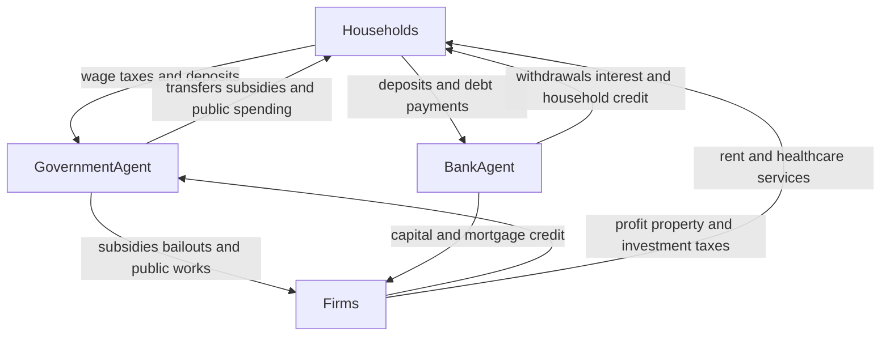

# Public institutions

EcoSim’s institutions are stateful agents plus coordinator-owned market machinery. `GovernmentAgent` and `BankAgent` live in `backend/agents.py`; `Economy` owns cross-agent settlement, healthcare queues, rental matching, stabilization, and diagnostics. Policy choice and mechanical execution are distinct: validated levers set parameters, while taxes, transfers, deposits, queues and contracts execute every tick.



*Figure 1. Institutional cash and service relationships; household taxes are aggregated into treasury settlement, while deposits and ordinary debt payments belong to the bank.*

## Government fiscal lifecycle

`GovernmentAgent` exposes bounded continuous tax rates and discrete levers for benefits, public works, minimum wage, subsidies, price/rent stabilization, infrastructure, technology, social spending and bailouts. `apply_policy_levers` maps options to numeric budgets/rates; `set_lever` validates the local action space. External proposals should also pass the canonical schema and fiscal guards rather than assigning fields directly.

Within `Economy.step()`:

1. pre-plan stabilizers may update commitments, execute eligible bailouts and manage public-works capacity;
2. sector subsidies are capped from trailing GDP and settle during purchases;
3. `plan_taxes` calculates progressive wage tax by wage percentiles, profit tax modifiers by firm cash percentiles, and housing property tax;
4. `plan_transfers` pays baseline unemployment benefits and proportionally fills low-cash gaps within the remaining transfer budget;
5. `apply_fiscal_results` adds wage/profit/property taxes and subtracts transfers;
6. infrastructure, technology, social programs, bond purchases, and investment tax settle later;
7. `_update_budget_pressure` computes the completed tick’s fiscal pressure and spending efficiency.

Government cash may become negative through transfers: the model treats the transfer budget as soft and permits deficits. By contrast, infrastructure and technology only spend when cash covers the configured outlay, and social spending is limited by available cash. Sustained pressure reduces spending effectiveness rather than imposing a hard balanced-budget constraint. Mechanical `adjust_policies` sizes transfer capacity; the legacy automatic chooser runs only when government stabilizers are enabled and LLM government is not enabled.

## Named payment scenario treasury and public surface

This section applies only to `income_first` and `income_late`; `legacy` keeps the established institutional lifecycle above. `Economy._payment_fiscal_close` clears prior restrictions, reserves unemployed benefits in `B`, then allocates up to 10% of the supplied tax base from **free** Treasury cash to `care`, `rent`, or both for `mixed`. `G` is the separately cash-backed sector-subsidy envelope, `withholding` tracks payroll tax while it is being settled, and `project` is an optional Services-project encumbrance. `_payment_free_treasury_cash` subtracts all restrictions from government cash, and `_payment_spend_restriction` debits both the chosen restriction and Treasury cash; restricted money cannot fund another claim.

`PaymentBook` owns the named-arm clearing account, seller payables, funded ordinary income, wage-arrear claims, and late/CEO holds. It is not a second owner of rent cash or physical delivery: named housing/care/goods adapters own tenancy and capacity, while registered loan claims belong solely to the bank ledger. Bank-backed claims credit bank reserves; Treasury-funded registered claims credit government cash. Household and firm debt attributes are compatibility mirrors, while housing `LoanContract` mortgages and direct firm-to-government loans use their own paths. [Tick lifecycle](tick-lifecycle.md) specifies when each owner settles.

`SimulationConfig` validates the payment options and bounds; `server.py::SetupConfig` exposes them for a new WebSocket session. `SimulationManager.initialize` copies every `payment_*` field into the session configuration before constructing `Economy`, and captures an immutable `payment_config_snapshot`. A running session locks these fields, including the sequence. `payment_snapshot` is read-only and returns scenario, parameter, settled-income, rent/care, restrictions, loans, and project fields; the server includes it as `metrics.payment`. It reports `legacy_sequence_no_payment_book` for legacy rather than pretending that legacy flows are payment-book outcomes.

### Funded public capacity project

With `payment_services_project_enabled=False` (the default), no named public project runs. When enabled, `reserve_payment_services_project` may authorize one `payment_services_project_cost` quote only after baseline benefit/care/rent claims and only if free Treasury cash covers it. It targets an existing Services firm with the highest prior unmet demand (then ID), puts the quote in `project`, and authorizes work on the next tick. `assign_payment_services_project_worker` requires a newly hired, retained worker beyond the firm’s baseline hires; ordinary production excludes that worker for the install week.

At phase 11.5, `complete_payment_services_project` pays the provider only when that worker’s full current wage was actually funded and the `project` restriction still covers the quote. It records a pending provider receipt and schedules one Services capacity slot no earlier than `payment_services_project_lag_ticks` later; `activate_payment_services_slots` then increases `production_capacity_units`. An unpaid worker cancels the project, an unfunded payable remains explicit, and provider exit cancels pending work/slots. This is a cash-funded capacity experiment, not generic public works, care capacity, or housing construction.

Baseline firms registered by `GovernmentAgent.register_baseline_firm` anchor essential sectors and follow special pricing/dividend/lifecycle rules. Public works creates/authorizes capacity conditionally and records requested, affordable, denied and job telemetry; it should not be reduced to a direct unemployment-number edit.

## Bank, deposits, and credit

`BankAgent` is optional. It tracks cash reserves, aggregate deposit liabilities, outstanding loans, credit scores and a loan ledger. `required_reserves = total_deposits * reserve_ratio`; `lendable_cash` is reserves above that requirement, and `can_lend` is the circuit breaker. Risk-adjusted rates rise as the `[0,1]` credit score falls; firm leverage is bounded relative to trailing revenue.

Loan origination appends a contract, increases outstanding repayment, and—unless government-backed—reduces reserves. Repayments reduce borrower cash and outstanding balances, replenish reserves for ordinary loans, and update scores; repeated misses/defaults can cause write-offs. Government-backed emergency loans debit government cash and are tracked by the bank without a second reserve disbursement.

Deposits are deliberately two-sided: the household owns `bank_deposit`, while the bank tracks only aggregate `total_deposits`. All withdrawals must call `BankAgent.withdraw` and then reduce the household balance. Before goods clearing, `_withdraw_deposits_for_planned_consumption` provides liquidity; rent/health payments can use `_ensure_cash_for_payment`; end-of-tick `_process_bank_deposits` sweeps excess cash, adjusts the deposit rate and pays only sustainable interest from lending income above a retained margin. Directly editing either side breaks the accounting invariant.

## Healthcare

Healthcare is a queue/capacity system, not a storable good. Households deterministically sample annual visit plans from health buckets, enqueue due requests, and cannot be duplicated while already queued. `Economy._prioritize_healthcare_queue` and `_healthcare_effective_capacity` triage against doctor/resident capacity. `_process_healthcare_services` checks available slots and affordability, can issue medical credit, records provider receipts and queue events, and applies planned healing. Firm healthcare inventory must remain zero.

The workforce pipeline uses `medical_training_status` values `none`, `student`, `resident`, and `doctor`, training time, medical-school debt and role-specific capacity. Ordinary private hiring is disabled for healthcare firms in `Economy.step()`. The optional doctor-health lock restores doctor health before and after service/wellbeing phases; it is a model policy, not clinical realism.

Queue depth, attempted slots, completions, affordability rejects, wait time and unmet care distinguish demand from realized treatment. A sector subsidy reduces patient price subject to the government’s subsidy cap; it does not itself create doctor capacity.

## Housing

Housing combines a specialized rental market, firm-owned unit capacity, repairs, property taxation and expansion finance:

- `_clear_housing_rental_market` maintains contracts, attempts payment using cash and accessible deposits, evicts/clears contracts when required, and matches unhoused households to available firm units.
- Active renters have `met_housing_need = True`; rent is firm revenue and household spending, separate from storable housing-good inventory.
- `_apply_housing_repairs` restores damaged/maintenance state and routes costs through the modeled economy.
- `FirmAgent.invest_in_unit_expansion` can self-finance units; construction cost is routed to miscellaneous redistribution.
- `_service_housing_mortgage_debt` runs before `_offer_housing_expansion_loans`. `LoanContract` uses amortizing PMT from `Economy._compute_housing_pmt`; underwriting tests cover DSCR/LTV gates, principal/interest split and money movement.
- Rent stabilization caps increases and records `rent_increase_limited_count`; property tax uses annualized rental income as an assessed-value proxy.

Housing firms therefore participate in general firm planning but use specialized rental and finance resolution after goods clearing. Unit capacity, occupied units, rental contracts and household flags must agree.

## Institutional invariants

- Fiscal plans are snapshots; aggregate government settlement occurs after market outcomes.
- Subsidy disbursement cannot exceed the per-tick cap/remaining envelope, and bailout accounting cannot exceed the active cycle budget.
- Loan and deposit totals remain nonnegative; ordinary loans cannot spend required reserves.
- Household deposit and bank liability changes are paired through bank methods.
- Healthcare visits do not exceed effective capacity and do not create inventory.
- One household has at most one active healthcare queue placement and one rental provider.
- Housing PMT amortizes principal at zero interest and exceeds principal over a positive-rate term.
- In named payment arms, `sum(payment_state["restrictions"].values())` is reserved Treasury cash, not extra money; only the declared owner may spend each envelope. A Services slot appears only after its quote, fully funded new-worker week, and configured delivery lag.

## Focused verification

```bash
python -m pytest backend/tests_contracts/test_payment_government.py backend/tests_contracts/test_payment_reporting.py -q
python -m pytest backend/tests_server/test_payment_scenarios.py -q
python -m pytest backend/tests_contracts/test_contracts_bank.py
python -m pytest backend/tests_contracts/test_contracts_deposits.py
python -m pytest backend/tests_contracts/test_contracts_healthcare.py
python -m pytest backend/tests_contracts/test_contracts_housing_loans.py
python -m pytest backend/tests_contracts/test_contracts_housing_revenue.py
```

`test_payment_government.py` covers envelope ownership and the staffed Services-project lifecycle; `test_payment_reporting.py` guards the source-derived report shape; `test_payment_scenarios.py` verifies public setup validation, session isolation, and launch-only configuration. Final timing results in `docs/reviews/ECONOMIC_IMPLEMENTATION_REVIEW.md` show that `income_first` did not meet the 5% cumulative median/p95 target, while the measured candidate `legacy` pairs stayed within 5%; the review record gives the exact numbers, workloads, and limits. Passing these correctness checks does **not** establish the performance gate.

See [Tick lifecycle](tick-lifecycle.md) for ordering and [Agents and markets](agents-and-markets.md) for household/firm decisions. These tests establish simulator accounting and behavioral contracts; they do not demonstrate that fiscal multipliers, underwriting, care outcomes, or housing institutions match any real jurisdiction.