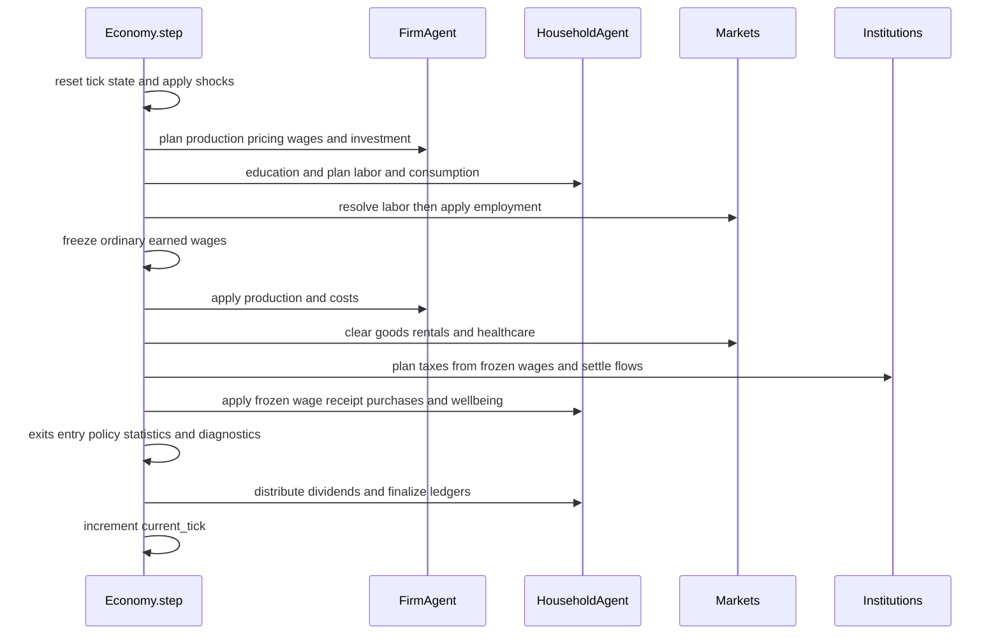

# Tick lifecycle

`backend.economy.Economy.step()` is the only complete simulation transition. A tick is approximately one week (`backend.config.TimeConfig.ticks_per_year = 52`). `payment_sequence="legacy"` retains the established lifecycle below. The named `income_first` and `income_late` arms take a separate funded-payment path; they share claim and funding rules but differ only in when settled net wages and benefits become household cash. Ordering is semantically significant: credit can fund plans, labor precedes production, production precedes sales, and tax/transfer plans are settled only after market resolution. See [Public institutions](public-institutions.md) for the treasury, public setup, and reporting boundary.



*Figure 1. The authoritative high-level call sequence in `Economy.step()`; several institution operations are interleaved as detailed below.*

## Boundary preparation and warm-up

At entry, `in_warmup` is recomputed as `current_tick < warmup_ticks`. Crossing the boundary sets an eight-tick cooldown, a six-tick stimulus window, synchronizes price expectations, and resets post-warm-up expectations. Queued firms activate only outside warm-up. Tick telemetry, regime events, shortage/health/housing diagnostics, subsidy and working-capital envelopes, firm support flags, bank telemetry, and unmet-demand counters are reset.

`_apply_random_shocks()` runs before planning but returns immediately in warm-up. Healthcare state is reset, doctor health locking is applied, and requests are enqueued before firm/household planning. Post-warm-up stimulus and stabilizer operations can therefore alter cash/capacity before private plans are made.

## Exact phase order

1. **Pre-plan state:** refresh target firm count and market views; calculate unemployment and wage/category anchors; optionally update loan commitments, execute bailouts, and authorize/deauthorize public works.
2. **Firm planning:** each firm refreshes `FirmHealthSnapshot`; eligible long-term capital lending precedes `FirmAgent.plan_production_and_labor`. The firm then calls `plan_pricing`, `plan_wage`, and `plan_capital_investment`. Healthcare hiring plans are zeroed because its doctor/resident pool is managed separately. Working-capital bridges and investment loans are offered; minimum wage is enforced on wage plans.
3. **Household planning:** unemployed low-skill households may pay for active education via `HouseholdAgent.maybe_active_education`; the payment is routed to miscellaneous redistribution. Post-warm-up job-search cooldowns tick. `plan_labor_supply` and vectorized consumption planning run; in performance mode consumption plans may be cached for four ticks. Optional consumption loans follow.
4. **Labor resolution and contract pairing:** `_run_labor_matching` resolves firm vacancies, layoffs, reservation wages, skills and switching. Firm application is authoritative for a resolved wage: before `HouseholdAgent.apply_labor_outcome`, `step()` substitutes the actual employer's `actual_wages` entry when present. `_sync_firm_employee_rosters` then rebuilds rosters from `household.employer_id`, removes stale pairings, clears unemployment wages, and supplies a missing household wage from the actual employer's existing contract or offer. Continuing workers receive their scheduled 2–3% raise every 50 ticks only from their actual employer; that write updates both sides.
5. **Production and earned-wage boundary:** immediately after phase 4, `step()` creates its tick-local `frozen_wages` map: each employed household's ordinary gross contract wage, or zero when unemployed. Production costs use that same phase-5 contract state. This is an earned-income snapshot, not a general payment ledger.
6. **Purchasing and sector markets:** planned-spend shortfalls withdraw from deposits, `_clear_goods_market` allocates inventory and cash, service infrastructure may expand, `_clear_housing_rental_market` and `_apply_housing_repairs` run, housing expansion and mortgage servicing/origination follow, miscellaneous revenue is redistributed, then `_process_healthcare_services` handles the queue.
7. **Fiscal planning:** `_build_household_tax_snapshots(frozen_wages=...)` reuses the phase-5 ordinary-income snapshot for `GovernmentAgent.plan_taxes`; firm tax snapshots and transfer planning retain their existing inputs. Capital investment spending is recycled.
8. **Settlement:** firms apply sales, profits, taxes, prices, and **future** wage contracts. After each firm update, its actual-worker contracts are mirrored to households still employed by that firm. Bank repayments happen before household income/purchase application. `_batch_apply_household_updates(..., frozen_wages=...)` reuses the phase-5 amount for ordinary wage cash, `last_wage_income`, and the wage ledger receipt, while applying the tax plan based on that same amount. `GovernmentAgent.apply_fiscal_results` settles aggregate tax and transfer flows.
9. **Institutional close:** deposits, interest, credit scores and settled-loan cleanup run. Government infrastructure, technology, social and bond spending and firm R&D/investment taxes are applied and routed through miscellaneous redistribution where documented. `_update_budget_pressure` sees the completed revenue/spending totals.
10. **Biological/wellbeing close:** warm-up expectations may be synchronized; `_batch_update_wellbeing` runs every tick normally but only every tenth tick in performance mode. Doctor health lock runs again.
11. **Lifecycle and evidence:** `_handle_firm_exits`, `_maybe_create_new_firms`, optional legacy policy adjustment, statistics, and diagnostics run. Healthcare worker bonuses and owner dividends are then distributed. Household ledgers finalize, affordability telemetry updates, optional audit plans/outcomes and before/after states are captured, and `current_tick` increments.

## Named payment scenarios

The following path applies only when `payment_sequence` is `income_first` or `income_late`; `legacy` continues through the existing market, rent, care, tax, transfer, and bank routines described in **Exact phase order**. The selected sequence is captured when `Economy` is constructed and `step()` rejects a mid-run change.

1. **Open and plan:** `preflight_loans` validates registered bank claims on the first tick; the payment arm creates a fresh `PaymentBook`, activates already-paid Services capacity, prepares household loan dues, and queues/requeues care. Planning uses a lagged tax belief and opening liquidity less once-indexed rent and loan obligations; this is a desired-order estimate, not cash escrow.
2. **Fund income before purchases:** after production, `PaymentBook.settle_income(frozen_wages)` pays each employer's current payroll proportionally from actual firm cash, then older wage arrears from any remainder. Unpaid current amounts become firm-worker `payment_state["wage_claims"]`; exit recovery is paid from a protected hold. The book validates population withholding before mutating payers, credits wage withholding to government cash, and records paid gross/net/tax. `settle_benefits` is limited by the `B` treasury envelope. `income_first` immediately credits paid net wages and benefits to households; `income_late` holds them in `PaymentBook.late_income`.
3. **Funded priority sequence:** one actual deposit-withdrawal pass follows payment-aware quotes. `PaymentGoodsMarket` clears essential Food first from an immutable price/supply book. Paid housing projects open before named rent settlement. Rent, care, household registered-loan dues, and the residual goods pass follow; sector adapters own stock, tenancy, and visit capacity while `PaymentBook` owns cash clearing and seller payables. A seller receives a payable only through `release_firm_receipts` in phase 9, so clearing cash cannot be spent twice.
4. **Close:** firm registered loans are collected after sales, direct Treasury firm loans after that, and normal household application runs in receipt-only mode. `release_late_income` then releases late wages/benefits and held CEO pay, so `income_late` cannot finance that tick's earlier purchases. Fiscal close at the end of the current tick reserves benefits and selected care/rent assistance from free Treasury cash for the next tick, after existing restrictions; it may also authorize the optional Services project.

`PaymentBook` is the cash/claim authority for paid income, wage arrears, clearing cash, seller payables, and late/CEO holds. The bank's active-loan ledger is the sole owner of registered loan claims; household and firm debt fields are mirrors. Housing mortgages and direct firm-to-government loans remain distinct claim paths. For treasury envelopes, funded projects, launch-only configuration, and read-only `metrics.payment`, see [Public institutions](public-institutions.md).

## Side-effect caveats

- Planning is not universally pure: `maybe_active_education`, loan origination, stabilizers, shocks, and some expansion decisions mutate state before general settlement.
- Statistics are calculated **before** the lifecycle-close owner-dividend distribution described in step 11. A metric based on household cash can therefore omit that transfer until the next tick, while finalized ledgers include it.
- `_apply_random_shocks` demand cash changes are exogenous and may violate conservation assumptions; conservation tests disable shocks and other sinks.
- The supply shock changes `last_units_produced`, not the current production-capacity parameter. Its same-tick economic effect is narrower than the docstring phrase “temporary productivity changes” implies.
- Performance mode intentionally changes update cadence and reuses consumption plans; hot-path equivalence tests are required when modifying these branches.

## Invariants

- `current_tick` increments exactly once after all finalization.
- Firm and household employment views are synchronized after labor application. For an employed worker, `household.wage` and the actual employer's `actual_wages[household_id]` are paired contract mirrors; a former employer must not update the worker or consume the worker's continuing-raise timestamp.
- Ordinary earned wages are frozen once at the phase-5 production boundary. A later phase-9 wage cut or reset changes the next contract but cannot change this tick's ordinary wage cash, wage-tax snapshot, `last_wage_income`, or wage ledger receipt. The next tick uses the new contract.
- Goods/services/healthcare cannot be sold beyond resolved supply/capacity; healthcare is non-storable.
- Prices are positive, inventories and wages nonnegative, cash finite, and household health/happiness/morale clamped to `[0, 1]` under tested configurations.
- Deposit withdrawals route through `BankAgent.withdraw`; direct reserve mutation would desynchronize the aggregate deposit liability.
- Audit data is observational: enabling it must not change resolution.
- In named payment arms, every restriction is deducted from free Treasury cash and a payment book’s clearing cash/payables must close without a duplicate seller release. `income_late` releases its held income only after the receipt-only household phase; it must not fund Food, rent, care, debt, or goods earlier in the tick.

## Focused verification

```bash
python -m pytest backend/tests_contracts/test_payment_acceptance.py -q
python -m pytest backend/tests_contracts/test_payment_core.py backend/tests_contracts/test_payment_sectors.py backend/tests_contracts/test_payment_loans.py backend/tests_contracts/test_payment_government.py -q
python -m pytest backend/tests_contracts/test_wage_contract_consistency.py -q
python -m pytest backend/tests_contracts/test_contracts_integration_smoke.py -k warmup
python -m pytest backend/tests_contracts/test_contracts_invariants.py
python -m pytest backend/tests_contracts/test_hot_path_optimizations.py
python -m pytest backend/tests_contracts/test_contracts_post_warmup.py
```

`test_payment_acceptance.py` is the composed public-scenario guard: named timing arms, both execution modes, cash/claim reconciliation, exit recovery, and funded public-project behavior. The focused core, sector, loan, and government suites isolate payroll/holds, funded supply and tenancy/care, versioned creditors, and treasury/project timing respectively. `test_wage_contract_consistency.py` remains the narrow PAY-01 guard for the legacy wage-contract boundary; it does not replace payment-arm acceptance evidence.

See [Agents and markets](agents-and-markets.md) for the decisions resolved by this sequence and [Public institutions](public-institutions.md) for fiscal, bank, housing, healthcare, and named-scenario settlement.