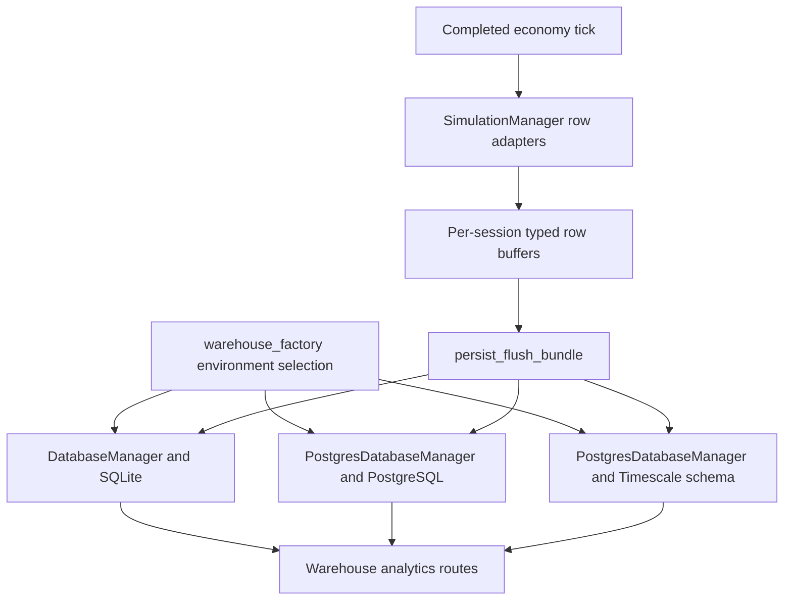
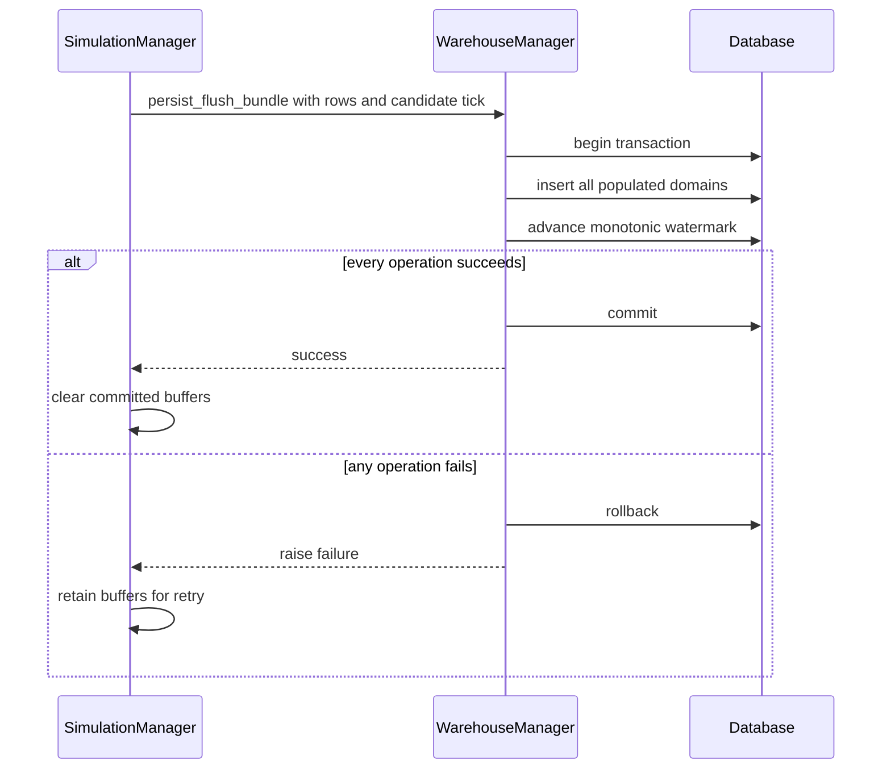

# Warehouse and durable evidence

EcoSim keeps the tick-critical economy in memory and uses the warehouse as an optional durable analytical record. `SimulationManager` in `backend/server.py` translates completed-tick state into typed dataclass rows from `backend/data/models.py`; it does not read the database to execute the next tick. Live UI delivery remains a WebSocket concern described in [sessions and WebSocket](../runtime/sessions-and-websocket.md). Historical reads and policy-context reconstruction are exposed through the implemented analytics routes documented in [HTTP API](../runtime/http-api.md).

## Ownership and backend selection

`backend/data/warehouse_factory.py::create_warehouse_manager` selects from `ECOSIM_WAREHOUSE_BACKEND`:

- `sqlite` creates `DatabaseManager`, takes `ECOSIM_SQLITE_PATH` when set, and immediately runs the idempotent `schema.sql` through `apply_schema()`.
- `postgres`, `postgresql`, `timescale`, and `timescaledb` create `PostgresDatabaseManager` with `ECOSIM_WAREHOUSE_DSN`. “Timescale” is a selection alias for the PostgreSQL-compatible manager; Timescale-specific behavior comes from schema/hypertable setup, not a third manager class.
- Unknown values fail with `ValueError`. Server initialization catches warehouse startup failures, logs them, and disables persistence rather than stopping simulation setup.

Persistence itself is gated by `ECOSIM_ENABLE_WAREHOUSE`; its sample default is off, while root Docker Compose explicitly enables SQLite. Each WebSocket session owns a `SimulationManager` and therefore its own manager handle, run id, row buffers, and watermark. The read API obtains a warehouse reader via `_get_warehouse_reader()` and closes readers it created.

*Figure 1. The completed-tick write path and the shared manager-backed analytics read path.*

## Typed models and all schema domains

`models.py` is the shared row contract; both SQL managers implement equivalent insert/read operations. Every fact domain is anchored to `simulation_runs.run_id`; agent and sector identifiers are analytical relationships rather than a complete normalized agent registry.

| Domain and grain | Typed model | Table | Purpose and notable fields |
|---|---|---|---|
| Run, one per run | `SimulationRun` | `simulation_runs` | Lifecycle, seed/config, code/schema/feature/diagnostic versions, final metrics, `last_fully_persisted_tick`, `analysis_ready`, termination reason |
| Policy baseline, one per run | `PolicyConfig` | `policy_config` | Tax, transfers, minimum wage, inflation, birth rate, stabilizer flag |
| Macro, run/tick | `TickMetrics` | `tick_metrics` | GDP, labor, wellbeing, wealth distribution, fiscal state, firm counts, queues and category prices |
| Sector, run/tick/sector | `SectorTickMetrics` | `sector_tick_metrics` | Firms, employees, vacancies, wages, price, inventory, output, revenue and profit |
| Firm, run/tick/firm | `FirmSnapshot` | `firm_snapshots` | Staffing and plans, price/output/inventory, finances, quality, healthcare service, burn and cash-streak state |
| Population sample, run/tick/household | `HouseholdSnapshot` | `household_snapshots` | Employment, income, wage expectations, skill, health/wellbeing, food/housing security and care demand |
| Tracked subject, run/tick/household | `TrackedHouseholdHistory` | `tracked_household_history` | Narrow every-tick trajectory for the UI-tracked subset |
| Labor event | `LaborEvent` | `labor_events` | Household/firm transition, wages, skill and deterministic `event_key` |
| Healthcare event | `HealthcareEvent` | `healthcare_events` | Queue wait, price/cost split, before/after health and `event_key` |
| Applied policy event | `PolicyAction` | `policy_actions` | Actor, action type, JSON payload, rationale and `event_key` |
| Decision context, run/tick | `DecisionFeature` | `decision_features` | Short/long trends and labor, healthcare, consumer, fiscal and inequality pressure |
| Tick explanation, run/tick | `TickDiagnostic` | `tick_diagnostics` | Primary drivers and counts for labor, health, firms, housing and shortage breadth |
| Shortage explanation, run/tick/sector | `SectorShortageDiagnostic` | `sector_shortage_diagnostics` | Active state, severity, driver, sell-through, vacancy, inventory, price, queue and occupancy pressure |
| Sparse transition | `RegimeEvent` | `regime_events` | Entity/sector, reason, severity, metric, JSON payload and idempotency key |
| Full model decision | `LLMGovernmentDecision` | `llm_government_decisions` | Snapshot/applied ticks, provider/model, raw and normalized outputs, accepted/rejected changes, evidence, timing/error |

`household_snapshots` is captured at tick 1 and then on `ECOSIM_HOUSEHOLD_SNAPSHOT_STRIDE` (default 5); tracked households are narrower but every tick. Aggregate rows flush by `ECOSIM_TICK_BATCH_SIZE` (50), while dense snapshots use `ECOSIM_SNAPSHOT_BATCH_SIZE` (5000). Decision windows are 5/20 ticks and the in-memory context retention is controlled by `ECOSIM_DECISION_CONTEXT_WINDOW` (default 40).

```mermaid
erDiagram
    SIMULATION_RUNS ||--|| POLICY_CONFIG : configures
    SIMULATION_RUNS ||--o{ TICK_METRICS : records
    SIMULATION_RUNS ||--o{ SECTOR_TICK_METRICS : records
    SIMULATION_RUNS ||--o{ FIRM_SNAPSHOTS : samples
    SIMULATION_RUNS ||--o{ HOUSEHOLD_SNAPSHOTS : samples
    SIMULATION_RUNS ||--o{ TRACKED_HOUSEHOLD_HISTORY : tracks
    SIMULATION_RUNS ||--o{ LABOR_EVENTS : emits
    SIMULATION_RUNS ||--o{ HEALTHCARE_EVENTS : emits
    SIMULATION_RUNS ||--o{ POLICY_ACTIONS : applies
    SIMULATION_RUNS ||--o{ DECISION_FEATURES : derives
    SIMULATION_RUNS ||--o{ TICK_DIAGNOSTICS : explains
    SIMULATION_RUNS ||--o{ SECTOR_SHORTAGE_DIAGNOSTICS : explains
    SIMULATION_RUNS ||--o{ REGIME_EVENTS : transitions
    SIMULATION_RUNS ||--o{ LLM_GOVERNMENT_DECISIONS : audits
```

*Figure 2. Logical warehouse domains; all durable facts belong to one simulation run.*

## Atomic flush and watermark contract

`SimulationManager._flush_warehouse_batches()` sends every nonempty domain buffer to `persist_flush_bundle`. Both managers perform all inserts and `_update_run_flush_metadata` in one transaction. A successful commit advances `simulation_runs.last_fully_persisted_tick` monotonically; an exception rolls the entire bundle back. Server buffers are retained on failure for retry. Snapshot/aggregate natural keys and event conflict-ignore behavior make retries practical; labor, healthcare, policy, regime, and LLM records receive deterministic content-derived `event_key` values where needed.

The watermark means “the highest tick whose submitted bundle committed,” not exact replay completeness. `analysis_ready` is set only during a clean completed close. Finalization records total ticks and final metrics; a failed final flush uses termination reason `warehouse_flush_failed` rather than claiming analytical readiness.

*Figure 3. Bundle data and its durability watermark become visible atomically.*

## Migrations and schema evolution

Fresh SQLite databases are schema-applied automatically. Existing stores use paired incremental migrations under `backend/data/migrations`: 001/002 create SQLite and Timescale/Postgres; 003–004 add aggregate/sector data; 005–006 events; 007–008 firms; 009–010 households; 011–012 decision features; 013–014 reliability manifest, watermark, and idempotency indexes; 015–016 diagnostics and regime events; 017–018 LLM decisions. PostgreSQL variants use JSON-capable columns and conditionally create Timescale hypertables. Current version stamps are `WAREHOUSE_SCHEMA_VERSION = 2026-03-hardening-v1`, `DECISION_FEATURE_VERSION = v1`, and `DIAGNOSTICS_VERSION = v1`.

Important operational boundary: selecting PostgreSQL does not automatically run all migrations in the factory, unlike SQLite’s `apply_schema()`. Provisioning/upgrading Postgres or Timescale is an operator step. See [deployment](../operations/deployment.md).

## Relationship to the analytics API

The warehouse routes are readers over manager methods, not a separate analytics service:

- run list, summary, macro tick history, decision features and full LLM decisions;
- tick diagnostics, sector metrics plus summary, shortage diagnostics and regime events;
- `/warehouse/compare` for compact multi-run comparisons;
- `/warehouse/runs/{run_id}/policy-context`, which reconstructs policy state and impact memory from policy config/actions, metrics, features and diagnostics.

Policy-context defaults its target using persisted watermark and run total ticks. This is materially different from `/decision-context/live`, which reads a session’s in-memory rolling window and can be fresher than the latest batch commit. Full route parameters and response/error contracts belong in [HTTP API](../runtime/http-api.md); LLM consumption belongs in [LLM government](../llm/government.md).

## Tests, claims, and evidence gaps

Grounded checks:

- `test_db_manager.py` exercises SQLite schemas, CRUD/query behavior, atomic rollback/watermark behavior, retry/idempotency and lifecycle metadata.
- `test_warehouse_integration.py` runs the real server-side SQLite path across economy ticks and validates persisted domains.
- `test_server_api.py` covers warehouse and read-API contracts; CI runs all three sets.
- `backend/data/test_sample_data.py` is sample-data validation, but is outside configured `testpaths` unless explicitly selected.

Evidence gaps and limits:

- CI has no PostgreSQL/Timescale service, so backend parity, migrations, JSON behavior and hypertables are source-grounded but not continuously integration-tested.
- No migration-chain test upgrades a populated database through all 18 scripts.
- The warehouse is not an exact replay engine: manifests omit a complete dependency/environment lock and not every transient state or random draw is persisted.
- Atomicity is bundle-scoped, not cross-session/global; SQLite remains single-writer and contention limits are not load-tested in CI.
- No retention, compression, backup/restore, encryption, authentication, or row-level access policy is implemented.
- Analytics endpoints are synchronous manager reads inside async handlers; production-scale query latency and event-loop impact are unmeasured.
- `docs/DATA_STORAGE_ARCHITECTURE.md` contains design language and should not override current schemas/managers when they diverge.

For validation/performance ownership, follow [testing and performance](../engineering/testing-performance.md).