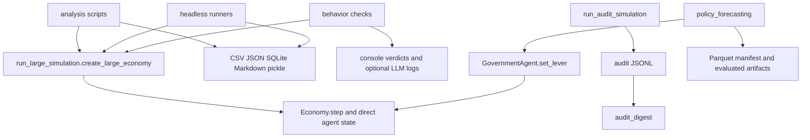
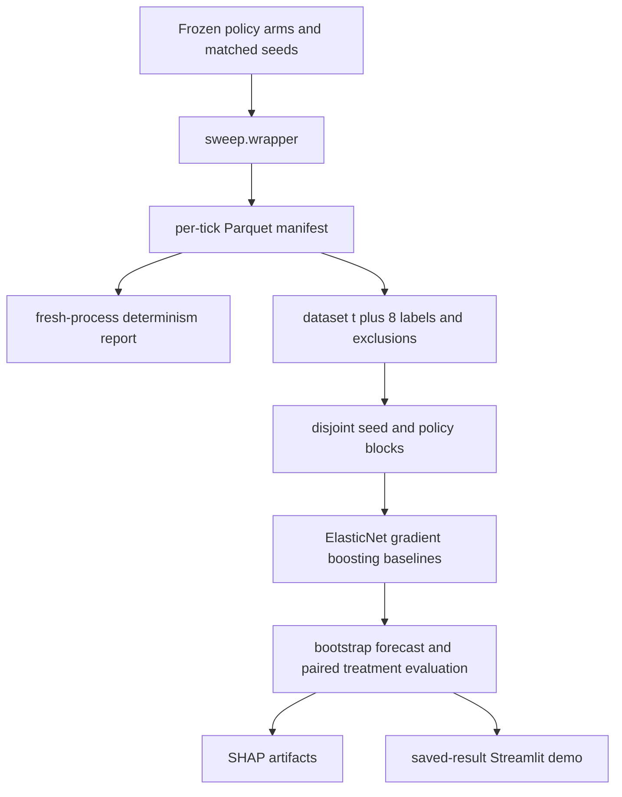

# Research Tools and Standalone Executables

<!-- openwiki: broken internal link [../../backend/tools/] link "../../backend/tools/" is outside the wiki root. Fix the href or restore the target, then delete this comment. -->
<!-- openwiki: broken internal link [../../backend/config.py] link "../../backend/config.py" is outside the wiki root. Fix the href or restore the target, then delete this comment. -->
<!-- openwiki: broken internal link [../../policy_forecasting/] link "../../policy_forecasting/" is outside the wiki root. Fix the href or restore the target, then delete this comment. -->
The scripts under [`backend/tools`](../../backend/tools/) are supplementary and are not on the FastAPI dashboard path. Most import the simulator directly, many mutate global [`config.CONFIG`](../../backend/config.py) or object fields, and several preserve historical assumptions rather than current public contracts. Treat “executable” as “can be invoked,” not “supported production interface.” The maintained research package is [`policy_forecasting`](../../policy_forecasting/); the standalone analysis/runners/checks are primarily exploratory, diagnostic, audit, demonstration, or legacy utilities.

## Execution and ownership map



*Standalone tools share simulator internals and filesystem artifacts; `policy_forecasting` instead defines a package-level manifest, split, evaluation, and test contract.*

Several directories include `sitecustomize.py`, and many scripts prepend `backend`, `tools`, and sibling directories to `sys.path`. Consequently both direct-file and module invocations may work, but imports such as `from run_large_simulation import create_large_economy` are path-bootstrap dependent. Prefer repository-root module commands where the file supports them; exact historical usage comments are retained below where relevant.

## Analysis family

| Executable and symbols | Inputs and call path | Outputs | Status, mutation risk, tests |
|---|---|---|---|
<!-- openwiki: broken internal link [../../backend/tools/analysis/analyze_llm_government_log.py] link "../../backend/tools/analysis/analyze_llm_government_log.py" is outside the wiki root. Fix the href or restore the target, then delete this comment. -->
| [`analyze_llm_government_log.py`](../../backend/tools/analysis/analyze_llm_government_log.py): `analyze`, `_group_partial_attempt_count`, `_policy_churn` | Positional saved LLM-government JSON. Reads `decision_records` or `decision_history_raw`, `tick_metrics`, policy/rejection fields. Command: `python backend/tools/analysis/analyze_llm_government_log.py experiments/llm_government_supporting_runs/llm_government_latest.json`. | JSON to stdout: cadence, non-empty/rejection rates, lever counts, grouped partial attempts, churn, fiscal-mode agreement, metric first/last/peak/trough, final policy. | Useful read-only postprocessor. Schema-tolerant via fallbacks but no dedicated test file; does not validate source artifact completeness. |
<!-- openwiki: broken internal link [../../backend/tools/analysis/audit_digest.py] link "../../backend/tools/analysis/audit_digest.py" is outside the wiki root. Fix the href or restore the target, then delete this comment. -->
| [`audit_digest.py`](../../backend/tools/analysis/audit_digest.py): `load_audit`, `build_digest`, `build_json_digest`, `estimate_tokens` | Audit JSONL from `run_audit_simulation.py`; optional `--output/-o`, `--max-tokens`. Command: `python backend/tools/analysis/audit_digest.py audit_full_dump.jsonl --output audit_full_dump_digest.md`. | Dense Markdown digest plus sibling JSON digest; token estimate is `len(text)//4`. | Active companion to the audit runner, but token limit only warns—it does not trim despite the help text’s target language. No dedicated automated tests. |
<!-- openwiki: broken internal link [../../backend/tools/analysis/generate_sample_data.py] link "../../backend/tools/analysis/generate_sample_data.py" is outside the wiki root. Fix the href or restore the target, then delete this comment. -->
| [`generate_sample_data.py`](../../backend/tools/analysis/generate_sample_data.py): `create_sample_economy`, `init_database`, `export_tick_data` | Hard-coded 50-household custom economy and 200-tick loop using direct `HouseholdAgent`, `FirmAgent`, `GovernmentAgent`, and `Economy` construction. | A bespoke SQLite schema plus CSV per-tick snapshots and JSON summary (per module docstring). | Legacy sample-data generator. Its `households`, `firms`, `government`, and `aggregate_metrics` schema is separate from `backend/data/` warehouse schemas; never use it as warehouse compatibility evidence. No tests. |
<!-- openwiki: broken internal link [../../backend/tools/analysis/generate_training_data.py] link "../../backend/tools/analysis/generate_training_data.py" is outside the wiki root. Fix the href or restore the target, then delete this comment. -->
| [`generate_training_data.py`](../../backend/tools/analysis/generate_training_data.py): `generate_policy_samples`, `run_simulation_with_policy`, `calculate_gini` | Fixed 500 samples, 100 ticks, 1,000 households, five firms/category. SciPy Latin-hypercube over nine camelCase policy features, or unseeded NumPy random fallback. Calls `create_large_economy`, then directly assigns government/config/firm fields before `Economy.step()`. Command implied by script: `python backend/tools/analysis/generate_training_data.py`. | `training_data_checkpoint_50.csv` etc. every 50 successful samples and a final timestamped training CSV in the current working directory. One row per run, containing policy and **final** outcomes. | **Legacy ML data path.** Directly mutates fields including `birth_rate`, `minimum_wage_floor`, UBI, and wealth-tax attributes rather than exclusively using the canonical policy API. Exceptions skip samples. No run manifest, matched seeds, temporal labels, or dedicated tests. |
<!-- openwiki: broken internal link [../../backend/tools/analysis/train_ml_model.py] link "../../backend/tools/analysis/train_ml_model.py" is outside the wiki root. Fix the href or restore the target, then delete this comment. -->
| [`train_ml_model.py`](../../backend/tools/analysis/train_ml_model.py): `load_training_data`, `train_models`, `analyze_feature_importance`, `save_models` | Auto-selects newest `training_data_*.csv` by mtime; nine policy inputs and eleven final-outcome targets. Random 80/20 row split plus five-fold CV. It calls `install_xgboost()`, which performs `pip install xgboost scikit-learn` at runtime if missing. Command: `python backend/tools/analysis/train_ml_model.py`. | `ml_models_<timestamp>/model_<target>.pkl` for 11 `XGBRegressor`s and `metadata.json` with metrics/importance. | **Legacy/incomplete prediction-layer prototype.** Runtime dependency mutation and pickle portability/security risks; no inference module or server integration exists—the script itself lists those as next steps. No dedicated tests and no checked-in model artifacts evidenced here. |
<!-- openwiki: broken internal link [../../backend/tools/analysis/run_tax_comparison.py] link "../../backend/tools/analysis/run_tax_comparison.py" is outside the wiki root. Fix the href or restore the target, then delete this comment. -->
| [`run_tax_comparison.py`](../../backend/tools/analysis/run_tax_comparison.py): `run_warmup`, `run_scenario`, `private_firm_stats`, `print_diff` | `--ticks` (30), `--households` (200). Warms once, waits up to 20 ticks for private firms, pickle-clones state, then compares defaults with max wage/profit/investment taxes applied via `GovernmentAgent.set_lever`. Command: `python backend/tools/analysis/run_tax_comparison.py --ticks 60 --households 500`. | Console per-tick tables and final difference summary; no durable artifact. | Exploratory matched-start comparison, not statistical evidence: one warmed state, no seed CLI, no confidence interval, and pickle cloning assumes the entire economy remains serializable. No dedicated tests. |
<!-- openwiki: broken internal link [../../backend/tools/analysis/demo_skill_experience.py] link "../../backend/tools/analysis/demo_skill_experience.py" is outside the wiki root. Fix the href or restore the target, then delete this comment. -->
| [`demo_skill_experience.py`](../../backend/tools/analysis/demo_skill_experience.py): `run_career_simulation`, `compare_workers_with_different_skills` | Hard-coded tiny custom economies; 520-tick career and one-tick three-worker comparison. Command: `python backend/tools/analysis/demo_skill_experience.py`. | Console wage/productivity tables. | Demonstration/legacy educational script, not a check. Assertions are prose, not machine-enforced, and behavior can drift from current labor mechanisms. No tests. |

## Runner family

| Executable | Inputs and behavior | Outputs | Status and boundaries |
|---|---|---|---|
<!-- openwiki: broken internal link [../../backend/tools/runners/run_large_simulation.py] link "../../backend/tools/runners/run_large_simulation.py" is outside the wiki root. Fix the href or restore the target, then delete this comment. -->
| [`run_large_simulation.py`](../../backend/tools/runners/run_large_simulation.py): `create_large_economy`, `main` | Main shared factory for many scripts. CLI: `--households` (10000), `--firms-per-category` (10), `--ticks` (500), `--export-every` (50), `--tag`; `--small` actually sets 1,000 households and **500** ticks despite help saying 200. Command: `python backend/tools/runners/run_large_simulation.py --households 10000 --firms-per-category 10 --ticks 500 --export-every 50 --tag 10k_balanced`. | Tagged database and summary files; console progress. | Widely reused headless research runner, but not server/session-equivalent. The help/implementation discrepancy is a source-level warning. Direct module factory is more central than CLI stability. |
<!-- openwiki: broken internal link [../../backend/tools/runners/run_audit_simulation.py] link "../../backend/tools/runners/run_audit_simulation.py" is outside the wiki root. Fix the href or restore the target, then delete this comment. -->
<!-- openwiki: broken internal link [../../audit_full_dump_digest.json] link "../../audit_full_dump_digest.json" is outside the wiki root. Fix the href or restore the target, then delete this comment. -->
| [`run_audit_simulation.py`](../../backend/tools/runners/run_audit_simulation.py): `serialize_tick`, `AuditAnalyticsTracker`, `RunAuditSummarizer`, `main` | `--households` 100, `--firms-per-category` 2, `--ticks` 52, `--seed` 42, `--output audit_full_dump.jsonl`, `--no-shocks`, `--no-digest`. Seeds Python/NumPy, enables `economy.audit_log_enabled`; `--no-shocks` monkeypatches `economy._apply_random_shocks = lambda: None`. | Config line plus initial/tick JSONL records; normally invokes compact Markdown/JSON digest generation. Root [`audit_full_dump_digest.json`](../../audit_full_dump_digest.json) is a large example artifact, but provenance must be checked separately. | Active deep audit utility. Very broad internal-state coupling and potentially large/sensitive artifacts. Disabling shocks changes runtime behavior by monkeypatch. No dedicated pytest owner. |
<!-- openwiki: broken internal link [../../backend/tools/runners/run_diagnostic.py] link "../../backend/tools/runners/run_diagnostic.py" is outside the wiki root. Fix the href or restore the target, then delete this comment. -->
| [`run_diagnostic.py`](../../backend/tools/runners/run_diagnostic.py) | Executes at import time: fixed 250 ticks, 1,000 households, snapshots every 25; calls `create_large_economy` and computes extensive NumPy summaries. It unconditionally calls `sys.stdout.reconfigure(encoding='utf-8')`. | Console snapshots and final summary; in-memory history only. | Legacy diagnostic script with no CLI/main guard. Import has expensive side effects and may fail where stdout lacks `reconfigure`. No tests. |
<!-- openwiki: broken internal link [../../backend/tools/runners/run_bank_simulation.py] link "../../backend/tools/runners/run_bank_simulation.py" is outside the wiki root. Fix the href or restore the target, then delete this comment. -->
| [`run_bank_simulation.py`](../../backend/tools/runners/run_bank_simulation.py): `create_economy`, `collect_metrics`, `main` | `--ticks` 100, `--households` 200, optional `--no-bank`; constructs and steps a bank-enabled/disabled economy. Command: `python backend/tools/runners/run_bank_simulation.py --ticks 100 --households 200`. | Console five-tick table and household/firm/government/bank final summary. | Diagnostic integration runner, not an assertion suite. Durable evidence and controlled same-seed ON/OFF comparison are absent. Bank contracts are instead owned by pytest files in `backend/tests_contracts/`. |
<!-- openwiki: broken internal link [../../backend/tools/runners/run_firm_tracker.py] link "../../backend/tools/runners/run_firm_tracker.py" is outside the wiki root. Fix the href or restore the target, then delete this comment. -->
| [`run_firm_tracker.py`](../../backend/tools/runners/run_firm_tracker.py): `main` | `--ticks`, `--households`, `--firm-index`, and post-warmup wage/profit/investment tax overrides. Waits up to 20 ticks for a private firm, then tracks one firm by ID. Command: `python backend/tools/runners/run_firm_tracker.py --ticks 30 --firm-index 0 --profit-tax 0.50`. | Detailed console row per tick. | Exploratory debugger. Selection by list index and one trajectory cannot support population claims. The no-private-firm error string omits interpolation (`{max_settle}`). No tests. |

All runners execute the simulator in-process. They do not reproduce WebSocket session configuration isolation, background LLM scheduling, server warehouse flush/finalization, or browser behavior. Use the [full-app evidence harness](testing-performance.md#full-application-evidence-harness) for those claims.

## Check family

The `checks/` name is historical: these are standalone scripts, not pytest-discovered tests under the configured `testpaths`.

| Executable | Inputs/outputs | Status and test ownership |
|---|---|---|
<!-- openwiki: broken internal link [../../backend/tools/checks/run_behavior_tests.py] link "../../backend/tools/checks/run_behavior_tests.py" is outside the wiki root. Fix the href or restore the target, then delete this comment. -->
| [`run_behavior_tests.py`](../../backend/tools/checks/run_behavior_tests.py): `ALL_TESTS`, `build_snapshot`, scenario functions | `--ticks` 20, `--households` 200, optional `--test`. Builds one warmed snapshot, clones/runs named scenarios, prints PASS/FAIL counts for policy, banking, healthcare, inventory, skills, fiscal and other behavioral responses. Example: `python backend/tools/checks/run_behavior_tests.py --test healthcare skills --ticks 20 --households 200`. | Exploratory behavioral scoreboard. `main()` prints results but does not call `sys.exit` on failures, so shell success is not a CI gate. Scenario thresholds are research judgments; no direct pytest wrapper. |
<!-- openwiki: broken internal link [../../backend/tools/checks/run_household_behavior_tests.py] link "../../backend/tools/checks/run_household_behavior_tests.py" is outside the wiki root. Fix the href or restore the target, then delete this comment. -->
| [`run_household_behavior_tests.py`](../../backend/tools/checks/run_household_behavior_tests.py): `ArchetypeRunner`, async `main` | `--households` 300, `--ticks` 60, `--feedback-every` 10, model/timeout/warmup/seed. Selects household archetypes and calls a local `LMStudioProvider` at localhost:1234. | Console trajectory/feedback and in-memory conversation/run logs. | Experimental LLM-assisted tester, external-service dependent and non-CI. If health check fails it returns without a nonzero exit. Despite its directory, it is an LLM consumer. |
<!-- openwiki: broken internal link [../../backend/tools/checks/test_firm_behavior.py] link "../../backend/tools/checks/test_firm_behavior.py" is outside the wiki root. Fix the href or restore the target, then delete this comment. -->
<!-- openwiki: broken internal link [../../backend/tools/checks/test_government_behavior.py] link "../../backend/tools/checks/test_government_behavior.py" is outside the wiki root. Fix the href or restore the target, then delete this comment. -->
<!-- openwiki: broken internal link [../../backend/tools/checks/test_household_agent.py] link "../../backend/tools/checks/test_household_agent.py" is outside the wiki root. Fix the href or restore the target, then delete this comment. -->
<!-- openwiki: broken internal link [../../backend/tools/checks/test_stochastic.py] link "../../backend/tools/checks/test_stochastic.py" is outside the wiki root. Fix the href or restore the target, then delete this comment. -->
<!-- openwiki: broken internal link [../../backend/tools/checks/test_training_setup.py] link "../../backend/tools/checks/test_training_setup.py" is outside the wiki root. Fix the href or restore the target, then delete this comment. -->
| [`test_firm_behavior.py`](../../backend/tools/checks/test_firm_behavior.py), [`test_government_behavior.py`](../../backend/tools/checks/test_government_behavior.py), [`test_household_agent.py`](../../backend/tools/checks/test_household_agent.py), [`test_stochastic.py`](../../backend/tools/checks/test_stochastic.py), [`test_training_setup.py`](../../backend/tools/checks/test_training_setup.py) | Direct-file scripted checks/demos of firm, government, household, stochastic, and training-data setup behavior; primarily console output and inline/manual expectations. | Legacy ad hoc checks. They live outside configured pytest `testpaths`, have no CI command, and should not be counted as regression coverage without individually verifying pytest-compatible assertions and collection. Canonical behavior coverage is in `backend/tests_contracts/`. |

## Legacy XGBoost versus `policy_forecasting`

These are not two versions of the same validated pipeline.

<!-- openwiki: broken internal link [../../policy_forecasting/] link "../../policy_forecasting/" is outside the wiki root. Fix the href or restore the target, then delete this comment. -->
| Dimension | Legacy `generate_training_data.py` + `train_ml_model.py` | [`policy_forecasting`](../../policy_forecasting/) |
|---|---|---|
| Question | Map nine policy settings to eleven end-of-run outcomes. | Forecast `unemployment` and `consumer_distress` at `t+8` within a frozen simulator, and estimate matched-seed arm effects. |
| Simulator access | Calls shared factory, then directly assigns government, config, and firm fields. | Imports `backend/` read-only and applies frozen deltas through public `GovernmentAgent.set_lever()`. |
| Design | 500 Latin-hypercube policies; SciPy fallback becomes unseeded random sampling. One final row per run. | Six pre-registered arms × matched seeds × per-tick rows; canonical lever-vector hash and manifest. |
| Time/leakage contract | No temporal frame; final outcomes only. Random row train/test split and ordinary 5-fold CV. | Features at/before `t`, labels joined from `t+8`; IDs, seed, tick, lever JSON and all future labels excluded; held-out seeds and canonical policy vectors. |
| Models/baselines | Eleven XGBoost regressors; no persistence/trend baseline. Runtime auto-install of XGBoost/scikit-learn. | ElasticNet and gradient boosting compared against policy-aware persistence/trend; blocked paired-bootstrap intervals; optional SHAP explanation. Frozen requirements. |
| Causal comparison | None; policies and outcomes are predictive rows without matched-seed effects. | Paired seed effects, Wilcoxon signed-rank tests, Holm correction, effect-size and determinism-noise gates. |
| Reproducibility | Checkpoint CSVs in CWD, newest file selected by mtime, no manifest, no determinism gate, no package tests. | Explicit artifact paths, deterministic replay command, package modules, and tests for config/dataset/distress/models/split. |
| Status | Legacy prototype; inference/server integration explicitly unfinished. | Maintained V1 research workflow with published methodology/results, still simulator-only and not a real-world forecast. |

The forecasting flow is:



<!-- openwiki: broken internal link [../../policy_forecasting/] link "../../policy_forecasting/" is outside the wiki root. Fix the href or restore the target, then delete this comment. -->
*The leakage-conscious package flow described and implemented under [`policy_forecasting/`](../../policy_forecasting/).*

Exact smoke and confirm commands:

```bash
python -m policy_forecasting.sweep.wrapper --arms baseline,wage_tax_high --seeds 0 --households 200 --ticks 20 --output policy_forecasting/artifacts/smoke_ticks.parquet
python -m policy_forecasting.dataset policy_forecasting/artifacts/smoke_ticks.parquet policy_forecasting/artifacts/smoke_supervised.parquet
python -m policy_forecasting.determinism --arm baseline --seed 0 --households 200 --ticks 20 --output policy_forecasting/artifacts/determinism_smoke.json

python -m policy_forecasting.sweep.wrapper --confirm-seeds --households 10000 --ticks 80 --processes 8 --output policy_forecasting/artifacts/confirm10k_ticks.parquet
python -m policy_forecasting.dataset policy_forecasting/artifacts/confirm10k_ticks.parquet policy_forecasting/artifacts/confirm10k_supervised.parquet
python -m policy_forecasting.determinism --arm baseline --seed 0 --households 10000 --ticks 80 --output policy_forecasting/artifacts/determinism_confirm10k.json
python -m policy_forecasting.run_pipeline policy_forecasting/artifacts/confirm10k_ticks.parquet policy_forecasting/artifacts/confirm10k_result.json --determinism-json policy_forecasting/artifacts/determinism_confirm10k.json
python -m policy_forecasting.run_explain policy_forecasting/artifacts/confirm10k_ticks.parquet policy_forecasting/artifacts/explain
```

<!-- openwiki: broken internal link [../../policy_forecasting/RESULTS.md] link "../../policy_forecasting/RESULTS.md" is outside the wiki root. Fix the href or restore the target, then delete this comment. -->
The confirm sweep is intentionally expensive: [`RESULTS.md`](../../policy_forecasting/RESULTS.md) reports six arms × 24 seeds × 80 ticks × 10,000 households, 11,520 tick rows, about 2.25 hours, and a 10,368-row supervised frame. Its published unemployment gradient-boosting result is `R2=0.924`, `MAE=0.028`, with `+0.080` MAE lift over policy-aware persistence and CI `[0.056, 0.107]`; distress did not beat persistence. These are simulator system-identification results. They neither validate real economic policy nor rehabilitate the legacy XGBoost artifacts.

## Operational boundaries

- **Global state:** runners and legacy analysis commonly mutate `CONFIG`, seeds, government fields, or economy methods. Run them in fresh processes; do not import side-effect scripts such as `run_diagnostic.py` into long-lived services.
- **Artifact schemas:** sample SQLite, audit JSONL, benchmark artifacts, warehouse tables, LLM JSON, legacy CSV/model pickle, and forecasting Parquet are distinct contracts. Similar metric names do not imply interchangeability.
- **Exit status:** console PASS/FAIL scripts and failed LLM health checks may still exit zero. CI relies on pytest/ruff/npm commands, not these scripts.
- **Dependencies:** `train_ml_model.py` mutates its environment with pip; forecasting uses a frozen requirements file; browser tools need Chrome/CDP; household LLM checks need LM Studio; Postgres/Timescale benchmarks need a DSN/service.
- **Coverage:** absence of a dedicated test does not make a tool unusable, but its output should be labeled exploratory. The only directly tested tool helpers in these families are benchmark and full-app helpers through `backend/tests_contracts`; forecasting has its own unit suite.
