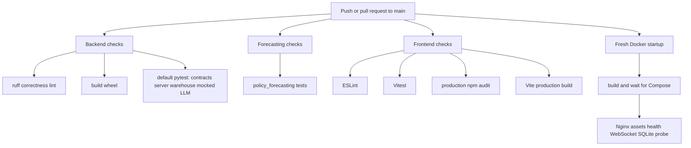
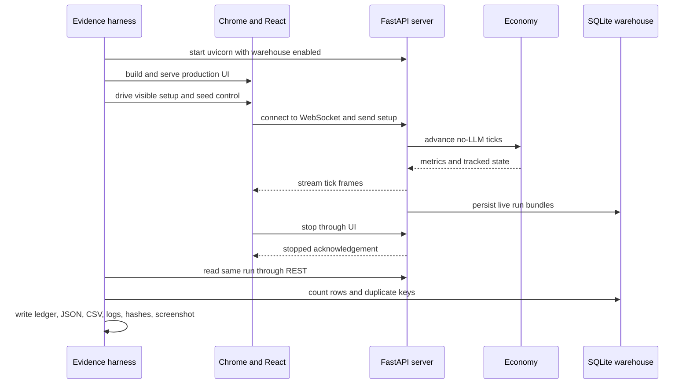

# Testing, CI, and Performance Evidence

<!-- openwiki: broken internal link [../../backend/tools/integration/run_full_app_evidence.py] link "../../backend/tools/integration/run_full_app_evidence.py" is outside the wiki root. Fix the href or restore the target, then delete this comment. -->
EcoSim has four distinct verification layers: deterministic Python contracts, package/UI CI gates, a short Docker startup probe, and evidence-producing performance/system harnesses. Do not treat them as interchangeable. Pytest proves narrow contracts; the Compose probe verifies the packaged Nginx/WebSocket/SQLite path without a browser; component benchmarks isolate subsystems; [`run_full_app_evidence.py`](../../backend/tools/integration/run_full_app_evidence.py) exercises one real no-LLM browser-to-database path and produces auditable artifacts, but does not prove every policy, view, database backend, LLM path, or forecasting integration.

## Test and CI topology



<!-- openwiki: broken internal link [../../.github/workflows/ci.yml] link "../../.github/workflows/ci.yml" is outside the wiki root. Fix the href or restore the target, then delete this comment. -->
*The four independent jobs and their gates are defined in [`.github/workflows/ci.yml`](../../.github/workflows/ci.yml).*

The workflow runs on pushes and pull requests to `main`, grants only `contents: read`, and cancels an older run in the same `ci-${{ github.workflow }}-${{ github.ref }}` concurrency group. No benchmark or full-app browser harness runs in CI.

| Job | Runtime/install | Exact gates | Boundary |
|---|---|---|---|
<!-- openwiki: broken internal link [../../pyproject.toml] link "../../pyproject.toml" is outside the wiki root. Fix the href or restore the target, then delete this comment. -->
| `backend` | Ubuntu, Python 3.11; `pip install -c backend/requirements.lock -e ".[test,ml]"` | `python -m ruff check .`; `pip wheel --no-deps --wheel-dir /tmp/ecosim-wheel .`; `python -m pytest --durations=10` | The lean `test` extra supplies the CI test/lint dependencies; `dev` remains optional tooling. Pytest runs contracts, server, and warehouse suites once, including mocked LLM contracts. Ruff selects only `E9`, `F63`, `F7`, and `F82`, not a broad style policy ([`pyproject.toml`](../../pyproject.toml), `[tool.ruff.lint]`). |
<!-- openwiki: broken internal link [../../policy_forecasting/requirements.txt] link "../../policy_forecasting/requirements.txt" is outside the wiki root. Fix the href or restore the target, then delete this comment. -->
| `forecasting` | Ubuntu, Python 3.11; frozen [`policy_forecasting/requirements.txt`](../../policy_forecasting/requirements.txt) | `python -m pytest policy_forecasting/tests -q` | Unit coverage is config, dataset, distress, models, and split. The expensive 10k confirm sweep is not CI. |
<!-- openwiki: broken internal link [../../frontend-react/src/App.test.jsx] link "../../frontend-react/src/App.test.jsx" is outside the wiki root. Fix the href or restore the target, then delete this comment. -->
| `frontend` | Ubuntu, Node 22; `npm ci --no-audit --no-fund` | `npm run lint`; `npm run test`; `npm audit --omit=dev --audit-level=high`; `npm run build` | Vitest currently centers on [`src/App.test.jsx`](../../frontend-react/src/App.test.jsx); browser/CDP performance and end-to-end persistence are separate harnesses. |
| `startup` | Ubuntu Docker Compose | `docker compose up --build -d --wait --wait-timeout 120`; `docker compose exec -T backend python -m backend.tools.integration.smoke_startup --url http://frontend --sqlite-path /app/runtime/ecosim.db` | The disposable stack is diagnosed on failure and removed with its test volume. The probe proves packaged asset/proxy/tick/persistence behavior, not browser interaction or external database/provider support. |

<!-- openwiki: broken internal link [../../pyproject.toml] link "../../pyproject.toml" is outside the wiki root. Fix the href or restore the target, then delete this comment. -->
[`pyproject.toml`](../../pyproject.toml) sets `pythonpath = ["backend"]`, `testpaths = ["backend/tests_contracts", "backend/tests_server", "backend/data/tests"]`, and `-q --tb=short --strict-markers -m 'not research'`. Therefore bare `python -m pytest` runs those three backend areas once; forecasting is still explicit and has frozen separate dependencies. Markers are:

- `slow`: manually deselect with `-m "not slow"`;
- `llm`: provider-free mocked LLM contracts included in the default suite;
- `research`: exploratory policy checks excluded by default and run explicitly with `python -m pytest -m research`.

### Suite ownership

| Suite | Principal coverage |
|---|---|
<!-- openwiki: broken internal link [../../backend/tests_contracts/] link "../../backend/tests_contracts/" is outside the wiki root. Fix the href or restore the target, then delete this comment. -->
| [`backend/tests_contracts/`](../../backend/tests_contracts/) | Bank, deposits, housing loans/revenue, healthcare, behavior, baseline, factories, invariants, macro modules, warmup/post-warmup, policy sensitivity, integration, LLM contracts, benchmark helpers, full-app helper logic, hot-path equivalence, and PAY-01 wage-contract consistency. Shared construction is in `conftest.py` and `factories.py`. |
<!-- openwiki: broken internal link [../../backend/tests_server/] link "../../backend/tests_server/" is outside the wiki root. Fix the href or restore the target, then delete this comment. -->
| [`backend/tests_server/`](../../backend/tests_server/) | REST API, WebSocket/session isolation, and live LLM-government scheduling. |
<!-- openwiki: broken internal link [../../backend/data/tests/] link "../../backend/data/tests/" is outside the wiki root. Fix the href or restore the target, then delete this comment. -->
| [`backend/data/tests/`](../../backend/data/tests/) | `DatabaseManager`, schema/write/read behavior, and warehouse integration. |
<!-- openwiki: broken internal link [../../policy_forecasting/tests/] link "../../policy_forecasting/tests/" is outside the wiki root. Fix the href or restore the target, then delete this comment. -->
| [`policy_forecasting/tests/`](../../policy_forecasting/tests/) | Frozen arm/config contract, t+8 dataset exclusions, distress construction, model behavior, and disjoint split logic. |
<!-- openwiki: broken internal link [../../frontend-react/src/App.test.jsx] link "../../frontend-react/src/App.test.jsx" is outside the wiki root. Fix the href or restore the target, then delete this comment. -->
| [`frontend-react/src/App.test.jsx`](../../frontend-react/src/App.test.jsx) | React application behavior under Vitest/jsdom; it is not Chrome/CDP evidence. |

Useful local commands, intentionally explicit about discovery and markers:

```bash
python -m pip install -c backend/requirements.lock -e ".[test,ml]"
python -m pytest --durations=10
python -m pytest -m llm
python -m pytest -m research
python -m pytest policy_forecasting/tests -q
cd frontend-react && npm ci --no-audit --no-fund && npm run lint && npm run test && npm run build
docker compose exec -T backend python -m backend.tools.integration.smoke_startup --url http://frontend --sqlite-path /app/runtime/ecosim.db
```

### PAY-01 wage consistency: focused verification and limits

`backend/tests_contracts/test_wage_contract_consistency.py` is the narrow regression suite for the PAY-01 contract. Its 12 cases exercise the public `Economy.step()` boundary in normal and performance modes, fast and legacy matching, and direct helper compatibility. They assert that paired household/actual-employer wage contracts survive switches, stale rosters, layoffs, fallback reconstruction, periodic raises, warm-up floors, and healthcare resets; they also assert that a late phase-9 cut changes the following contract but not phase-5 earnings, wage-tax input, or the household wage receipt in the current tick. Consult [Tick lifecycle](../backend/tick-lifecycle.md) for the source-owned ordering and [Agents and markets](../backend/agents-and-markets.md) for the paired-contract invariant.

The PAY-01 implementation review records **358 tests passed** and the 12 new regression cases passed. This is functional/accounting evidence, not validation of the broader PS3.1 income-first payment sequence: funding and treasury restrictions, two-pass goods settlement, rent/care/debt priorities, wage arrears, and exit-recovery timing remain unimplemented.

Early timing observations used 1,000 households only. They are insufficient to accept a cumulative 5% performance budget, particularly because workload composition changed. Representative repeated 10,000-household measurements, matched workload analysis, and cumulative/integrated payment-package performance evidence remain pending. Do not use PAY-01's early 1k timings to update the 10k benchmark claims below.

Run the narrow check first:

```bash
python -m pytest backend/tests_contracts/test_wage_contract_consistency.py -q
```

Run `python -m pytest --durations=5` only when the change touches shared backend behavior or a broader suite result is required; it is a broader functional gate, not a scale-performance measurement.

### Review evidence and interpretation

The September 2026 review found 323 active non-research backend tests passing both before and after cleanup. Before cleanup, two tests were skipped and one known distressed three-worker firm downsizing gap was marked expected-failure; afterward there were no skips and the same expected failure. The default suite now includes 52 provider-free mocked LLM tests. Two orchestration tests replace real retry/shutdown waits with assertions of requested retry delay and behavior, rather than weakening those contracts.

On the review Mac, reported pytest time fell from 10.04 seconds to 4.50 seconds after the wait removal. This is a local measurement, not a CI-runtime guarantee, and the added Docker startup job adds deployment-validation work; it does not support a claim that total CI is faster. Research-marked directional policy tests passed during review but remain outside the default gate because their exploratory expectations require separate interpretation. Missing metrics in policy sweeps and deterministic replay now fail rather than silently comparing as zero.

## Performance hot paths and semantic guards

<!-- openwiki: broken internal link [../../backend/agents.py] link "../../backend/agents.py" is outside the wiki root. Fix the href or restore the target, then delete this comment. -->
<!-- openwiki: broken internal link [../../backend/economy.py] link "../../backend/economy.py" is outside the wiki root. Fix the href or restore the target, then delete this comment. -->
At 10,000 households, backend tick compute dominates the measured full-app path. The optimized area is household consumption planning and application, chiefly symbols in [`backend/agents.py`](../../backend/agents.py) and [`backend/economy.py`](../../backend/economy.py):

- `build_awareness_market_views()` builds shared, normalized market views once rather than per household.
- `HouseholdAgent.refresh_awareness_pool()` accepts those views and caches membership sets.
- `HouseholdAgent._get_purchase_tie_break_noise()` caches deterministic, read-only NumPy noise generated from household ID and CRC32 category seed.
- `Economy._build_firm_market_views()` and `Economy._batch_plan_consumption()` precompute category arrays and `indices_by_firm_id`.
- `HouseholdAgent._filter_category_arrays_to_awareness_pool()` uses those indices while preserving market order.
- `Economy._batch_apply_household_updates()` directly preserves wage, transfer, tax, and goods ledger flows without per-flow method calls.

<!-- openwiki: broken internal link [../../backend/tests_contracts/test_hot_path_optimizations.py] link "../../backend/tests_contracts/test_hot_path_optimizations.py" is outside the wiki root. Fix the href or restore the target, then delete this comment. -->
[`test_hot_path_optimizations.py`](../../backend/tests_contracts/test_hot_path_optimizations.py) checks cache identity/read-only arrays, exact seed formula, growing-prefix equivalence, awareness growth/rotation, shared-view reuse, precomputed index shape, indexed-versus-legacy purchase-plan equality, market order, empty results, and ledger/cash semantics. These are focused equivalence checks, not a whole-economy proof.

<!-- openwiki: broken internal link [../../backend/tools/benchmarks/regression_snapshot.py] link "../../backend/tools/benchmarks/regression_snapshot.py" is outside the wiki root. Fix the href or restore the target, then delete this comment. -->
For behavior-preserving refactors, [`regression_snapshot.py`](../../backend/tools/benchmarks/regression_snapshot.py) snapshots aggregates, every firm, and only the first `120` households at selected ticks. Floats are rounded to six decimals by default and compared with absolute tolerance `1e-6`; this deliberately ignores smaller floating-point differences and does not snapshot all household state.

```bash
python -m backend.tools.benchmarks.regression_snapshot --households 1500 --seed 42 --ticks 80 --snap-ticks 1,10,80 --save benchmarks/results/golden_market.json
python -m backend.tools.benchmarks.regression_snapshot --households 1500 --seed 42 --ticks 80 --snap-ticks 1,10,80 --compare benchmarks/results/golden_market.json
```

Compare mode exits nonzero on divergence. It also reports unprofiled p50/p95/mean wall-clock per tick.

## Benchmark harness inventory

Install benchmark extras with:

```bash
python -m pip install -c backend/requirements.lock -e ".[dev,ml,benchmarks]"
```

<!-- openwiki: broken internal link [../../backend/tools/benchmarks/] link "../../backend/tools/benchmarks/" is outside the wiki root. Fix the href or restore the target, then delete this comment. -->
<!-- openwiki: broken internal link [../../backend/tools/benchmarks/common.py] link "../../backend/tools/benchmarks/common.py" is outside the wiki root. Fix the href or restore the target, then delete this comment. -->
<!-- openwiki: broken internal link [../../backend/tools/benchmarks/reporting.py] link "../../backend/tools/benchmarks/reporting.py" is outside the wiki root. Fix the href or restore the target, then delete this comment. -->
<!-- openwiki: broken internal link [../../backend/tests_contracts/test_benchmark_harness.py] link "../../backend/tests_contracts/test_benchmark_harness.py" is outside the wiki root. Fix the href or restore the target, then delete this comment. -->
All component harnesses are non-production CLIs under [`backend/tools/benchmarks/`](../../backend/tools/benchmarks/). [`common.py`](../../backend/tools/benchmarks/common.py) owns run IDs, metadata, percentiles, and JSON/CSV writers; [`reporting.py`](../../backend/tools/benchmarks/reporting.py) renders summaries. [`test_benchmark_harness.py`](../../backend/tests_contracts/test_benchmark_harness.py) tests parsing, nearest-rank percentile behavior, phase labels, output writing, summaries, safe run IDs, and—critically—that benchmark modules mutate the same `config.CONFIG` singleton as simulations.

| Harness | Input/workload | Outputs and status | Claim boundary |
|---|---|---|---|
<!-- openwiki: broken internal link [../../backend/tools/benchmarks/run_sim_bench.py] link "../../backend/tools/benchmarks/run_sim_bench.py" is outside the wiki root. Fix the href or restore the target, then delete this comment. -->
| [`run_sim_bench.py`](../../backend/tools/benchmarks/run_sim_bench.py) | Household sizes, ticks, warmup, seeds; optional `--profile` adds one cProfile tick. | Raw JSON, per-tick CSV, Markdown, metadata, optional profile text under `benchmarks/results/<timestamp>-sim/`. Labels `warmup`, `private_firm_ramp`, and `full_private_market`. | Isolated engine; no browser/server/warehouse. Profiling perturbs the extra profiled tick. |
<!-- openwiki: broken internal link [../../backend/tools/benchmarks/run_warehouse_bench.py] link "../../backend/tools/benchmarks/run_warehouse_bench.py" is outside the wiki root. Fix the href or restore the target, then delete this comment. -->
| [`run_warehouse_bench.py`](../../backend/tools/benchmarks/run_warehouse_bench.py) | SQLite/Postgres/Timescale backend, households, ticks, seeds, flush and snapshot strides. | Row counts, ingest/write overhead, flush and query latencies, DB/WAL sizes, raw rows and summary. | Synthetic benchmark-owned persistence workload, not live dashboard traffic. External DSN required for Postgres/Timescale. |
<!-- openwiki: broken internal link [../../backend/tools/benchmarks/run_policy_sweep.py] link "../../backend/tools/benchmarks/run_policy_sweep.py" is outside the wiki root. Fix the href or restore the target, then delete this comment. -->
| [`run_policy_sweep.py`](../../backend/tools/benchmarks/run_policy_sweep.py) | Seeds and non-LLM grids such as `baseline,tax_grid,benefit_grid`. | Per-run outcomes, averages and 95% intervals, JSON/CSV/Markdown. | Performance/exploratory policy grid; not the frozen, leakage-aware `policy_forecasting` study. |
<!-- openwiki: broken internal link [../../backend/tools/benchmarks/run_dashboard_bench.py] link "../../backend/tools/benchmarks/run_dashboard_bench.py" is outside the wiki root. Fix the href or restore the target, then delete this comment. -->
| [`run_dashboard_bench.py`](../../backend/tools/benchmarks/run_dashboard_bench.py) | Existing backend URL, household count, target messages. | WebSocket payload size, cadence, and backend `tickComputeMs`. | Protocol probe; no real rendered browser. |
<!-- openwiki: broken internal link [../../backend/tools/benchmarks/run_frontend_bench.py] link "../../backend/tools/benchmarks/run_frontend_bench.py" is outside the wiki root. Fix the href or restore the target, then delete this comment. -->
| [`run_frontend_bench.py`](../../backend/tools/benchmarks/run_frontend_bench.py) | Existing backend/frontend, Chrome/CDP, households, ticks, viewport/view cycle. | Payload/parse/frame/long-task/LCP/CLS/heap/DOM/error measurements and screenshot. | Real UI/browser, but server startup and durable readback are outside this harness. |
<!-- openwiki: broken internal link [../../backend/tools/benchmarks/regression_snapshot.py] link "../../backend/tools/benchmarks/regression_snapshot.py" is outside the wiki root. Fix the href or restore the target, then delete this comment. -->
| [`regression_snapshot.py`](../../backend/tools/benchmarks/regression_snapshot.py) | Fixed-seed economy and save/compare mode. | Golden JSON or mismatch report plus timing; tested through shared-harness assertions. | Semantic refactor guard, not a publication benchmark and not complete entity state. |

Published component commands:

```bash
python -m backend.tools.benchmarks.run_sim_bench --households 10000 --ticks 80 --warmup-ticks 10 --seeds 42,43,44 --output-root benchmarks/results --verbose
python -m backend.tools.benchmarks.run_warehouse_bench --backend sqlite --households 10000 --ticks 200 --seeds 42,43,44 --flush-every 20 --household-snapshot-stride 20 --output-root benchmarks/results --verbose
python -m backend.tools.benchmarks.run_frontend_bench --url http://127.0.0.1:5173 --households 10000 --ticks 100 --timeout-seconds 1200 --remote-debugging-port 9231 --view-cycle-interval 20 --output-root benchmarks/results
```

<!-- openwiki: broken internal link [../../benchmarks/results/2026-05-17-optimized-performance.md] link "../../benchmarks/results/2026-05-17-optimized-performance.md" is outside the wiki root. Fix the href or restore the target, then delete this comment. -->
The corresponding report, [`2026-05-17-optimized-performance.md`](../../benchmarks/results/2026-05-17-optimized-performance.md), reports local Windows/Python 3.11/24-logical-CPU/Chrome 148 measurements: saturated engine p50 `3.653s`, p95 `5.579s`, `14.84` weeks/min; SQLite `49,935.76` rows/s and `0.362%` mean write overhead over `421,328` rows; browser p95 parse `0.30ms`, next-frame `57.7ms`, and payload `47.9KB`. The report says the repository was dirty, so these are workstation evidence rather than clean-commit production-capacity claims.

## Full-application evidence harness



<!-- openwiki: broken internal link [../../backend/tools/integration/run_full_app_evidence.py] link "../../backend/tools/integration/run_full_app_evidence.py" is outside the wiki root. Fix the href or restore the target, then delete this comment. -->
*The production browser, WebSocket, simulation, persistence, stop, and readback path implemented by [`run_full_app_evidence.py`](../../backend/tools/integration/run_full_app_evidence.py).*

The canonical command used by the five-run ledger is:

```bash
python -m backend.tools.integration.run_full_app_evidence --households 10000 --firms-per-category 5 --seed 42 --ticks 50 --timeout-seconds 1200 --tick-batch-size 5
```

<!-- openwiki: broken internal link [../../docs/testing/full_app_evidence_test.md] link "../../docs/testing/full_app_evidence_test.md" is outside the wiki root. Fix the href or restore the target, then delete this comment. -->
The harness creates a timestamped `full-app-evidence` directory, initializes a temporary SQLite schema, builds/serves the production React application, starts `backend.server:app`, drives Chrome through CDP, passes the visible dashboard seed in `SETUP`, measures frames, sends UI STOP and requires STOPPED acknowledgement, waits for warehouse finalization, reads the same `run_id` through REST, checks duplicate event keys, and writes process logs, browser rows/errors, stream summaries, REST payload/count evidence, SQLite counts, stable SHA-256 row hashes, metadata, screenshot, and Markdown claim ledger. Artifact requirements and validity vocabulary are specified in [`docs/testing/full_app_evidence_test.md`](../../docs/testing/full_app_evidence_test.md).

<!-- openwiki: broken internal link [../../backend/tests_contracts/test_full_app_evidence_harness.py] link "../../backend/tests_contracts/test_full_app_evidence_harness.py" is outside the wiki root. Fix the href or restore the target, then delete this comment. -->
[`test_full_app_evidence_harness.py`](../../backend/tests_contracts/test_full_app_evidence_harness.py) tests summary/hash/duplicate helpers, rejection of an unclaimable frontend firm-count control, and seed propagation. It monkeypatches processes/browser/database in its orchestration test; passing that pytest file is not itself full-app evidence.

### Published full-app evidence

| Evidence set | Result |
|---|---|
<!-- openwiki: broken internal link [../../benchmarks/results/2026-06-08-5run-full-app-evidence-ledger.md] link "../../benchmarks/results/2026-06-08-5run-full-app-evidence-ledger.md" is outside the wiki root. Fix the href or restore the target, then delete this comment. -->
| [`2026-06-08-5run-full-app-evidence-ledger.md`](../../benchmarks/results/2026-06-08-5run-full-app-evidence-ledger.md) | Five seed-42 runs, 10k households, 50 frames. Median p50 backend tick `2750ms`, median p95 `4000ms`, parse p95 `0.300ms`; no duplicates or browser errors. Compared with a pre-optimization `6156ms` p95 artifact, the p95 reduction is `35.02%`. One run persisted 50 tick rows while four persisted 51, so frame target and tick-row count are not identical invariants. |
<!-- openwiki: broken internal link [../../benchmarks/results/2026-06-08-3seed-full-app-evidence-ledger.md] link "../../benchmarks/results/2026-06-08-3seed-full-app-evidence-ledger.md" is outside the wiki root. Fix the href or restore the target, then delete this comment. -->
| [`2026-06-08-3seed-full-app-evidence-ledger.md`](../../benchmarks/results/2026-06-08-3seed-full-app-evidence-ledger.md) | Seeds 7/42/99; median p95 backend tick `4625ms`, payload `39,778` bytes, parse `0.300ms`, 51 tick rows each, zero duplicate keys and browser errors. Seed wiring is explicitly attributed to the visible dashboard control. |

The full app is the strongest performance evidence because it includes the production React build, Chrome, WebSocket server, simulator, live SQLite writes, STOP lifecycle, and REST readback. It deliberately excludes LLM government and expects zero LLM decision rows. It also excludes Postgres/Timescale, offline forecasting, synthetic fixture coverage, every possible view/policy, and frontend click latency. The defensible claim is one representative no-LLM real-use path—not “the whole system is fully tested.”
