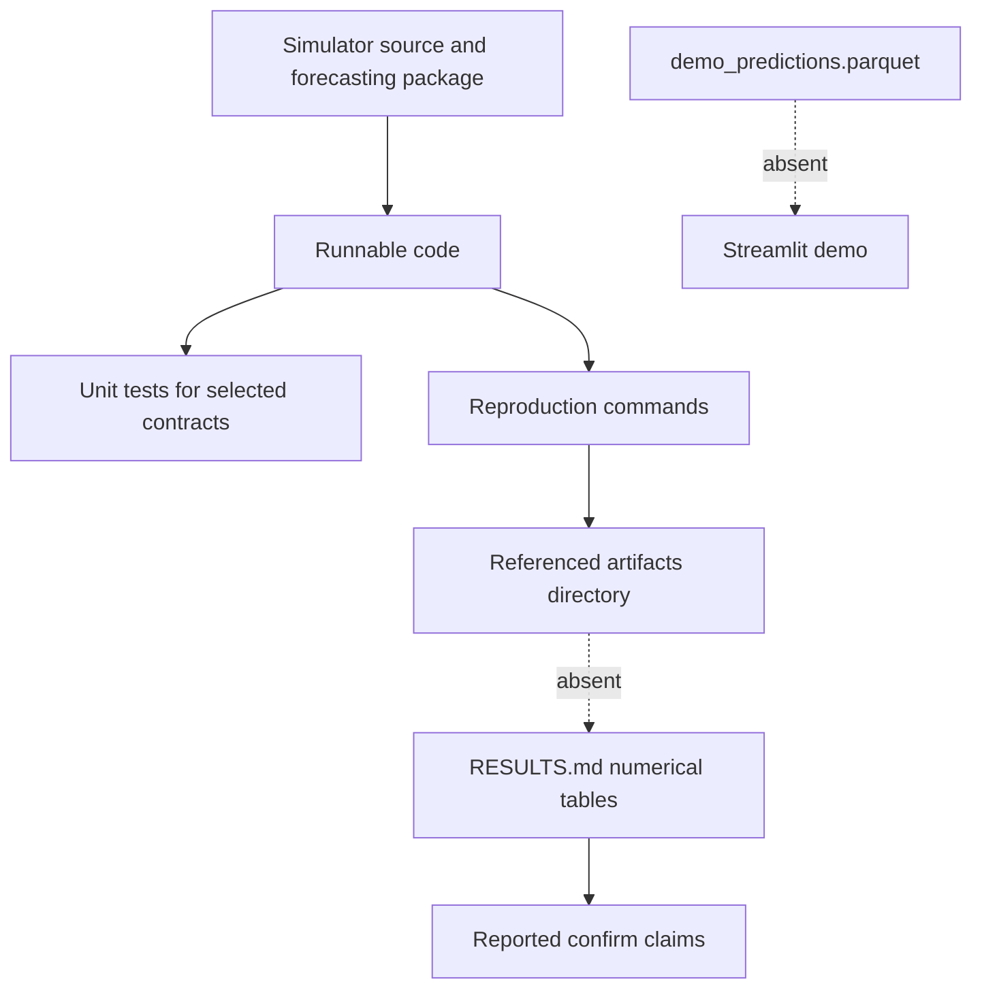
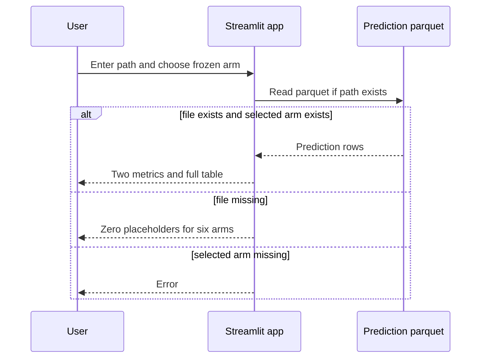

# Forecasting evidence and demo

This page separates source-backed implementation from reported experiment results. The repository contains runnable pipeline code and a prose result report, but it does **not** contain the raw or derived artifacts cited by that report. Consequently, the numerical claims can be attributed to `policy_forecasting/RESULTS.md`, but cannot be independently recomputed from the checked-in tree.

## Evidence chain



*Caption: Checked-in evidence boundary: code, tests, commands, and prose results exist; confirm and demo data artifacts do not.*

## Published confirm report

`RESULTS.md` reports a sweep dated **2026-05-17** with six arms × 24 seeds × 80 ticks × 10,000 households: 11,520 tick rows, 10,368 supervised rows, 6,480 train rows, and 1,728 final rows, completed in about 2.25 hours. It reports byte-identical baseline replay, gradient boosting unemployment R² 0.924 and MAE 0.028, and an MAE improvement of 0.080 over persistence with CI `[0.056, 0.107]`. Distress reportedly did not beat persistence. It also reports six of ten arm/outcome treatment pairs clearing its claim gate and identifies `gdp_ma4` as the leading unemployment SHAP feature.

These are **reported simulator results only**. They are not real-world macroeconomic forecasts, do not validate policy transfer outside EcoSim, and do not establish real-world causal effects. The docs themselves state this boundary, and `economic_finding()` emits the same caveat.

### Absent artifacts

No `policy_forecasting/artifacts/` files are present. Searches find no `confirm10k_ticks.parquet`, `confirm10k_supervised.parquet`, `confirm10k_result.json`, `determinism_confirm10k.json`, SHAP CSV/text output, model file, prediction parquet, run log, environment capture, checksum manifest, or machine-readable report. There is also no `demo_predictions.parquet`. `RESULTS.md` says every number comes from artifacts in that absent directory, so the report is a secondary claim, not a self-contained evidence bundle.

The sweep metadata implementation would record dimensions, row count, elapsed seconds, horizon, and dropped manifest columns, but not package versions, commit SHA, machine details, per-run failures, parquet checksum, or simulator configuration snapshot. Models are never serialized. `run_pipeline` writes metrics/treatment JSON but not row-level predictions, the assigned split table, selected policy hashes, or a demo artifact.

## Implementation/documentation discrepancies

| Topic | Documentation claim | Implemented behavior / consequence |
|---|---|---|
| Final split | Schema says frozen final test is held-out lever vectors × held-out seeds; V1 says it holds out both | `assign_splits()` assigns **all seeds** for tail policy hashes to `final_test`. Seeds overlap numerically with train runs on other policies. Blocks are disjoint by policy/seed pair, but the final set is not restricted to held-out seeds. |
| Validation use | Validation is “used only for model selection and tuning” | No tuning or model selection consumes validation. `run_pipeline` trains on `train` and evaluates `final_test`; validation is ignored unless no final policy exists. |
| Frozen final read once | Docs call the final test frozen/read once | Nothing enforces one-time access; every pipeline/explanation invocation reconstructs and reads it. SHAP is also computed on final rows. |
| Split selection | General held-out canonical vectors | Policies are sorted by 16-character hash and tail-selected. With the six-arm confirm, the held-out arm depends on hash order rather than preregistered semantic identity; the output does not record which arm/hash was held out. |
| Feature manifest | Schema says feature matrix is “exactly” the frozen union | `feature_columns()` uses exclusion, not allow-listing. Any unexcluded input column becomes a feature. Schema conformance, dtypes, uniqueness, and column completeness are not validated. |
| Same-tick distress | README says same-tick `mean_distress` is allowed | Sweep also emits duplicate same-tick `consumer_distress`; both survive feature selection, creating duplicate information. This is not future-label leakage but is undocumented redundancy. |
| Configurable horizon | Dataset CLI exposes `--horizon` | Label names and exclusion logic remain `__t+8`; a horizon other than eight is mislabeled, and differently suffixed future columns would not be excluded. |
| Trend baseline | Described as trend baseline for `t+8` | It adds one lag-1 difference once, rather than extrapolating that trend eight ticks. |
| “Policy-aware” persistence | Docs call persistence policy-aware | It predicts only current outcomes. Policy state may be present in the frame but is not used by `PersistenceBaseline`. “Policy-aware” means evaluation occurs within policy-generated trajectories, not that the baseline consumes levers. |
| Confidence blocking | Docs say CIs/errors are blocked by run and time bands | Forecast comparison CIs use `run_id:time_regime`; raw MAE/RMSE/R² are row-level. Treatment-effect CIs resample seed deltas and do not use time-regime blocks after tick averaging. |
| Baseline claim flag | “Beats persistence” semantics | `delta_vs_*_claim` is true for an interval wholly above **or below** zero. A significantly worse model therefore receives `claim=True`; callers must inspect delta direction. |
| Determinism noise | Pipeline accepts determinism report | Harness writes nested `replicate_delta_distribution.max_abs_delta`; pipeline reads nonexistent top-level `max_replicate_delta` or `noise_band`, defaults to `0.0`, and can incorrectly claim effects exceed measured noise. |
| Determinism statement | Report says byte-deterministic across all per-tick metrics | Hash equality is over JSON serialization of returned rows in two fresh processes. Useful, but not proof of determinism beyond that arm/seed/config/environment or unobserved simulator state. |
| Duplicate arm handling | Schema says baseline-equivalent duplicate arms are dropped | Frozen constants are tested distinct, but sweep accepts repeated arm IDs and contains no general canonical deduplication. |
| Public surfaces / frozen backend | Docs say wrapper uses public surfaces and imports backend read-only | It does avoid editing backend, but reads many concrete attributes (`planned_layoffs_ids`, `last_tick_actual_hires`, etc.) and mutates global backend `CONFIG.random_seed`; these are tighter implementation couplings than a stable formal API. |
| Feature origin | Schema mentions existing data models, diagnostics, shortage rows, and regime events | Wrapper snapshots the live `Economy`, firms, households, government, and `get_economic_metrics()` directly; it does not read warehouse rows or regime events. |
| Counts/threshold language | `n_below_cash_thresh` | Implementation counts households where derived `cash_stress > 0`, equivalent to cash below four times essential spend, and returns float—not an independently configured threshold/count type. |
| Results reproducibility | “Complete runnable code” and exact report | Code is present, but source artifacts, predictions, split export, checksums, and environment evidence are absent. Current source behavior cannot prove that the prose numbers came from the current commit. |

## Demo behavior



*Caption: The demo is a saved-table viewer; it neither invokes the simulator nor runs a trained forecaster.*

`policy_forecasting.demo.app` expects columns `arm_id`, `unemployment_rate__t+8`, and `consumer_distress__t+8`. It selects the first row for the chosen arm and the first baseline row, computes deltas live, displays two `st.metric` cards, then shows the entire frame. Although fallback rows include `delta_unemployment_vs_baseline` and `delta_distress_vs_baseline`, the app ignores those columns and recomputes deltas.

Important limitations:

- No pipeline stage creates `DEFAULT_PREDICTIONS` (`policy_forecasting/artifacts/demo_predictions.parquet`).
- If the file is absent, `_load_predictions()` silently fabricates six zero forecasts. Non-baseline fallback delta fields are `None`, but the displayed recomputed deltas are `+0.000`. This can look like a valid forecast rather than “no data.”
- The app does not identify model, seed, tick, split, uncertainty, source run, policy hash, or artifact timestamp.
- Duplicate arm rows are silently reduced to the first. Duplicate/missing baseline rows are not validated; a missing baseline raises an uncaught positional-index error.
- Extra or missing required columns and malformed values are not schema-checked.
- It compares saved arm-level point rows; it does not accept current economy state, execute counterfactual simulation, load a model, or calculate forecasts.
- There are no demo tests and no screenshot specifically for this Streamlit surface.

## Test ownership and gaps

The package has 11 focused tests across five files:

- `test_config.py`: six arm IDs, distinct canonical hashes, baseline/deltas, resolved/sorted hashing;
- `test_dataset.py`: forward join/tail drop and identifier/future-label/policy-ablation exclusions;
- `test_distress.py`: shortfall formula, weighted household score, household averaging/history update;
- `test_models.py`: persistence and one-step trend outputs;
- `test_split.py`: policy/seed block disjointness and early/mid/late labels.

Not tested are the backend sweep integration, snapshot schema and dtypes, parallel execution, parquet/metadata writing, determinism subprocess harness, ElasticNet/gradient boosting fitting, evaluation metrics/bootstrap direction, multiplicity correction, treatment effects, `run_pipeline`, `run_explain`, SHAP, artifact JSON schemas, and Streamlit demo. No test asserts exact `FEATURE_MANIFEST` equality or catches arbitrary extra features. No test checks the documented confirm dimensions/results.

Root pytest configuration sets `testpaths=["backend/tests_contracts"]`, so a plain `pytest` does **not** discover `policy_forecasting/tests`. Run it explicitly:

```bash
python -m pytest policy_forecasting/tests -q
```

The package requirements pin pytest, but the root project dependencies do not install the full forecasting stack unless `policy_forecasting/requirements.txt` is used.

## Reproduction and evidence ladder

The least expensive meaningful ladder is:

1. Run the package tests explicitly.
2. Run a tiny two-arm/one-seed sweep to validate backend integration and parquet generation.
3. Run the dataset CLI and inspect label-tail count: each complete run should contribute `ticks - 8` supervised rows.
4. Run determinism and manually verify `hash_equal` plus nested `replicate_delta_distribution.max_abs_delta`; do not rely on the current pipeline noise parser.
5. Run `run_pipeline`; inspect which canonical policy was final, delta signs as well as claim flags, and both policy-state variants.
6. Run SHAP only after a non-empty final split exists.
7. Build a separate arm-level prediction parquet if the demo is required; no supplied command does this.
8. Run the 10k confirm only with an explicit compute budget, then retain raw parquet, metadata, result JSON, determinism JSON, SHAP files, predictions, logs, checksums, package versions, and commit SHA.

Canonical commands are documented in [the pipeline page](./pipeline.md#commands) and in `RESULTS.md`. Re-running may or may not reproduce the published table because the original artifacts and environment record are absent.

## Claim boundary

Defensible source-level statement: the repository implements a simulator experiment pipeline capable of generating frozen-arm, matched-seed data and comparing `t+8` regressors and within-simulator treatment deltas.

Attributed but unverified statement: `RESULTS.md` reports that its 10k confirm run found strong held-out unemployment forecasting, no distress forecasting improvement, and several matched-seed policy effects.

Not supported: real-world policy efficacy, broad policy-space generalization, production forecast serving, autonomous policy recommendation, causal transfer outside the simulator, or independently verified reproduction of the published 2026-05-17 numbers.
