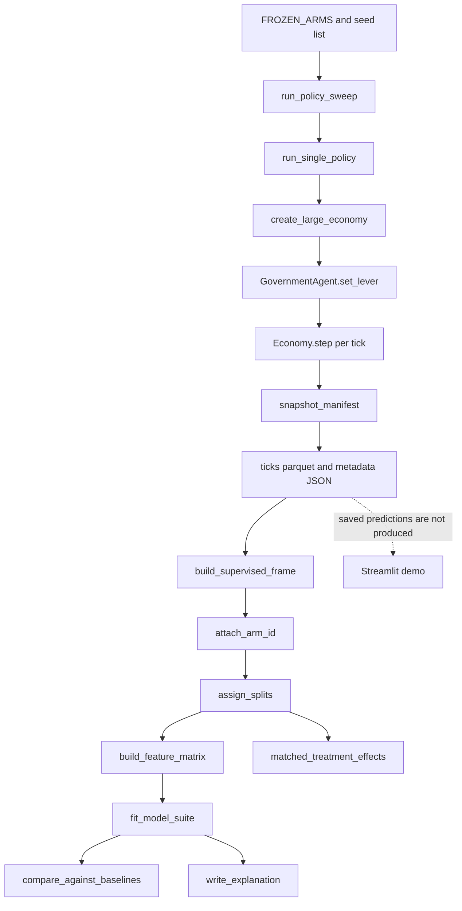
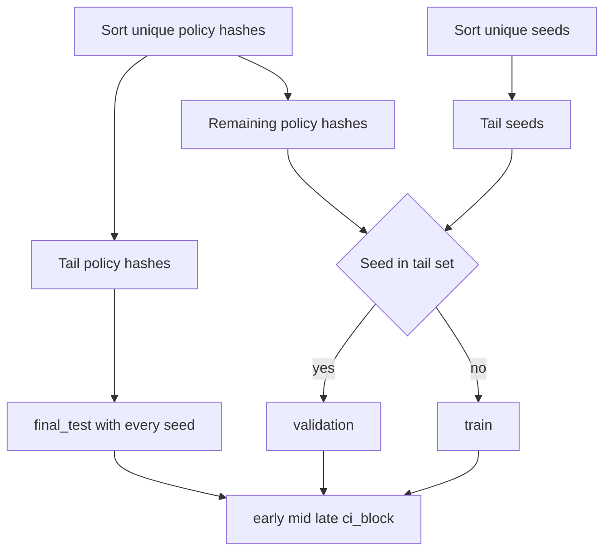

# Policy forecasting pipeline

`policy_forecasting` is an external experiment package around the EcoSim simulator. It does not provide a production forecasting API. Its implemented path is: run frozen policy arms against the simulator, record economy-level tick rows, forward-join two `t+8` labels, assign deterministic policy/seed splits, fit four regressors, evaluate prediction errors and matched-seed arm effects, and optionally produce one SHAP ranking. All economic findings are **simulator-only system-identification claims**, not real-world forecasts or causal policy advice.

## End-to-end flow



*Caption: Implemented sweep-to-analysis flow; the dashed demo edge marks the missing prediction-export stage rather than a real producer.*

The sweep composition root is `policy_forecasting.sweep.wrapper`. `_backend_imports()` imports `backend.tools.runners.run_large_simulation.create_large_economy` and the backend `CONFIG`; `set_run_seed()` seeds Python `random`, NumPy, and `CONFIG.random_seed`. `run_single_policy()` creates an economy, calls `apply_policy()`, then executes `economy.step()` before each `snapshot_manifest()`. Tick is recorded as `economy.current_tick - 1`.

## Frozen policy contract

`config.py` defines 17 `POLICY_STATE_COLUMNS` and the baseline-resolved vector. `resolve_levers()` rejects unknown keys but does not validate values or cross-lever constraints. `canonical_lever_json()` sorts the resolved vector and normalizes floats to ten decimal places; `canonical_policy_hash()` is the first 16 hexadecimal characters of SHA-256 over that JSON.

| `arm_id` | Delta passed to `GovernmentAgent.set_lever()` |
|---|---|
| `baseline` | none |
| `wage_tax_high` | `wage_tax_rate=0.30` |
| `profit_tax_high` | `profit_tax_rate=0.35` |
| `benefit_high` | `benefit_level="high"` |
| `min_wage_high` | `minimum_wage_policy="high"` |
| `subsidy_food_25` | `sector_subsidy_target="food"`, `sector_subsidy_level=25` |

The seed presets are `SMOKE_SEEDS_2K=range(4)` and `CONFIRM_SEEDS=range(24)`. Despite the constant name, the smoke preset controls seeds only; CLI household scale defaults independently to 2,000. Default sweep dimensions are six arms, four seeds, 2,000 households, 80 ticks, ten firms per category, and one process. `--confirm-seeds` changes only the seeds; the documented confirm command explicitly supplies 10,000 households and eight processes.

## Tick-row schema and derivation

The persisted grain is one row per `(run_id, policy_canonical, seed, tick)`. `run_id` is `policy-{arm_id}-seed{seed}-hh{households}`. `levers_json` contains the complete baseline-resolved policy state. `snapshot_manifest()` emits:

- identifiers: `run_id`, `policy_canonical`, `levers_json`, `seed`, `tick`;
- labor: `unemployment_rate`, MA4/MA8, hires, planned layoffs, planned vacancies, fill ratio, wage-pressure index;
- demand: GDP, inventory, mean-price index, GDP MA4, and revenue/mean price for frozen sectors `food`, `housing`, `services`, `healthcare`;
- welfare: cash-stress and food-insecurity mean/p10/p50/p90, mean health/happiness, stressed counts, `mean_distress`, and health-below-0.7 share;
- firm stability: burn/survival/weak-demand counts and `bankruptcies_tick`;
- fiscal: government cash, last revenue minus spending, and simulator `fiscal_pressure`;
- all 17 policy-state fields from `government.to_dict()`;
- `consumer_distress`, copied from same-tick `mean_distress` after manifest defaults are filled.

Missing manifest fields are silently filled with numeric `0.0`. Policy fields missing from `government.to_dict()` are initially `None`, but because they already exist they are not replaced by the later `setdefault`. Sector firms outside the four frozen names are ignored; a sector with no firms gets price zero because division uses `max(1, count)`.

### Distress formula

For each household, `DistressHistory.record()` appends the positive shortfall ratio to an eight-entry deque. `food_insecurity()` divides the number of positive entries by **eight even during startup**, so early ticks are implicitly padded with non-shortfall ticks. With `essential_spend` taken from `CONFIG.households.subsistence_min_cash` (fallback 50), implementation is:

`clip01(0.40*cash_stress + 0.25*food_insecurity + 0.20*(1-health) + 0.15*(1-happiness))`,

where `cash_stress=clip01(1-cash/(4*essential_spend))`. Economy distress is the household mean. `n_below_cash_thresh` actually counts `cash_stress > 0`; it is stored as a float. `n_food_insecure` similarly counts positive food-insecurity values.

## Labels and leakage boundary

`build_supervised_frame(rows, horizon=8)` copies tick rows, shifts label ticks backward by the requested horizon, and performs a validated one-to-one inner merge on `(run_id, policy_canonical, seed, tick)`. Tail rows without a future observation disappear. It accepts `consumer_distress` preferentially, otherwise `mean_distress`, and always names labels `unemployment_rate__t+8` and `consumer_distress__t+8`—even when a non-eight `--horizon` is supplied.

`feature_columns()` excludes identifiers, labels ending literally in `__t+8`, and metadata `split`, `time_regime`, `ci_block`, `arm_id`. The policy ablation additionally removes all 17 policy columns. It does **not** select against `FEATURE_MANIFEST`; therefore every other input column is admitted as a feature. This includes same-tick `consumer_distress`, arbitrary extra parquet columns, and future labels with suffixes other than `__t+8`.

## Split semantics



*Caption: Exact `assign_splits()` behavior: final policy vectors include all seeds, while validation seeds are held out only on non-final policies.*

`assign_splits()` chooses lexicographic/hash-sorted tails, not randomized or arm-semantic selections. Defaults are one final policy and four validation seeds. `run_pipeline._adaptive_split_sizes()` instead chooses one final policy only with at least three policies, and `max(1, n_seeds//4)` validation seeds with at least two seeds. The final evaluation frame is `final_test`, falling back to `validation` only when no final policy exists.

Each run is partitioned by row position into early, mid, and late thirds. `ci_block` is `{run_id}:{time_regime}`. No temporal rows are withheld from training inside a train run.

## Models

- `PersistenceBaseline`: predicts current unemployment and current `mean_distress` (or `consumer_distress`) as `t+8`.
- `TrendBaseline(lag=1)`: predicts current value plus its one-tick within-run difference. Despite the eight-tick target, it extrapolates only one observed step.
- `make_elastic_net()`: median-imputed/scaled numeric columns, most-frequent-imputed one-hot categoricals, then `MultiOutputRegressor(ElasticNet(alpha=0.02,l1_ratio=0.4,max_iter=20000))`.
- `make_gradient_boosting()`: the same preprocessing, then two `GradientBoostingRegressor` instances with 180 trees, learning rate 0.04, depth 3.

`fit_model_suite()` fits all four. In `_model_predictions()`, however, fitted baseline objects from that suite are ignored; fresh baselines predict against the full final frame because the trend baseline requires identifiers that `build_feature_matrix()` removes. The learned models predict against leakage-filtered `X_final`. There is no hyperparameter search, calibration, serialization, model registry, or use of the validation split for selection.

## Evaluation and treatment effects

`regression_metrics()` reports target-level MAE, RMSE, and R². `compare_against_baselines()` computes baseline absolute error minus model absolute error and bootstraps means over `ci_block` 2,000 times. Positive delta favors the model. `delta_vs_*_claim` is true whenever the 95% interval excludes zero in **either direction**, so the field can be true when a model is significantly worse; direction must be read from the delta.

`matched_treatment_effects()` first averages each outcome over all supervised ticks per `(arm_id, seed)`, then pairs each arm with baseline by seed. It reports mean arm-minus-baseline delta, a 5,000-resample paired bootstrap CI, Wilcoxon p, paired standardized effect `dz`, Holm and Benjamini–Hochberg adjustments, and a claim gate requiring both adjusted p-values below 0.05, `|dz|>=0.8`, and—if supplied—effect magnitude above the determinism noise band. This is simulator treatment analysis; temporal averaging and matched seeds do not establish real-world causality.

## Determinism and explanation

`measure_determinism()` launches two fresh Python processes with `PYTHONHASHSEED=0`, hashes unrounded JSON tick rows, and computes numeric replicate deltas. Its JSON stores the maximum at `replicate_delta_distribution.max_abs_delta`. `run_pipeline.run()` instead looks for top-level `max_replicate_delta` or `noise_band`; with an actual harness report neither exists, so it silently uses `0.0`. See [evidence and discrepancies](./evidence-and-demo.md#implementationdocumentation-discrepancies).

`run_explain` recreates the split and model suite, then explains only gradient-boosting target index 0 (`unemployment_rate__t+8`) on the first 1,000 final rows. `shap_summary()` writes mean absolute SHAP rankings, and `economic_finding()` names only the top feature while explicitly labeling the result simulator system identification. No directionality, dependence plot, uncertainty, distress explanation, or stability analysis is implemented.

## Commands

```bash
python -m policy_forecasting.sweep.wrapper --arms baseline,wage_tax_high --seeds 0 --households 200 --ticks 20 --output policy_forecasting/artifacts/smoke_ticks.parquet
python -m policy_forecasting.dataset policy_forecasting/artifacts/smoke_ticks.parquet policy_forecasting/artifacts/smoke_supervised.parquet
python -m policy_forecasting.determinism --arm baseline --seed 0 --households 200 --ticks 20 --output policy_forecasting/artifacts/determinism_smoke.json
python -m policy_forecasting.run_pipeline policy_forecasting/artifacts/smoke_ticks.parquet policy_forecasting/artifacts/smoke_result.json --determinism-json policy_forecasting/artifacts/determinism_smoke.json
python -m policy_forecasting.run_explain policy_forecasting/artifacts/smoke_ticks.parquet policy_forecasting/artifacts/explain
streamlit run policy_forecasting/demo/app.py
```

The expensive documented confirm sweep is:

```bash
python -m policy_forecasting.sweep.wrapper --confirm-seeds --households 10000 --ticks 80 --processes 8 --output policy_forecasting/artifacts/confirm10k_ticks.parquet
```

Dependencies are separately pinned in `policy_forecasting/requirements.txt`; root `pyproject.toml` includes only pandas in optional `ml`, not scikit-learn, SciPy, SHAP, Streamlit, or PyArrow.
