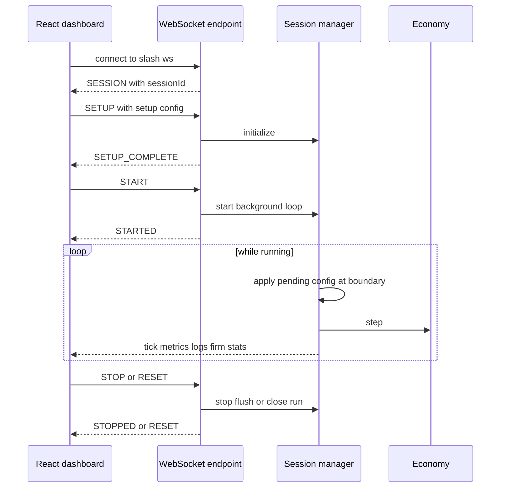
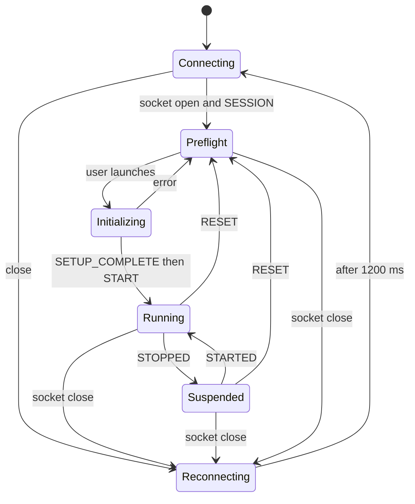

# React dashboard

The dashboard is a single `EcoSimUI` component composed in `frontend-react/src/App.jsx`. It owns the browser-side session state, renders seven mutually exclusive screens, sends all simulation mutations over `/ws`, and consumes the live frame produced by `SimulationManager._run_loop_scoped`. It does **not** query warehouse or decision-context HTTP endpoints; its backend integration is the WebSocket only. For server ownership and protocol details, see [WebSocket session runtime](../runtime/sessions-and-websocket.md). For policy normalization, grouped levers, and effective semantics, see [configuration and policy](../backend/configuration-and-policy.md).

## State architecture

State is local React state rather than a store or reducer:

| State family | Source fields | Meaning |
|---|---|---|
| Navigation/lifecycle | `activeView`, `isInitialized`, `isInitializing`, `isRunning`, `tick` | Starts in `CONFIG`; non-config navigation is disabled until setup completes. Running state changes only on backend acknowledgements, except `SETUP_COMPLETE` optimistically marks running while immediately sending `START`. |
| Transport/session | `ws`, `wsConnected`, `sessionId`, `reconnectTimerRef` | One browser socket and the server-issued session identifier. |
| Telemetry | `metrics`, `firmStats`, `logs` | Current metrics plus server-owned histories, tracked entities, firm aggregates, and a bounded client log buffer. |
| Selection/filtering | subject and firm indices; subject search/filter; log search/type/severity/index/density/auto-scroll | Pure presentation state. Out-of-range entity indices fall back to zero. |
| Setup | `setupConfig` and `setupConfigRef` | Population, firms, seed, initial tax/LLM settings, and stabilizer exclusions sent with `SETUP`. The ref ensures the asynchronous setup acknowledgement uses the latest profile. |
| Runtime policy | `config`, `pendingConfigRef`, `configUpdateTimer` | Camel-case control values. Changes are locally immediate, coalesced for 400 ms, then sent as one `CONFIG` command. |

Telemetry merge is deliberately shallow at the top level and defensive for `priceHistory`, `supplyHistory`, `netWorthHistory`, `trackedSubjects`, and `trackedFirms`: absent values preserve the previous client value. Logs append with `prev.slice(-300)` before new events, so the resulting buffer can briefly exceed 300 by the size of the incoming batch. Current samples are appended client-side to several histories to keep inspectors current between backend history samples.

The backend computes expensive aggregate metrics every five ticks (`metrics_stride = 5`) unless no cache exists or an LLM decision is due, but emits a frame every tick. Long histories are sampled every 25 ticks. Consequently, a new `tick` does not guarantee every displayed aggregate changed.

## Screen inventory

1. **Config — `CONFIG`, “Simulation Controls”.** Always reachable. Before launch it edits setup population, seed, initial taxes, policy assistant, and stabilizer exclusions. It also exposes supported policy settings, a live snapshot, reset defaults, and `Launch Simulation`. After launch, policy widgets route to runtime `CONFIG`; `Apply Changes` flushes pending values. The UI includes `num_firms` in setup state and sends it, but this screen has no firm-count control.
2. **Command — `DASHBOARD`, “Economic Command Deck”.** Macro tiles, GDP pulse, population distress, market map, finance and policy summaries, wage and sector-price histories, recent derived signals, and wealth distribution. “Macro Stress” is a frontend composite: 45% unemployment, 40% inverse happiness, and 15% firm pressure.
3. **Population — `SUBJECTS`, “Population Intelligence”.** Search and cohort filters over the backend’s 12 tracked households; selected-agent identity, employment, expected-wage drivers, skills, morale, finances, needs, traits, wealth/wage histories, and animated avatar. Filters and risk labels are client-derived and are not simulator classifications.
4. **Markets — `FIRMS`, “Markets & Firms”.** Firm/employee/wage/struggle summary, category sizing and health, top-cash and top-employer tables, seven-firm watchlist, selected-firm dossier, cash/profit history, and building canvas. Category distress uses average cash below `$2,000`; “booming” uses above `$10,000`—both are presentation thresholds.
5. **Finance — `FINANCE`, “Finance & Credit”.** Government-backed loan count, treasury debt/fiscal-flow chart, credit alerts, and explicit missing-data panels. Bank reserves, private balances, default rate, interest rate, and household deposits are shown as unavailable; the liquidity hologram is decorative and labels bank telemetry inactive.
6. **Government — `GOVERNMENT`, “Government Console”.** Manual and AI policy controls, market/stabilization/bailout tools, government canvas, macro/fiscal cards, LLM decision timeline, accepted/rejected changes, policy history, and debt history. Runtime controls are schema-normalized by the backend; UI labels are not proof that every raw value is applied literally. See [configuration and policy](../backend/configuration-and-policy.md).
7. **Logs — `LOGS`, “Audit Console”.** Client-buffered live events with search, type/severity filters, density and auto-scroll controls, event table, selected-event detail, and raw JSON. `normalizeLog` heuristically maps backend types/messages to UI type and severity; this is an audit viewer, not durable warehouse history.

## Charts and canvases

`LineChart` wraps Recharts `AreaChart`; `MeasuredChart` obtains explicit pixel width through `ResizeObserver` (or window resize fallback), avoiding a responsive-container dependency. It supports multiple aligned arrays, hidden axes, gradients, tooltips, and duplicates a single sample so a line remains visible. Alignment is positional, not by tick, and missing points become zero (`ds[i]?.value || 0`), which can misrepresent differently sampled series.

`WealthDistributionChart` is a Recharts bar chart for bottom 50%, derived middle 40%, and top 10%, with the Gini shown separately. `CircularProgress` is SVG. `SystemDistressGauge`, market maps, live-run projection, and finance hologram are DOM/CSS visualizations.

The three canvas components use `ResizeObserver`, device-pixel-ratio scaling, generated point clouds/wireframes, perspective projection, and `requestAnimationFrame`:

- `NeuralAvatar` renders a human or building variant; the dashboard uses its human form for the selected household.
- `NeuralBuilding` changes geometry/palette by sector, tier, activity, and distress state.
- `NeuralGovernment` renders an obelisk whose palette and pulse follow LLM status/activity. Refs allow status changes without reconstructing geometry; its main effect depends only on `active`.

All cancel the current animation frame and disconnect the observer on cleanup. Geometry and flicker use `Math.random`, so visuals are intentionally non-deterministic and unrelated to the simulation’s isolated RNG.

## WebSocket controls and backend integration



*Figure 1. Source-backed browser setup, control, and per-tick telemetry sequence.*

Endpoint selection is `VITE_WS_URL` when non-empty, otherwise same-origin `/ws` with `ws` or `wss`; the server-side fallback is `ws://localhost:8002/ws`. Vite proxies `/ws` to `ws://127.0.0.1:8002`; Nginx proxies it to `backend:8002/ws` and preserves upgrade headers.

| Client action | Wire payload | Server behavior |
|---|---|---|
| Launch | `{command: "SETUP", config: setupConfig}` | Validates/initializes a new economy, then emits `SETUP_COMPLETE`; UI auto-sends `START`. |
| Suspend/resume | `STOP` / `START` | Stops or reuses the background loop and returns `STOPPED` / `STARTED`. UI waits for acknowledgement. |
| Reset | `RESET` | Cancels loop, closes warehouse run, sets server tick zero, emits `RESET`; UI clears telemetry and returns to Config. |

This is a client-visible reset, not fresh economy construction. The server retains the existing economy until another `SETUP`; the stock dashboard returns to Config and normally sends `SETUP` before running again, but a raw protocol client could send `START` and continue the retained economy with reset manager tick numbering.
| Policy edit | `CONFIG` with supported camel-case subset | If running, merges pending updates and applies them before the next `Economy.step`; if paused, applies immediately through the same policy-schema path. No explicit config acknowledgement is emitted. |
| Stabilizers | `STABILIZERS` plus disable flag and agent list | Updates household/firm/government state and emits `STABILIZERS_UPDATED`. |

The socket protocol rejects unknown commands, malformed JSON, and payloads over 1 MiB. Setup’s Pydantic model requires at least three households, while the frontend precheck only requires one; the visible population slider starts at 100, so normal UI use satisfies the server constraint.

## Lifecycle and reconnect



*Figure 2. Browser-visible lifecycle; reconnect creates a fresh server session rather than resuming the prior run.*

On close the UI marks transport offline, clears `sessionId`, stops initializing/running indicators, and reconnects after a fixed 1.2 seconds. It does **not** clear `isInitialized`, metrics, or the active view. The backend, however, cancels the old manager, closes its warehouse run, and removes the session. A successful reconnect therefore yields a new blank server session while the UI may still display stale initialized telemetry and enabled controls. There is no resume token, state replay, exponential backoff, jitter, heartbeat, or reconnect test. Component cleanup cancels the timer and closes the effect-owned socket.

## Tests, gaps, and validation commands

### Covered

- `frontend-react/src/App.test.jsx` mocks WebSocket and verifies Config preflight, same-origin endpoint resolution under jsdom, ONLINE/Ready state, `SESSION`, transition on `SETUP_COMPLETE`, and automatic `START`.
- `frontend-react/src/test/setup.js` supplies `ResizeObserver` and `matchMedia` shims.
- Backend session tests verify distinct managers/session IDs, registry release, independent config and Python/NumPy RNG streams, context-local config proxying, cross-session initialization isolation, and prevention of duplicate run tasks.
- Backend API tests cover warehouse readers and live decision context, but those HTTP surfaces are not consumed by this dashboard.

### Material gaps

- Only one frontend test exists; no screen-by-screen rendering, chart/canvas, filter, pause/reset, policy debounce, stabilizer, malformed-frame, server-error, disconnect, or reconnect assertions.
- `onmessage` calls `JSON.parse` without a local guard; malformed server data would throw in the event callback.
- Server `{error: ...}` frames only log to the console and clear initialization; there is no persistent user-facing error state.
- Reconnect preserves stale initialized UI while the server destroys the old session.
- Runtime `CONFIG` has no acknowledgement or rejected-lever feedback channel, so local controls can diverge from effective backend policy until telemetry exposes a later snapshot.
- `flushConfigUpdates` nulls pending state even when disconnected, uninitialized, or otherwise unable to send; edits can be lost.
- Setup exposes no firm-count widget despite sending the default `num_firms: 5`.
- Multi-series charts align by array index rather than tick and substitute zero for missing points.
- Finance explicitly lacks core bank/deposit telemetry; dashboard finance is currently treasury and government-loan oriented.
- Canvas accessibility is visual only: canvases have no textual alternative, and animation has no reduced-motion handling.
- `NeuralAvatar` and `NeuralBuilding` build pairwise connections with quadratic point comparisons; no visualizer performance tests exist.

### Narrow commands

```bash
cd frontend-react && npm test
cd frontend-react && npm run build
cd frontend-react && npm run lint
pytest -q backend/tests_server/test_server_sessions.py
pytest -q backend/tests_server/test_server_api.py
```

Use the frontend test for the browser handshake, the backend session suite for lifecycle/isolation changes, and both when changing the protocol. Build catches Vite/Rollup integration (including dedicated `charts` and `icons` chunks); lint is independently required because the test does not enforce static quality.
