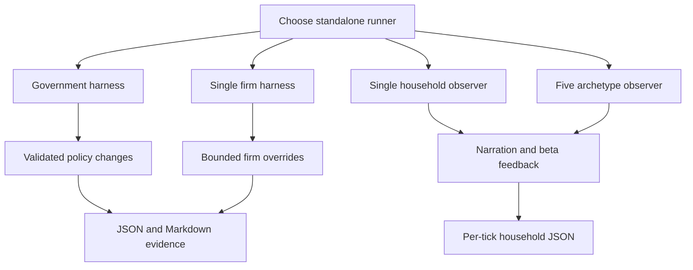

# Experiments and evaluation

This page distinguishes production-path integration from research runners. The shared provider interface does not make every consumer an integrated agent. For the live government lifecycle and safety boundary, see [LLM government](government.md).

## Consumer status matrix

| Consumer | Call chain | Effect on simulation | Provider path | Outputs | Status |
|---|---|---|---|---|---|
| Live government | `SimulationManager` → frozen economy → `LLMGovernmentAdvisor.decide` → `LLMProvider.complete` → sanitizer → boundary `set_lever` | Accepted policy levers change the next live tick | Configured provider factory | WebSocket status, policy actions, full warehouse decision rows | **Integrated, opt-in** |
| Government harness | `run_llm_government_test.py` → economy tick loop → advisor | Controls policy in a standalone simulator run | Explicit Ollama, LM Studio, Groq, or OpenRouter setup | JSON and Markdown run artifacts, console diagnostics | **Experimental harness** |
| Government controls | `run_government_control_compare.py` → no-government or conservative scripted scenarios | Deterministic non-LLM policy controls | None | `control_compare_latest.json` and `.md` by default | **Evaluation control** |
| Single firm | `run_llm_firm_test.py` → `LLMFirmAdvisor.decide` → provider → runner-applied overrides | One selected private firm can receive bounded price, wage, expected-sales, R&D, and inventory-target overrides | Runner limits selection to Ollama or LM Studio | Console and run log assembled by runner/advisor history | **Standalone experimental controller** |
| Single household | `run_household_llm_tester.py` → select household → tick → prompt → provider | No action override; model comments on the household’s actual state and periodically supplies beta feedback | Runner constructs LM Studio provider | `household_llm_run_log_<archetype>.json` | **Observer/beta tester** |
| Five archetypes | `run_all_archetypes.py` → five independent economies → household prompt helpers → shared LM Studio provider | No action override; independent narrated trajectories | LM Studio only in this runner | Five per-run JSON files and combined comparison JSON | **Exploratory batch harness** |
| Multi-household behavior check | `run_household_behavior_tests.py` → selected frugal/spendthrift/average households → narration and feedback | Observation only | Local provider path | Per-archetype behavior logs and combined report | **Behavioral check, not runtime test suite** |

`LLMConfig.enable_llm_agents` is marked “Future”; neither the server nor `Economy.step` wires firm or household advisors into the live application. Calling those tools “integrated” would therefore be incorrect.

## Experimental flows


*Caption: The inspected standalone entrypoints separate government control, one-firm control, and household observation; only the government has a live-server path.*

### Government harness and controls

`run_llm_government_test.py` configures scale, seed, warmup, first decision, cadence, provider/model and sampling. It appends metrics snapshots, calls the same advisor/sanitizer family, prints decisions, and writes detailed JSON/Markdown. `run_government_control_compare.py` supplies `no_government` and `conservative_scripted` scenarios and reuses diagnostics from the LLM runner without calling a model. These controls are useful comparators, but matching a seed alone does not guarantee the model arms saw identical information: provider timing, constrained-observation draws, model context, and any runner configuration must also be frozen and archived.

### Firm controller

`LLMFirmAdvisor` computes the deterministic heuristic baseline on a **deep-copied firm**, then prompts with observable market inputs, a target-firm snapshot, that baseline, and recent memory. It accepts numeric values only for five named fields. Parse/provider failure yields no overrides and deterministic explanations. The runner, not `Economy.step`, decides when and how to apply those values and records observed one-step outcomes. This is a one-firm intervention experiment, not evidence that all firms are LLM-driven.

### Household and all-archetype observers

The household tester advances the real simulator first, then prompts from one household’s identity, state, receipts, and economy metrics. Its own module states that the LLM is a commentator/observer and that decision override is future work. The five-run wrapper selects frugal, average, spendthrift, random seed 42, and random seed 99 households in **independent economies**. It calls LM Studio after warmup on each tick, periodically requests beta feedback, and writes per-run and combined JSON. The comparison therefore measures narrated simulated trajectories, not model-caused household behavior.

A subtle implementation gap: `run_all_archetypes.py` maintains `conversation_history` but `build_tick_prompt` receives no history argument; the list is truncated/reset yet not inserted into the shown call. Treat claims of conversational memory in that runner cautiously.

## Evaluation and evidence

The checked-in experiment report describes one 1,000-household, seed-42, 200-tick comparison with decisions beginning at tick 15 and recurring every 26 ticks. It compares Granite 8B, Gemma 26B, Llama 70B, GPT-OSS 120B, and Ring 1T against a fixed baseline. Reported outcomes include final/minimum government cash, average/final/trailing GDP and unemployment, happiness/health, fiscal pressure, accepted-decision rate, and evidence-match rate. The report’s strongest run is Ring 1T within that setup; it explicitly does **not** establish a general size ranking.

`analyze_llm_government_log.py` can recompute cadence, non-empty accepted/raw rates, rejection reasons, lever counts, partial grouped attempts, churn, fiscal-mode agreement, and first/last/peak/trough series from a generated JSON artifact. However, the report says raw per-run artifacts are intentionally not checked in. The table and images are curated evidence, not independently replayable evidence from repository contents.

### What a stronger evaluation should freeze

- Simulator commit, full config, population, seed, warmup, ticks, shock settings, and policy baseline.
- Exact provider/model identifiers, serving parameters, prompt templates, schema version, retry/repair attempts, and raw responses.
- The complete constrained observation and `data_seen` payload per decision, including unavailable indicators.
- Snapshot and apply ticks, accepted/model changes, mechanical corrections, rejections, and live-apply failures.
- Multiple matched seeds and repeated provider runs; report distributions and paired differences, not one ranking.
- Predeclared welfare, fiscal, stability, validity, evidence, latency, and failure metrics without collapsing governance into one score.

## Commands and tests

```bash
# Provider-free contracts and live-server degradation/boundary behavior
pytest -q backend/tests_contracts/test_contracts_llm.py
pytest -q backend/tests_server/test_live_llm_government.py
pytest -q backend/tests_contracts/test_contracts_behavior.py -k household

# Inspect runner interfaces before a paid or local-provider run
python backend/tools/llm/run_llm_government_test.py --help
python backend/tools/llm/run_government_control_compare.py --help
python backend/tools/llm/run_llm_firm_test.py --help
python backend/tools/llm/run_household_llm_tester.py --help
python backend/tools/llm/run_all_archetypes.py --help

# Analyze a generated government artifact
python backend/tools/analysis/analyze_llm_government_log.py path/to/llm_government.json
```

Do not treat the executable scripts under `tools/checks` as pytest coverage merely because their names contain “test”. Provider-backed commands require a reachable local endpoint or credentials and can be slow, costly, and nondeterministic. Run them in disposable output directories because several default artifact paths are relative to the current working directory.

## Gaps and simulator-only boundary

- **Raw-evidence gap:** published run JSON, exact prompts/responses, provider metadata, and repair attempts are absent, so accepted/evidence rates and headline outcomes cannot be audited from source alone.
- **Replication gap:** one seed and one population size cannot estimate variance, robustness, or ranking stability.
- **Same-information gap:** the report asserts common schema/schedule, but absent raw observations prevent verification that every model saw byte-equivalent information.
- **Integration gap:** firm and household experiments bypass server scheduling, WebSocket status, and full warehouse decision persistence.
- **Causal gap:** household LLM output is observational; differences among independent archetype runs arise from simulator state/selection, not household LLM actions.
- **External-validity boundary:** EcoSim omits major institutions and uses synthetic agents. Results describe behavior inside this simulator only. They do not establish competence, safety, fairness, legality, or welfare effects in real governments, firms, households, or economies.
