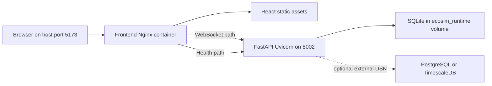
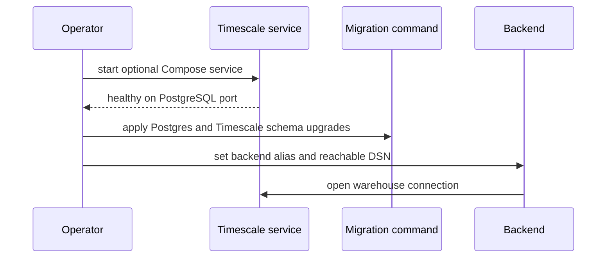

# Deployment and operations

EcoSim has a Python 3.11 FastAPI/Uvicorn backend and a separately built React application served by Nginx. The checked-in deployment is a local/single-host Docker Compose topology, not a production platform specification. Runtime composition and ownership are covered further in [architecture overview](../architecture/overview.md); persistence details are in [warehouse](../data/warehouse.md).

## Supported execution shapes

### Python/backend development

The root package is `ecosim` and includes `backend*` and `policy_forecasting*`. The backend image’s canonical process is:

```text
python -m uvicorn backend.server:app --host 0.0.0.0 --port 8002 --no-date-header
```

A local environment must install Python 3.11 dependencies (the image uses `backend/requirements.lock`, while CI installs editable extras constrained by that lock), then run the same module command. Warehouse persistence is off by default in `.env.example`, so an unmodified local backend remains in-memory for live simulation.

### Frontend development

`frontend-react` is an independent npm workspace. CI and the production Docker build use Node 22; the Docker build runs `npm ci --no-audit --no-fund`, then copies `dist` into Nginx 1.27 Alpine. Use Node 22.22.2 or later within the 22.x release line for source development. Vite development behavior and dashboard integration belong in [frontend dashboard](../frontend/dashboard.md).

### Root Docker Compose

`docker compose up --build -d --wait` builds two services:

- `backend`: port 8002 is exposed only to the Compose network, warehouse enabled with SQLite at `/app/runtime/ecosim.db`, and the named `ecosim_runtime` volume mounted at `/app/runtime`.
- `frontend`: published at host port `${ECOSIM_PORT:-5173}`, starts only after the backend healthcheck passes, and serves the SPA through Nginx.

`ECOSIM_PORT` changes only the host binding; it does not change the internal Nginx-to-backend addresses. For example, `ECOSIM_PORT=5183 docker compose up --build -d --wait` serves the dashboard at `http://localhost:5183`. `docker compose down` retains `ecosim_runtime`; CI uses `docker compose down --volumes` because its probe stack is disposable. The named volume keeps SQLite at `/app/runtime/ecosim.db` across normal stack teardown, but the application defines **no automatic retention limit** for that history.

Both Compose services use the shared `bounded-logs` policy: Docker's `json-file` driver rotates each service's container logs at `10m` per file and retains at most three files. This bounds container log growth; it does not prune SQLite data in `ecosim_runtime`.

Nginx proxies `/ws` to `backend:8002/ws` with upgrade headers and one-hour read/send timeouts, and proxies `/health`. All other paths use static files with SPA fallback. It does **not** proxy `/warehouse/*` or `/decision-context/live`; clients needing those HTTP analytics routes must reach the backend directly or add proxy locations. The current Compose file does not publish backend port 8002, which is an important topology gap.



*Figure 1. The checked-in Compose network, including the default durable SQLite volume and optional external warehouse.*

## Docker storage cleanup

Run these Compose commands from the same checkout and with the same Compose project name (`-p`, if used) as startup. They target EcoSim's project resources rather than indiscriminately removing other projects' databases; `docker builder prune` is the exception because it clears unused build cache across Docker projects.

| Intent | Command | Effect |
|---|---|---|
| Inspect Docker disk usage | `docker system df` | Shows images, containers, volumes, and build cache. |
| Stop EcoSim and retain experiments | `docker compose down` | Removes this stack's containers and network but retains the SQLite volume. |
| Clear unused build cache | `docker builder prune` | Frees unused build cache; subsequent builds may take longer. |
| Remove EcoSim images but retain experiments | `docker compose down --rmi local` | Removes this stack's containers and locally built images while retaining the SQLite volume. |
| Reset EcoSim and delete saved experiments | `docker compose down --volumes --rmi local` | Removes this stack's containers, locally built images, and `ecosim_runtime`; the next startup creates an empty SQLite database. |

Because SQLite history has no retention policy, use the explicit reset only when the project's experiments are disposable. Do not use the CI cleanup command merely to stop a local stack if its persisted runs must be retained. The Compose startup probe is a normal CI gate, but its cleanup is intentionally destructive because it operates on fresh test data; see [where to change what](../where-to-change-what.md) for the corresponding validation boundary.

## Environment controls

| Area | Variables | Operational effect |
|---|---|---|
| Browser/API | `CORS_ORIGINS` | Allowed browser origins; sample permits localhost and 127.0.0.1 on 5173 |
| Sessions | `ECOSIM_MAX_SESSIONS` | Maximum active WebSocket sessions, sample 8 |
| Warehouse gate | `ECOSIM_ENABLE_WAREHOUSE` | Enables server persistence; sample off, root Compose on |
| Backend | `ECOSIM_WAREHOUSE_BACKEND` | `sqlite`, `postgres`, or `timescale` aliases |
| SQLite | `ECOSIM_SQLITE_PATH` | Database file; root Compose overrides to persistent `/app/runtime/ecosim.db` |
| Postgres/Timescale | `ECOSIM_WAREHOUSE_DSN` | Connection DSN; sample contains local development credentials |
| Batching | `ECOSIM_TICK_BATCH_SIZE`, `ECOSIM_SNAPSHOT_BATCH_SIZE` | Aggregate and dense-row flush thresholds, defaults 50 and 5000 |
| Sampling/context | `ECOSIM_HOUSEHOLD_SNAPSHOT_STRIDE`, `ECOSIM_DECISION_CONTEXT_WINDOW` | Full household cadence and rolling context capacity, defaults 5 and 40 |
| LLM optionality | provider keys/models and retry variables | Optional government integrations; simulator runs without keys |
| Labor rollout | match mode, comparison, diagnostics and unemployment guard variables | Selects/observes matching behavior and guardrails; comparison/diagnostics add overhead |

`.env.example` is documentation, not proof that Compose automatically imports every value. Root Compose hard-codes only the three SQLite warehouse variables; pass other values through an env file or Compose override. Never retain sample Postgres credentials outside isolated development.

## Optional Timescale service

`ops/docker-compose.timescale.yml` runs `timescale/timescaledb:latest-pg16`, publishes 5432, stores data in `timescale_data`, and healthchecks with `pg_isready`. It is a standalone Compose file: it does not attach the root backend or inject its DSN. An operator must start it, configure `ECOSIM_WAREHOUSE_BACKEND=timescale`, provide a reachable DSN, and apply the PostgreSQL/Timescale schema or migrations. Details of manager selection, paired migrations and hypertables are in [warehouse](../data/warehouse.md).



*Figure 2. Timescale requires explicit provisioning, migration and backend wiring; the files do not compose it automatically.*

## Health, lifecycle, and durability

FastAPI exposes `GET /health`; root Compose probes it from inside the backend container every 10 seconds after a 15-second start period and permits 12 failures. Frontend startup depends on backend health and its own healthcheck fetches `/`. `restart: unless-stopped` is set for both root services and Timescale.

A healthy HTTP process does not certify warehouse reachability or migration state: `/health` is used as a basic liveness/readiness signal, while warehouse initialization may fail and be disabled so simulation can continue. Monitor run metadata—especially `last_fully_persisted_tick`, `analysis_ready`, and `termination_reason`—to establish data durability. Session disconnect/stop paths attempt buffered flush and run closure, but abrupt process/container loss can leave the newest in-memory batch uncommitted. See [sessions and WebSocket](../runtime/sessions-and-websocket.md) for session lifecycle and [HTTP API](../runtime/http-api.md) for observability surfaces.

## Images and supply chain

- Backend: `python:3.11-slim`; copies package metadata, lock file and all backend sources; installs locked requirements and editable root package; runs as the image’s default root user.
- Frontend build: `node:22-alpine`; runs `npm ci --no-audit --no-fund` and `npm run build`.
- Frontend runtime: `nginx:1.27-alpine`; static assets and checked-in proxy configuration.
- Timescale: floating `timescale/timescaledb:latest-pg16` tag.

The tags are versioned only partially and no digest pinning, image signing, SBOM generation, vulnerability scan, or non-root hardening is checked in. The backend editable install is acceptable for this image shape but is not an immutable wheel-based release install.

## CI evidence

`.github/workflows/ci.yml` validates on pushes and pull requests to `main`:

- Python 3.11 install with the lean `.[test,ml]` extra, correctness-focused Ruff rules, wheel build, and the default contracts/server/SQLite-warehouse suite, including provider-free mocked LLM tests;
- forecasting tests under its frozen requirements;
- Node 22 `npm ci --no-audit --no-fund`, lint, tests, high-severity production dependency audit, and frontend build;
- a fresh Compose build/start, then the backend-container startup probe against `http://frontend` and `/app/runtime/ecosim.db`.

The startup probe verifies Nginx-served HTML and built JavaScript/CSS assets, proxied `/health`, the real WebSocket proxy, two advancing simulation ticks, `STOPPED` and `RESET` acknowledgements, and read-only SQLite readback of its uniquely identified run and saved ticks. It is not a real-browser test and does not exercise live LLMs, research sweeps, PostgreSQL/Timescale, migration provisioning, or release deployment. Broader evidence ownership belongs in [testing and performance](../engineering/testing-performance.md).

## Production-scope gaps

The repository does not currently define:

- TLS termination, public DNS, authentication/authorization, API rate limiting, CSRF strategy, or a secrets manager;
- an HTTP proxy for analytics routes in the production Nginx config;
- Kubernetes/systemd/cloud manifests, horizontal scaling, sticky session strategy, or shared session coordination;
- graceful container stop timing and explicit Uvicorn worker/concurrency tuning;
- centralized logs, metrics, traces, alerting, warehouse health readiness, or disk-capacity alarms;
- SQLite backup/restore, Postgres backup/PITR, migration rollback, disaster recovery, retention, or volume encryption;
- resource requests/limits, database connection-pool sizing, load-tested session capacity, or multi-writer SQLite guidance;
- pinned image digests, non-root containers, read-only filesystems, capability drops, network policies, or automated image scanning.

Accordingly, treat the checked-in Compose deployment as local demonstration and single-host development infrastructure. Before external exposure, close the networking/security gaps, choose and test a durable database plan, add migrations and backups to release procedure, and add end-to-end image/Compose evidence.