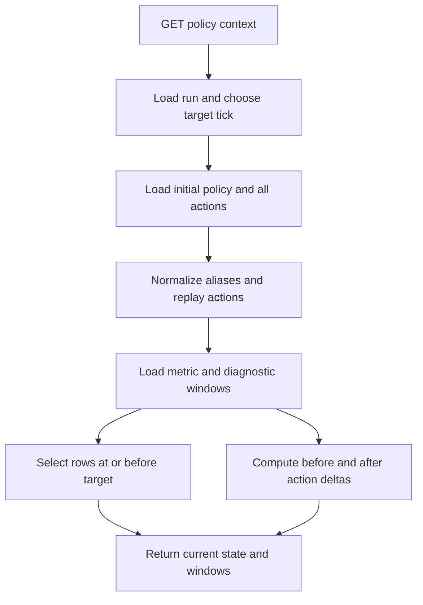

# HTTP API

All implemented HTTP routes are read-only `GET`s. FastAPI also exposes generated `/docs`, `/redoc`, and `/openapi.json` unless deployment configuration changes the framework defaults; these are framework-generated rather than application handlers. The WebSocket `/ws` protocol is documented separately in [sessions and WebSocket](sessions-and-websocket.md).

## Complete application endpoint surface

| Method and path | Query parameters | Success body |
|---|---|---|
| `GET /health` | none | `status: "ok"`, `version: "2.0.0"` |
| `GET /decision-context/live` | required `session_id` non-empty; `window` integer 1–200, default 20 | active session context: session/tick, latest, bounded history and counts |
| `GET /warehouse/runs` | optional `status`; `limit` 1–200 default 25; `offset` ≥0 default 0 | `runs` serialized run rows, `count` |
| `GET /warehouse/runs/{run_id}/tick-metrics` | `tick_start` ≥0 default 0; `tick_end` ≥0 default 999999 | `runId`, `tickMetrics`, `count` |
| `GET /warehouse/runs/{run_id}/summary` | none | `runId`, `summary` |
| `GET /warehouse/runs/{run_id}/decision-features` | same tick range | `runId`, `decisionFeatures`, `count` |
| `GET /warehouse/runs/{run_id}/llm-government-decisions` | same tick range | `runId`, `llmGovernmentDecisions`, `count` |
| `GET /warehouse/runs/{run_id}/tick-diagnostics` | same tick range | `runId`, `tickDiagnostics`, `count` |
| `GET /warehouse/runs/{run_id}/sector-metrics` | same tick range; optional `sector` | `runId`, echoed `sector`, `sectorMetrics`, aggregate `summary`, `count` |
| `GET /warehouse/runs/{run_id}/sector-shortages` | same tick range; optional `sector` | `runId`, echoed `sector`, `sectorShortages`, `count` |
| `GET /warehouse/runs/{run_id}/regime-events` | same tick range; optional `event_type`, `entity_type` | `runId`, echoed `eventType` and `entityType`, `regimeEvents`, `count` |
| `GET /warehouse/runs/{run_id}/policy-context` | optional `tick` ≥0; `window` 1–200 default 20; `policy_lookback` 1–100 default 12; `impact_horizon` 1–100 default 12 | reconstructed policy state, current rows, rolling windows, recent regime events and impact-enriched policy actions |
| `GET /warehouse/compare` | repeated required `run_ids` strings | de-duplicated `runIds`, `comparison`, `count` |

There are no application `POST`, `PUT`, `PATCH`, or `DELETE` handlers. CORS permits configured origins, credentials false, methods GET/POST/OPTIONS, and Content-Type/Authorization headers; allowing POST in middleware does not create a POST endpoint. Default origins are localhost ports 5173, 3000, 8080 and 127.0.0.1:5173, overridable as a comma-separated `CORS_ORIGINS` value.

## Reader and error semantics

Each warehouse request calls `create_warehouse_manager()` and closes it in `finally`. The factory is selected by `ECOSIM_WAREHOUSE_BACKEND` (SQLite by default); storage details belong to [warehouse](../data/warehouse.md). Missing warehouse imports return 503 `{"detail":"Warehouse backend is not available in this environment."}`; initialization exceptions return 503 with the exception text. FastAPI query/path validation returns 422.

Only two handlers add application-level existence/input errors:

- live context returns 404 `Active simulation session not found.` when the in-process registry lacks the ID;
- policy context calls `get_run()` and returns 404 `Run '<id>' was not found.`;
- compare removes duplicates while preserving order and returns 400 if normalization yields no IDs, though the required-list validator commonly produces 422 when the parameter is omitted.

Other run-specific routes delegate to warehouse getters and generally return empty rows, `null` summary, or backend behavior rather than first checking run existence. The handlers do not enforce `tick_start <= tick_end`, cap comparison cardinality despite the “small set” docstring, paginate histories, authenticate, or translate database exceptions into a stable application error contract.

## Policy-context reconstruction

For `/warehouse/runs/{run_id}/policy-context`, omitted `tick` becomes the maximum of `last_fully_persisted_tick`, run `total_ticks`, and zero. `windowStart = max(0, tick - window + 1)`. The handler reads all policy actions through target tick, retains the last `policy_lookback`, and expands metric fetch start far enough to include the baseline tick before the earliest retained action.

Initial `PolicyConfig` is converted to a dictionary, then actions overwrite canonical keys. Aliases normalize wage/profit/wealth taxes, benefit level/rate, minimum wage, UBI, inflation, birth rate, and stabilizer state. JSON payload strings are decoded; value selection prefers `value`, then the canonical key, then `enabled` for stabilizers, then the sole value in a one-key object.

Each recent action receives an `impact` object. Baseline is action tick minus one, bounded at zero; evaluation is action tick plus `impact_horizon`, bounded by target tick. Nearest rows at or before those ticks produce deltas for unemployment, GDP, average health, consumer distress, healthcare pressure, and shortage breadth. Missing baseline/evaluation rows or nonnumeric values yield `null` deltas rather than errors.



*Caption: Warehouse policy evidence is replayed into current state and enriched with bounded before/after observations.*

This endpoint provides persisted policy evidence for external analytical consumers; it is not the active-session endpoint. `/decision-context/live` reads a manager's in-memory rolling deque and is lost at disconnect. The current [React dashboard](../frontend/dashboard.md) does not call either endpoint: it receives the session ID and live telemetry exclusively through WebSocket.

## Tests and commands

```bash
python -m pytest backend/tests_server/test_server_api.py -q
python -m pytest backend/tests_server/test_server_sessions.py -q
```

`test_server_api.py` creates a fresh SQLite schema, seeds runs, policy, tick/sector/decision/diagnostic/shortage/regime rows, exercises warehouse histories, summary, comparison and policy-context behavior, and checks the live-context success/404 paths. It also verifies the SQLite factory initializes a fresh database. These server tests are outside the `pyproject.toml` default `testpaths`, so `python -m pytest` alone does not discover them.
