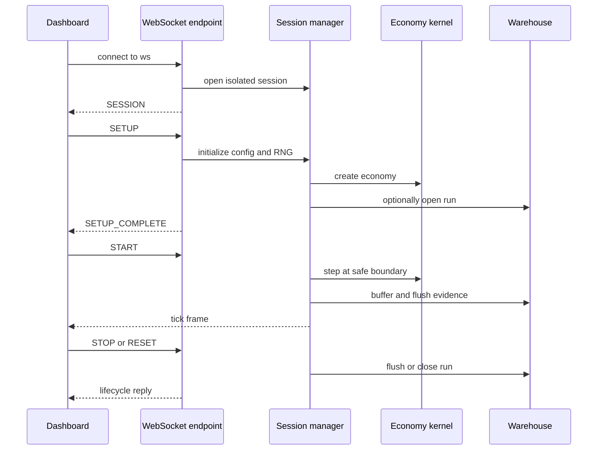
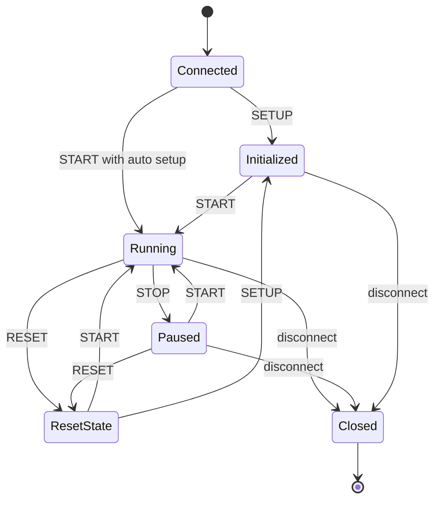

# Sessions and WebSocket runtime

`GET /ws` is not an HTTP route: it is the sole WebSocket endpoint. Every accepted connection gets a new 32-character UUID-hex session ID and a new `SimulationManager`; there is no authentication, resume token, reconnection, or manager sharing. A reconnect is a fresh session and fresh simulation.

## Protocol surface

Client messages are JSON objects with a lowercase `command` field whose value is uppercase. The exact command set is:

| Command | Inputs | Effect | Reply |
|---|---|---|---|
| `SETUP` | `config` object | Validate and replace the economy, reset histories/RNG/LLM state, select tracked subjects, optionally open warehouse run | `{"type":"SETUP_COMPLETE"}` or error |
| `START` | none | Auto-initialize defaults if needed; set running and create at most one loop task | `{"type":"STARTED"}` |
| `STOP` | none | Clear running flag and flush warehouse batches; current synchronous tick may finish | `{"type":"STOPPED"}` |
| `RESET` | none | Stop and cancel loop, close warehouse run as stopped, set manager tick to zero | `{"type":"RESET","tick":0}` |
| `CONFIG` | `config` object | Apply now if paused or merge for the next pre-tick boundary if running | no acknowledgement |
| `STABILIZERS` | `disable_stabilizers` boolean default false; `disabled_agents` array default empty | Re-enable all, or disable named households/firms/government/all | `STABILIZERS_UPDATED` with effective state |

`SETUP.config` is Pydantic-validated for `num_households` 3–100,000 (default 1,000), `num_firms` 1–1,000 per category (default 5), optional seed 0–2,147,483,647, optional `enable_llm_government` (default false), `disable_stabilizers` (false), and `disabled_agents` containing only households, firms, government, or all. Pydantic's default extra-field behavior means setup-only `wage_tax` and `profit_tax` survive in the raw dictionary and are manually applied even though absent from the model; other extras have no generic effect. Runtime `CONFIG` keys are enumerated in [configuration and policy](../backend/configuration-and-policy.md).

Frames from server are:

- first frame: `SESSION` with `sessionId`;
- lifecycle frames listed above;
- error objects with only `error` for capacity, invalid/oversized input, unknown command, setup/start failure, loop failure, or endpoint crash;
- tick frames without a `type`: top-level `tick`, `metrics`, `logs`, and `firm_stats`. `metrics` includes current macro/fiscal/wellbeing/inequality values, policy and LLM state, full history arrays, price/supply histories, tracked households and firms, and `tickComputeMs`.

Text payloads over 1 MiB are rejected without closing. Invalid JSON and unknown commands also leave the socket open. Session-capacity rejection sends an error then closes with code 1013. The protocol does not validate that a decoded JSON value is an object before calling `.get`, so a valid JSON scalar/array reaches the outer failure path.



*Caption: One dashboard connection owns setup, tick execution, telemetry, and optional warehouse evidence for one isolated manager.*

## Configuration and random isolation

A manager deep-clones `SimulationConfig`. Initialization and `run_tick()` execute under `use_config(self.config)`, so legacy `CONFIG` reads resolve through a `ContextVar`. Each manager also stores Python `random` and legacy NumPy `RandomState` states. `_random_scope()` saves process-global states, activates session states for synchronous simulator work, captures the advanced session states, then restores outer states. Tests prove two managers retain different config trees and deterministic independent streams.

This mechanism depends on the economic step being synchronous and non-awaiting while module-level RNG state is installed. Introducing an `await`, thread handoff, or independently scheduled RNG consumer inside that scope would invalidate isolation. New code should prefer explicit generators, but must preserve established stream ordering where reproducibility matters.

## Concurrency and lifecycle

`SessionRegistry` defaults `ECOSIM_MAX_SESSIONS` to 8 and clamps it to at least 1. `open_session()` checks current dictionary length, creates manager, then registers it. `_prune_closed_sessions()` exists but is not called by `open_session`; normal disconnect cleanup removes sessions directly. Registry operations assume one event loop/process and have no lock. Multi-worker deployment creates independent registries and independent caps.

`start_background_loop()` sets `is_running`; if a task is still active it reuses it rather than spawning a duplicate. The loop applies pending manual config and pending LLM decisions at the pre-step boundary, then runs the synchronous [economy tick](../backend/tick-lifecycle.md), computes/persists evidence, sends one frame, and throttles toward 100 ms with a 50 ms minimum sleep. `STOP` is cooperative. `RESET` cancels, closes persistence, and zeroes `tick`, but does not create a new economy or clear all histories by itself; a subsequent `START` can continue the same economy with tick numbering reset. `SETUP` is the true fresh-economy operation.



*Caption: Protocol lifecycle, including the important distinction between tick reset and fresh `SETUP` initialization.*

Disconnect cancels the task, closes the warehouse run as stopped, and removes the registry entry. Unexpected endpoint or loop failures close the run as failed. LLM work is separately scheduled and applied only at safe boundaries; see [government LLM](../llm/government.md). Warehouse flush/watermark semantics are in [warehouse](../data/warehouse.md), and the consuming client is [dashboard](../frontend/dashboard.md).

## Focused validation

```bash
python -m pytest backend/tests_server/test_server_sessions.py -q
python -m pytest backend/tests_server/test_live_llm_government.py -q
python -m pytest backend/tests_server/test_server_api.py -q
```

`test_server_sessions.py` covers distinct managers, release, context-proxy/module aliasing, independent RNG/config, cross-initialization isolation, and duplicate-task prevention. It does not constitute an end-to-end assertion for every command or every telemetry field.
